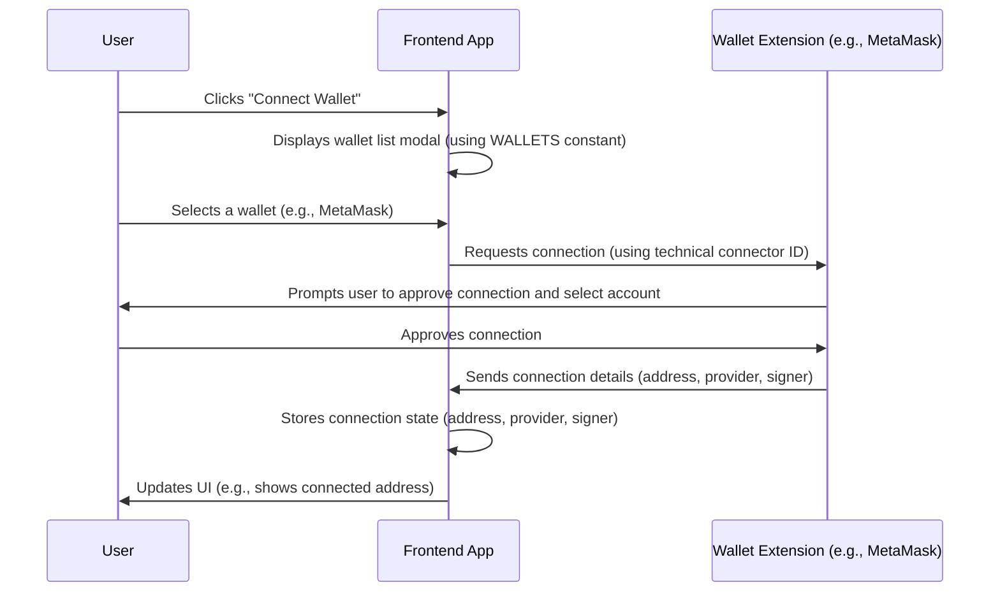

# Chapter 1: Wallet & Authentication

Welcome to the first chapter of this tutorial! We're starting our journey by understanding how our frontend application connects to the exciting world of blockchains. The very first step for a user to interact with a decentralized application (dApp) is to link their **cryptocurrency wallet**. This chapter is all about how our project handles this crucial connection process.

Think of your cryptocurrency wallet (like MetaMask, Trust Wallet, etc.) as your digital identity and your secure key to interact with the blockchain. Just like you need a passport or ID to access certain services in the real world, you need your wallet to access and use features on a dApp.

The **"Wallet & Authentication"** concept in our project provides the "secure communication line" between your browser (running our frontend) and your wallet. It’s the gateway that allows our application to:

1.  See your unique blockchain address (your identity).
2.  Ask your permission (via your wallet) to perform actions on the blockchain, like sending tokens or interacting with smart contracts.
3.  Read information directly from the blockchain.

Without this connection, our dApp is just a static webpage; it can't interact with the decentralized network. This abstraction manages the connection state – whether you are connected, which wallet you're using, your address, and the tools needed to read data and sign transactions.

### What is a Wallet (in this context)?

In the world of dApps, a wallet isn't just a place to store crypto. It's a piece of software (often a browser extension, mobile app, or hardware device) that:

*   Holds your private keys (the secret codes that prove you own your assets and identity).
*   Allows you to view your balance.
*   Most importantly for dApps, it lets you sign transactions and messages using your private key, proving that *you* authorized an action without revealing the key itself.

When we talk about connecting a wallet, we mean linking this software tool to our frontend application.

### Why "Authentication"?

Unlike traditional websites where you might log in with a username and password stored in a database, dApps often use your wallet address as your primary form of "authentication." Your wallet address is unique to you on the blockchain, and proving ownership of it (by signing something with your private key via your wallet) verifies your identity.

### Key Pieces of the Connection

Once your wallet is connected, our frontend gets access to a few critical pieces of information and tools:

1.  **Blockchain Address:** Your public address (like `0x123...abc`). This is your identity on the blockchain, visible to everyone.
2.  **Signer:** An object provided by the wallet that allows the frontend to request you to sign messages or transactions. When the frontend needs to perform an action requiring your permission (like transferring tokens), it uses the signer to send a request to your wallet. Your wallet then pops up a window asking you to approve or reject the action.
3.  **Provider:** An object that allows the frontend to read data from the blockchain. This includes things like checking balances, getting information about smart contracts, or seeing recent transactions. It's like a read-only connection to the blockchain network.

These three pieces are essential for our dApp to function. The address identifies you, the signer lets you authorize actions, and the provider lets the app see what's happening on the blockchain.

### The User Flow: Connecting a Wallet

Let's walk through the typical process from the user's perspective:

1.  The user visits our dApp.
2.  They click a "Connect Wallet" button.
3.  A modal (a small pop-up window) appears showing a list of supported wallets.
4.  The user clicks on their preferred wallet, for example, "MetaMask".
5.  If MetaMask is installed, the MetaMask browser extension will pop up, asking the user to confirm which account they want to connect to our dApp and requesting permission to view their address.
6.  The user approves the connection in MetaMask.
7.  The modal in our dApp closes, and the "Connect Wallet" button might change to show the user's connected address or wallet name.

Behind the scenes, once the user approves, our "Wallet & Authentication" abstraction receives the user's address, the signer, and the provider from the connected wallet. The frontend now knows who the user is and has the tools to interact with the blockchain on their behalf (with their explicit permission for transactions).

### How the Code Supports This

Our project uses libraries to help manage this complex connection process. We define the different types of wallets we support and map them to technical identifiers that these libraries understand.

Look at `src/clients/web3/types.ts`:

```typescript
export enum Connector {
  MetaMask = 'MetaMask',
  TrustWallet = 'TrustWallet',
  WalletConnect = 'WalletConnect',
  SafePal = 'SafePal',
  CoinbaseWallet = 'CoinbaseWallet',
  BinanceChainWallet = 'BinanceChainWallet',
  BraveWallet = 'BraveWallet',
  InfinityWallet = 'InfinityWallet',
  OkxWallet = 'OkxWallet',
  OperaWallet = 'OperaWallet',
  BitKeep = 'BitKeep',
}
```

This code simply lists all the different wallets our application *knows* about. `Connector` is just a way for us to refer to these wallets within our code using clear names like `Connector.MetaMask`.

Next, `src/clients/web3/connectors.ts` maps these friendly names to specific IDs required by the underlying wallet connection library:

```typescript
import { Connector } from './types';

export const connectorIdByName = {
  [Connector.MetaMask]: 'metaMask',
  // ... other injected wallets often use 'injected'
  [Connector.BraveWallet]: 'injected',
  // ...
  [Connector.CoinbaseWallet]: 'coinbaseWallet',
  [Connector.WalletConnect]: 'walletConnect',
  // ...
};
```

This `connectorIdByName` object is like a dictionary. When the user clicks "MetaMask" in the UI, our code looks up `Connector.MetaMask` in this dictionary and gets the value `'metaMask'`, which is the technical name the library uses to identify and connect to MetaMask.

The list of wallets shown in the connection modal comes from `src/components/AuthModal/constants.ts`:

```typescript
import MetaMaskLogo from '@/assets/img/wallets/metaMaskLogo.svg';
import { Connector } from '@/clients/web3/types';
import { Wallet } from './types';

export const WALLETS: Wallet[] = [
  {
    name: t('wallets.metamask'), // Get display name from translations
    Logo: MetaMaskLogo, // The image to show
    connector: Connector.MetaMask, // Link to our Connector enum
  },
  // ... other wallets (currently commented out)
];

// ... other wallet lists like INTEGRATED_WALLETS, UPCOMING_WALLETS
```

This `WALLETS` array defines the wallets that appear in the user interface's connection list. Each entry includes the wallet's name (translated for different languages), its logo image, and the `Connector` enum value we saw earlier. This is what drives the visual selection of wallets.

Finally, the file `src/clients/web3/Web3Wrapper/client.ts` (though heavily commented out in the provided snippet) is where the core configuration for the underlying wallet connection library (likely `wagmi` based on the imports) would live. It's responsible for setting up which blockchain network(s) the app will connect to and listing the technical connector objects for the supported wallets. When the user selects a wallet from the list provided by `WALLETS`, the code uses the `connector` property from `WALLETS` (like `Connector.MetaMask`), looks up its technical ID in `connectorIdByName`, and then tells the underlying library to initiate the connection using the corresponding connector configured in `client.ts`.

### Under the Hood: The Connection Flow

When a user clicks a wallet like MetaMask:



This diagram shows the basic steps: the user action triggers the frontend to ask the wallet extension, the wallet asks the user for permission, and upon approval, the necessary information flows back to the frontend.

### Conclusion

In this chapter, we've learned that connecting a user's wallet is the fundamental first step for our dApp to interact with the blockchain. This "Wallet & Authentication" layer handles the process of linking the frontend to the user's wallet software, obtaining their blockchain address, and getting the tools (signer and provider) needed to read blockchain data and propose transactions for the user's approval. We also saw how our project defines the supported wallets and maps them to technical identifiers.

With the wallet connected, our application now has the key to access blockchain features on behalf of the user. The next crucial step is understanding how the application is configured to interact with the *specific* blockchain network and its components.

Let's move on to [Chapter 2: Application Configuration](02_application_configuration_.md).

---

Generated by [AI Codebase Knowledge Builder](https://github.com/The-Pocket/Tutorial-Codebase-Knowledge)