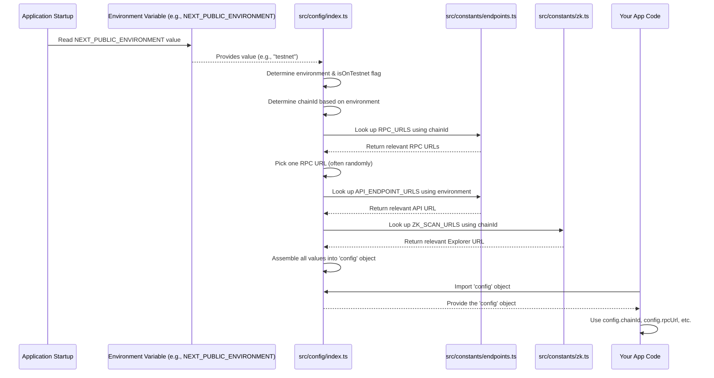

# Chapter 2: Application Configuration

Welcome back! In [Chapter 1: Wallet & Authentication](01_wallet___authentication_.md), we learned how our application connects to a user's wallet, getting their address and the tools needed to interact with *a* blockchain network. But wait, which blockchain network are we talking about? Is it the main, live network where real value is exchanged, or is it a test network used for development and testing?

This is where **Application Configuration** comes in.

### Why Do We Need Configuration?

Imagine you're building a game. You probably have:
1.  A version for testing, where you don't mind things breaking and you can experiment freely.
2.  A version for your friends to try out before release.
3.  The final version that millions of players use.

Each version might need to connect to different servers, use different settings, or display different information.

Similarly, our decentralized application (dApp) needs to work in different "environments":

*   **Development:** For developers to build and test features locally.
*   **Testnet:** A public blockchain network that mimics the main network but uses "fake" tokens with no real value. This is crucial for testing smart contracts and application logic before deploying to the main network.
*   **Mainnet:** The live, production blockchain network where real transactions happen and assets have value.

Our application needs to know which environment it's currently running in so it can connect to the correct blockchain network, the correct API servers, and use the correct external links (like a block explorer to view transactions).

The "Application Configuration" concept is our project's way of bundling all these environment-specific settings into one place. This makes sure our app talks to the right services depending on whether it's running in development, on testnet, or on mainnet, without needing to change the core code logic.

### What's Inside the Configuration?

The configuration holds key pieces of information that change depending on the environment:

1.  **Environment Type:** Is this `mainnet`, `testnet`, `storybook`, etc.? This is the master switch that determines everything else.
2.  **Chain ID:** Every blockchain network has a unique number called a Chain ID. For example, the zkSync Era Mainnet has Chain ID `324`, and the zkSync Era Testnet (Goerli) has Chain ID `280`. Our app needs to know this ID to ensure it's connected to the right network and to interact correctly with wallets and smart contracts on that specific chain.
3.  **RPC URL:** This is the address of a server that allows our application to read data from the blockchain and send transactions. Think of it like a phone number for the blockchain network. Different networks (testnet vs. mainnet) have different RPC URLs.
4.  **API URL:** Our application might also interact with traditional backend servers (for data that isn't stored on the blockchain, or for faster access). These API servers also have different addresses depending on the environment.
5.  **Block Explorer URL:** When you see a transaction link (like "View on Explorer"), this URL tells the app which website to use to show the transaction details on the specific blockchain network it's connected to.

### How to Use the Configuration

The most common way to use the configuration is to import a special `config` object that contains all these settings and then access the specific value you need.

For example, if you need to know the current Chain ID to interact with a wallet, you would do this:

```typescript
import config from '@/config';

const currentChainId = config.chainId;

// Now you can use currentChainId (e.g., 280 or 324)
// in parts of your application that need to interact
// with the specific network.
console.log(`The application is configured for Chain ID: ${currentChainId}`);
```

This is very straightforward! You just import the `config` object and read the property you need (`chainId`, `rpcUrl`, `apiUrl`, etc.). This `config` object acts as a central source of truth for environment-specific settings.

If you need to check if the application is running on a test network, you'd use the `isOnTestnet` property:

```typescript
import config from '@/config';

if (config.isOnTestnet) {
  console.log('Running on a test network!');
  // Maybe show a "Testnet Mode" banner in the UI
} else {
  console.log('Running on Mainnet!');
}
```

This simple pattern (`import config; access property;`) is used throughout the application whenever a component or function needs to know which environment it's operating in or which endpoints to use.

### How the Configuration is Built (Under the Hood)

How does this `config` object automatically know which environment it's in and load the correct settings?

The magic happens when the application starts. It reads a special variable that tells it which environment it should be configured for. This variable is usually set when the application is built or deployed.

Let's look at the files involved:

1.  `src/config/index.ts`: This is the main file that creates the `config` object we import everywhere.
2.  `src/constants/endpoints.ts`: This file stores the actual RPC and API URLs for different environments and chain IDs.
3.  `src/constants/zk.ts`: This file stores other chain-specific constants, like the block explorer URL.

Here's a simplified flow:



The application reads the environment variable first. Based on this, the `src/config/index.ts` file decides the Chain ID. Then, it looks up the corresponding RPC URL, API URL, and Block Explorer URL from the constant files (`src/constants/endpoints.ts` and `src/constants/zk.ts`). Finally, it bundles all these pieces into the single `config` object that the rest of the application uses.

Let's see snippets from the code:

First, `src/constants/endpoints.ts` defines the URLs:

```typescript
import { ZkChainId, Environment } from '@/types';

// Maps environment names to API server URLs
export const API_ENDPOINT_URLS: Record<Environment, string> = {
  mainnet: 'https://api.zoroprotocol.com/api',
  preview: 'https://api-preview.zoroprotocol.com/api',
  testnet: 'https://testnetapi.venus.io/api',
  // ... other environments
};

// Maps Chain IDs to lists of RPC server URLs
export const RPC_URLS: {
  [key: string]: string[];
} = {
  [ZkChainId.MAINNET]: ['https://mainnet.era.zksync.io'],
  [ZkChainId.TESTNET]: ['https://testnet.era.zksync.dev'],
};
```

This file is simply a dictionary mapping the different environments/chain IDs to their corresponding URLs.

Next, `src/constants/zk.ts` defines the explorer URLs:

```typescript
import { ZkChainId } from '@/types';

// Maps Chain IDs to Block Explorer URLs
export const ZK_SCAN_URLS = {
  [ZkChainId.MAINNET]: 'https://explorer.zksync.io',
  [ZkChainId.TESTNET]: 'https://zksync2-testnet.zkscan.io',
};

// ... other constants like BLOCK_TIME_MS
```

Another dictionary, this time for block explorers based on the Chain ID.

Finally, `src/config/index.ts` ties it all together:

```typescript
import sample from 'lodash/sample'; // Utility to pick a random item from a list
import { ZkChainId, Environment } from '@/types';
import { ZK_SCAN_URLS } from '@/constants/zk';
import { API_ENDPOINT_URLS, RPC_URLS } from '@/constants/endpoints';

export interface Config {
  environment: Environment;
  chainId: ZkChainId;
  isOnTestnet: boolean;
  rpcUrl: string; // The selected RPC URL for the current network
  apiUrl: string; // The selected API URL for the current environment
  zkScanUrl: string; // The selected Block Explorer URL
  // ... other config values
}

// 1. Determine the environment from system variables
const environment: Environment =
  (process.env.NEXT_PUBLIC_ENVIRONMENT as Environment | undefined) || 'mainnet'; // Default to 'mainnet' if not set

// 2. Determine if it's a testnet environment
const isOnTestnet =
  environment === 'testnet' ||
  environment === 'storybook' || // Storybook might use testnet settings
  environment === 'ci'; // Continuous Integration might use testnet settings

// 3. Determine the Chain ID based on whether it's a testnet
const chainId: ZkChainId = isOnTestnet ? 280 : 324; // 280 is testnet, 324 is mainnet

// 4. Look up the specific URLs using the determined chainId and environment
const rpcUrl = sample(RPC_URLS[chainId]) as string; // Pick one RPC URL if there are multiple
const apiUrl = API_ENDPOINT_URLS[environment];
const zkScanUrl = ZK_SCAN_URLS[chainId];

// 5. Create the final config object
const config: Config = {
  environment,
  chainId,
  isOnTestnet,
  rpcUrl,
  apiUrl,
  zkScanUrl,
  // ... include other config values
};

export default config; // Export the config object so other files can import it
```

This code block shows the simple logic: read the environment variable, decide the Chain ID, and then grab the right URLs from the constants files. The result is the `config` object, ready to be used anywhere in the application.

By keeping all these environment-specific details separate from the core logic, we make our application much easier to manage, test, and deploy to different environments. We simply change the environment variable when building or deploying, and the application automatically uses the correct settings.

### Conclusion

In this chapter, we've explored the concept of **Application Configuration**. We learned why it's essential for dApps running in different environments (like testnet and mainnet) and how it centralizes critical settings such as Chain ID, RPC URL, API URL, and Block Explorer URL. We saw how easy it is to access these settings using the `config` object and got a peek under the hood at how this object is built based on the application's environment variable, looking up values from constant files.

With our wallet connected (Chapter 1) and our application configured for the correct network, we're ready to start interacting with the core logic of the decentralized world: Smart Contracts.

Let's move on to [Chapter 3: Smart Contract Instances](03_smart_contract_instances_.md).

---

Generated by [AI Codebase Knowledge Builder](https://github.com/The-Pocket/Tutorial-Codebase-Knowledge)