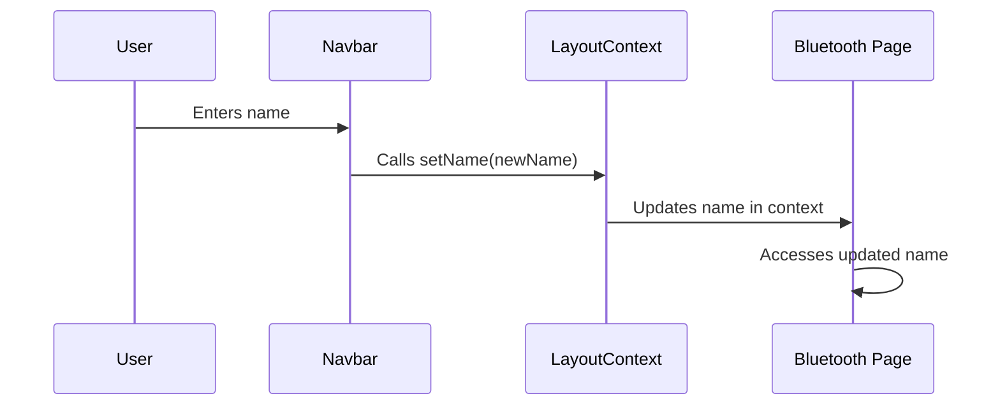

# Chapter 2: LayoutContext

Continuing from our discussion of [Navigation](01_navigation.md), which lets us move between different "rooms" of our app, let's talk about `LayoutContext`.  `LayoutContext` is like a shared whiteboard accessible from any room in our house.  It allows different parts of our application to share important information, like the connected Bluetooth devices, the data coming from those devices, and even the user's name.

Our central use case will be understanding how the Bluetooth device name is shared between the `navbar` and the `bluetooth` page.  The user enters their name on the `navbar`, and we want this name to be available on the `bluetooth` page when downloading data.

## What problem does `LayoutContext` solve?

Imagine you have multiple family members using the same whiteboard.  Without any organization, it would quickly become messy and confusing! `LayoutContext` solves this problem in our application.  It provides a structured way to share information between components without passing props down through multiple levels.

## Key Concepts: Provider and Consumer

`LayoutContext` has two main parts: the `Provider` and the `Consumer` (though we'll use a hook called `useLayoutContext` which simplifies accessing the context).

1. **`LayoutContext.Provider`**: This is the whiteboard itself. It wraps the components that need to share or access information. It holds the shared "state" (the information written on the whiteboard).

2. **`useLayoutContext()`**:  This is how components "read" from the whiteboard. It's like looking at what's written on the board and using that information.

## Sharing the User's Name: A Concrete Example

Let's see how the user's name, entered in the `navbar`, is made available in the `bluetooth` component.

###  Providing the Name in `layout.js`

```javascript
// ... other code ...
const LayoutContext = createContext();

function RootLayout({ children }) {
  const [name, setName] = useState(null);
  // ... other state variables ...

  return (
    <html lang="en">
      {/* ... other code ... */}
      <LayoutContext.Provider value={{ name, setName, /* ... other values */ }}>
        <AppMenuBar callBack={setName} name={name}/>
        {children}
      </LayoutContext.Provider>
      {/* ... other code ... */}
    </html>
  );
}

export const useLayoutContext = () => useContext(LayoutContext);
// ... other code ...
```

Here, `LayoutContext.Provider` wraps our entire application. We "provide" the `name` and `setName` within its `value`. This makes them accessible to all components within the `Provider`.

### Accessing the Name in `bluetooth/page.js`

```javascript
// ... other code ...
import { useLayoutContext } from '../layout';
// ... other code ...

function BluetoothComponent() {
  const {name, setName} = useLayoutContext();
  // ... other code ...
    // ... using name for downloading data ...

}

export default BluetoothComponent;
```
Here, `useLayoutContext()` gives us access to the `name` and `setName` from the `LayoutContext`. Now the `BluetoothComponent` can access and even update the user's name!


## Under the Hood: How `LayoutContext` Works

Let's use a simplified sequence diagram to understand what happens when the user enters their name:



1. The user types their name in the `navbar`.
2.  The `navbar` calls the `setName` function, which was provided by `LayoutContext`.
3. `LayoutContext` updates the `name` value in its internal "whiteboard".
4.  Any component that uses `useLayoutContext()`, like our `BluetoothComponent`, will now see the updated `name`.


## Conclusion

In this chapter, you've learned about `LayoutContext` and how it acts like a shared whiteboard for our application.  You understand how the `Provider` makes information available and how `useLayoutContext()` allows components to access that information. We saw how this allows us to share the user's name between the `navbar` and the `bluetooth` component.


Next, let's delve into the specifics of [Bluetooth Device Connection](03_bluetooth_device_connection.md) and learn how our app interacts with Polar sensors.


---

Generated by [AI Codebase Knowledge Builder](https://github.com/The-Pocket/Tutorial-Codebase-Knowledge)