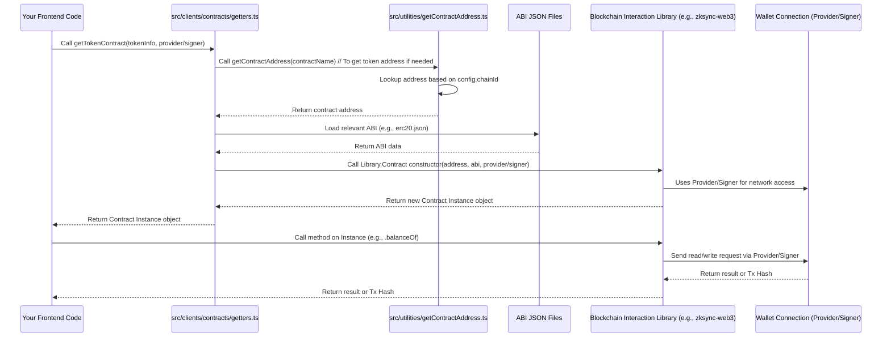

# Chapter 3: Smart Contract Instances

Welcome back! In our previous chapters, we laid some crucial groundwork. In [Chapter 1: Wallet & Authentication](01_wallet___authentication_.md), we learned how our application connects to a user's cryptocurrency wallet, giving us access to their blockchain address and the essential tools – the **Provider** for reading data and the **Signer** for proposing transactions – to interact with the blockchain. Then, in [Chapter 2: Application Configuration](02_application_configuration_.md), we saw how our app knows which specific blockchain network (like testnet or mainnet) it's connected to, thanks to a central `config` object.

Now, we're ready to combine these concepts and dive into how our frontend application actually *talks* to the programs running on that blockchain network: **Smart Contracts**.

### Talking to Programs on the Blockchain

Imagine you want to interact with a specific company's customer service. You need two things:
1.  Their phone number (where to reach them).
2.  A manual or script detailing what services they offer and what information they need from you (e.g., "Press 1 for billing," "Please have your account number ready").

Interacting with a smart contract on the blockchain is very similar! The smart contract is like the company's customer service program.

1.  You need the smart contract's unique address on the blockchain (its "phone number").
2.  You need its **ABI (Application Binary Interface)**, which is like the manual detailing all the functions (services) the contract offers, what inputs they require, and what outputs they provide.

Our frontend application uses something called a **Smart Contract Instance** to act as the **translator** between our familiar JavaScript/TypeScript code and the smart contract code running on the blockchain. This instance takes the contract's address and its ABI and provides a convenient way for our code to call the contract's functions.

### What is a Smart Contract Instance?

A smart contract instance is essentially an object in our frontend code that represents a specific smart contract deployed at a specific address on a specific blockchain network.

Think of it like this:

```
Your Frontend Code <---> Smart Contract Instance <---> Blockchain Network <---> Smart Contract Code
```

The Smart Contract Instance is the layer that abstracts away the low-level details of blockchain communication. Instead of manually crafting raw data bytes to send to the blockchain address, you interact with the instance object as if you were calling a regular function in your own code.

To create a smart contract instance, you typically need:

1.  **The Contract's Address:** Where the contract lives on the currently configured blockchain network. As we saw in [Chapter 2: Application Configuration](02_application_configuration_.md), our application knows which network it's on, and we use this information to find the correct address for a specific contract.
2.  **The Contract's ABI:** The "manual" listing the contract's functions. These are usually stored in JSON files in our project.
3.  **A Provider or Signer:** This comes from our wallet connection ([Chapter 1: Wallet & Authentication](01_wallet___authentication_.md)).
    *   Use a **Provider** if you only need to **read data** from the contract (like checking a balance or getting a configuration setting). This is free and doesn't require user approval.
    *   Use a **Signer** if you need to **write data** to the contract by sending a transaction (like transferring tokens, approving spending, or depositing funds). This costs gas (blockchain fees) and requires the user to approve the action in their wallet.

### Using a Smart Contract Instance (The User's Perspective)

Let's consider a common use case: checking the balance of a specific token (like USDC) for the connected user.

1.  We know which token we're interested in (USDC).
2.  We need the USDC token's contract address on the current network.
3.  We need the standard ABI for ERC-20 tokens (USDC is an ERC-20 token, and they all share common functions like `balanceOf`, `transfer`, `approve`, etc.).
4.  We need the user's connected address (from [Chapter 1: Wallet & Authentication](01_wallet___authentication_.md)).
5.  We need a **Provider** to read the data from the blockchain.

With these pieces, we can create a smart contract instance for the USDC token and call its `balanceOf` function, passing the user's address. The instance handles formatting the request, sending it via the Provider, and decoding the response.

Here's a simplified look at what this might look like in code:

```typescript
import { Token } from '@/types'; // Our definition of a Token
import { getTokenContract } from '@/clients/contracts/getters'; // Helper to get a contract instance
// Assume we have a connected wallet providing a Provider

// --- Imagine these come from elsewhere in the app ---
const usdcToken: Token = {
  symbol: 'USDC',
  decimals: 6,
  asset: '...', // logo
  address: '0x...', // Actual USDC address on the current network
};
const userAddress = '0xabc...123'; // User's connected wallet address
const provider = /* ... get the Provider from wallet connection ... */ ;
// -------------------------------------------------

// 1. Get the smart contract instance for the USDC token
const usdcContract = getTokenContract(usdcToken, provider);

// 2. Use the instance to call the 'balanceOf' function on the contract
// The instance makes blockchain calls look like regular function calls
const balanceWei = await usdcContract.balanceOf(userAddress);

console.log(`User USDC balance (in smallest units): ${balanceWei}`);
// We would later use utilities to format this 'balanceWei' based on 'decimals'
// (like 6 for USDC) into a human-readable number (e.g., 10.50 USDC).
```

In this example, `getTokenContract` is a helper function that hides some of the instance creation details, but the core idea is: we get an object (`usdcContract`), and we call a method on it (`balanceOf`) that corresponds to a function on the smart contract. The smart contract instance translates this call into a blockchain request.

If we wanted to send a transaction, like approving another contract to spend our USDC, we would do almost the same thing, but we'd need a **Signer** instead of just a Provider when creating the instance:

```typescript
import { Token } from '@/types';
import { getTokenContract } from '@/clients/contracts/getters';
// Assume we have a connected wallet providing a Signer

// --- Imagine these come from elsewhere in the app ---
const usdcToken: Token = { /* ... same USDC token info ... */ };
const spenderAddress = '0xdef...456'; // The contract address we want to approve
const amountToApproveWei = /* ... amount in smallest units ... */;
const signer = /* ... get the Signer from wallet connection ... */ ;
// -------------------------------------------------

// 1. Get the smart contract instance, THIS TIME WITH A SIGNER
const usdcContractWithSigner = getTokenContract(usdcToken, signer);

// 2. Use the instance to call the 'approve' function on the contract
// This call will trigger a transaction in the user's wallet
try {
  const transactionResponse = await usdcContractWithSigner.approve(
    spenderAddress,
    amountToApproveWei
  );

  console.log(`Approval transaction sent: ${transactionResponse.hash}`);

  // We'd typically wait for the transaction to be mined afterwards
  // await transactionResponse.wait();
  // console.log('Transaction confirmed!');

} catch (error) {
  console.error('Error sending approval transaction:', error);
  // Blockchain error handling will be covered in a later chapter
}
```

Notice the key difference: calling `balanceOf` is a read operation (free, no user prompt), while calling `approve` is a write operation (costs gas, triggers a wallet prompt for the user to approve). The smart contract instance object (`usdcContract` vs `usdcContractWithSigner`) is the same *type* of object, but the presence of the Signer enables the ability to send transactions.

### How Smart Contract Instances are Created (Under the Hood)

Our project simplifies the process of creating these instances using helper functions, mainly located in `src/clients/contracts/getters.ts`. These functions take care of finding the correct contract address (using helpers we'll see) and loading the correct ABI.

Let's walk through the process when you call a function like `getTokenContract`:



Here's how the code pieces fit together:

1.  **Finding the Address:** The `src/utilities/getContractAddress.ts` file, as hinted in [Chapter 2: Application Configuration](02_application_configuration_.md), is responsible for knowing the addresses of key smart contracts on different networks. It uses the application's current `chainId` from the `config` object to look up the correct address from JSON files containing these addresses.

    ```typescript
    // src/utilities/getContractAddress.ts (simplified)
    import config from '@/config';
    import mainContractChainAddresses from '@/constants/contracts/addresses/main.json';

    // This object maps contract names (like 'comptroller')
    // to their address on the CURRENTLY configured chainId
    const contractAddresses = Object.entries(mainContractChainAddresses).reduce(
      (acc, [contractName, addresses]) => ({
        ...acc,
        [contractName]: (addresses as any)[config.chainId], // Look up address by chainId
      }),
      {} as Record<keyof typeof mainContractChainAddresses, string>
    );

    const getContractAddress = (contractName: keyof typeof contractAddresses) =>
      contractAddresses[contractName];

    export default getContractAddress; // Export this helper function
    ```

    This simplified snippet shows that `getContractAddress` takes a contract's logical name (like `'comptroller'`) and returns its physical address on the blockchain network specified by `config.chainId`.

2.  **Loading the ABI:** The project stores the ABIs for different contracts in JSON files, like `src/constants/contracts/abis/erc20.json` for standard tokens or `src/constants/contracts/abis/comptroller.json` for the main lending pool contract.

    ```json
    // src/constants/contracts/abis/erc20.json (snippet)
    [
      {
        "constant": true,
        "inputs": [
          {
            "name": "_owner",
            "type": "address"
          }
        ],
        "name": "balanceOf", // This is the function name
        "outputs": [
          {
            "name": "balance",
            "type": "uint256" // This is the return type
          }
        ],
        "payable": false,
        "stateMutability": "view", // 'view' means it's a read-only function
        "type": "function"
      },
      {
        "constant": false,
        "inputs": [
          {
            "name": "_spender",
            "type": "address"
          },
          {
            "name": "_value",
            "type": "uint256"
          }
        ],
        "name": "approve", // This is the function name
        "outputs": [
          {
            "name": "",
            "type": "bool"
          }
        ],
        "payable": false,
        "stateMutability": "nonpayable", // 'nonpayable' means it changes state (requires gas)
        "type": "function"
      }
      // ... many other function definitions
    ]
    ```

    The ABI is just a structured description. Our blockchain interaction library reads this to know how to encode function calls and decode responses.

3.  **The Core Instance Creator:** The `src/clients/contracts/getters.ts` file contains the primary function, `getContract`, which uses a blockchain interaction library (like `zksync-web3` or `ethers.js`) to create the instance.

    ```typescript
    // src/clients/contracts/getters.ts (simplified)
    import { Contract, Signer } from 'zksync-web3'; // Or ethers

    export const getContract = ({
      abi,
      address,
      signer, // This can be a Signer OR a Provider
    }: {
      abi: any; // ContractInterface is the actual type, but 'any' for simplicity
      address: string;
      signer?: Signer; // Made optional here to allow passing just a Provider
    }) => {
      // The underlying library (zksync-web3 or ethers) does the heavy lifting
      // It needs the address, the ABI, and the connection object (Provider or Signer)
      return new Contract(address, abi, signer);
    };

    // --- Example of a helper function using getContract ---
    import erc20Abi from '@/constants/contracts/abis/erc20.json';
    import { Token } from '@/types';

    export const getTokenContract = (token: Token, signerOrProvider: Signer | undefined) => {
      // getContract needs the raw address and ABI
      return getContract({
        abi: erc20Abi, // We use the standard ERC20 ABI for all tokens
        address: token.address, // We get the address from the Token object passed in
        signer: signerOrProvider, // Pass the Provider or Signer provided by the caller
      });
    };

    // --- Example for a specific contract by name ---
    import comptrollerAbi from '@/constants/contracts/abis/comptroller.json';
    import getContractAddress from '@/utilities/getContractAddress';

    export const getComptrollerContract = (signerOrProvider: Signer | undefined) => {
      const address = getContractAddress('comptroller'); // Get address using helper
      return getContract({
        abi: comptrollerAbi, // Use the specific Comptroller ABI
        address,
        signer: signerOrProvider,
      });
    };
    ```

    The `getContract` function is the core factory. It takes the address, the ABI data, and either a Provider (for reading) or a Signer (for writing). It then uses the blockchain interaction library (`zksync-web3` in this case) to create the actual instance object. Helper functions like `getTokenContract` and `getComptrollerContract` then wrap `getContract`, making it easier to get instances for specific, common contract types without needing to manually find the ABI or address every time.

By using these helpers, whenever we need to interact with the Comptroller contract or a specific token contract anywhere in our application, we simply call the relevant `get...Contract` function, pass the Provider or Signer we obtained from [Chapter 1: Wallet & Authentication](01_wallet___authentication_.md), and get back a ready-to-use instance object to call its functions.

### Conclusion

In this chapter, we explored the concept of **Smart Contract Instances**. We learned that they are like specialized translators that allow our frontend code to interact with smart contracts deployed on the blockchain. We saw that creating an instance requires the contract's unique address, its ABI (the manual of its functions), and a connection object (a Provider for reading data, a Signer for sending transactions) obtained from the user's connected wallet. We also looked under the hood at how our project uses helper functions in `src/clients/contracts/getters.ts`, combined with address lookups (`src/utilities/getContractAddress.ts`) and ABI files, to simplify the creation of these instances.

With the ability to create smart contract instances, our application can now directly read data from and propose transactions to specific programs on the blockchain. The next step is to understand the core data structures our application uses to represent key blockchain entities like tokens and markets, which are often the inputs and outputs of these smart contract interactions.

Let's move on to [Chapter 4: Tokens and Markets Data Structures](04_tokens_and_markets_data_structures_.md).

---

Generated by [AI Codebase Knowledge Builder](https://github.com/The-Pocket/Tutorial-Codebase-Knowledge)