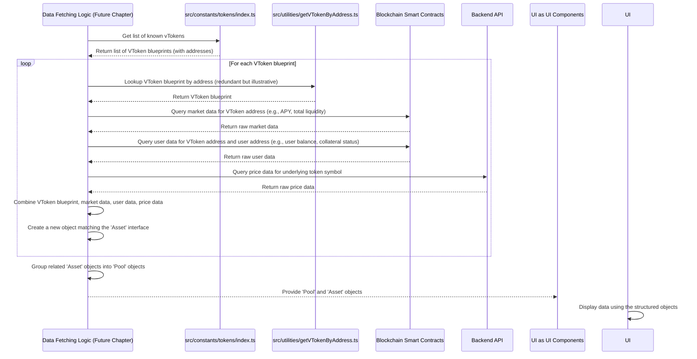

# Chapter 4: Tokens and Markets Data Structures

Welcome back! In the previous chapters, we've built a solid foundation: we know how to connect a user's wallet ([Chapter 1: Wallet & Authentication](01_wallet___authentication_.md)), how our application configures itself for the correct blockchain network ([Chapter 2: Application Configuration](02_application_configuration_.md)), and how to use Smart Contract Instances to talk to programs on that network ([Chapter 3: Smart Contract Instances](03_smart_contract_instances_.md)).

Now, let's shift our focus to the **data** itself. What kind of information do we need from the blockchain and APIs to display useful things to the user, like a list of assets they can supply or borrow, along with details like prices, interest rates, and their own balances?

This is where **Tokens and Markets Data Structures** come in.

### Organizing Blockchain Information for the UI

Imagine you're building a financial dashboard. You wouldn't just dump raw numbers onto the screen. You'd need to organize them: "Here's your checking account balance," "Here's your savings account balance," "Here's the interest rate on your mortgage."

Similarly, our dApp needs to represent the complex world of blockchain assets and lending markets in a structured way that's easy for our user interface (UI) to understand and display.

The core problem is: how do we take information like "the address of the USDC contract is 0x...; its balance in the lending pool is Y; the current supply APY for USDC is Z%; the user has W USDC in their wallet and has supplied V USDC to the pool, which is worth $U" and bundle it together logically?

The "Tokens and Markets Data Structures" are the **blueprints** (like interfaces or types in TypeScript) that define exactly how we will organize this information in our application's memory. They specify what pieces of data belong together and what format they should be in (e.g., is a balance a simple number or a special type for large blockchain numbers?).

The central use case for these structures is populating lists and tables that show the user available assets, their market data, and their personal position within those markets.

### Key Data Blueprints

Our project defines several key data structures to represent these concepts. They build upon each other to provide increasingly comprehensive views. Let's look at the main ones:

1.  **`Token`**: Represents a standard cryptocurrency token (like ETH, USDC, USDT).
2.  **`VToken`**: Represents the tokenized version of a standard token supplied to the lending protocol (like vETH, vUSDC, vUSDT).
3.  **`Asset`**: Combines information about a `VToken` and its underlying `Token` with *market data* (price, APY, liquidity) and *user-specific data* (user balances, collateral status). This is the comprehensive view for a single asset within a market.
4.  **`Pool`**: Represents a lending pool, which is a collection of `Asset`s, along with overall pool information.

Let's explore each one.

#### 1. The `Token` Blueprint

At its most basic, a `Token` is just a standard asset. We need a few key pieces of information to work with it:

*   **`symbol`**: The short ticker symbol (e.g., "ETH", "USDC").
*   **`decimals`**: How many decimal places the token uses (e.g., 18 for ETH, 6 for USDC). This is crucial for converting large blockchain numbers into human-readable amounts ([Chapter 7: Token Amount Utilities](07_token_amount_utilities_.md) will cover this).
*   **`address`**: The smart contract address of the token on the specific blockchain network. Essential for interacting with the token's contract ([Chapter 3: Smart Contract Instances](03_smart_contract_instances_.md)).
*   **`asset`**: Information for displaying an icon or image for the token.

This blueprint is defined in `src/types/index.ts`:

```typescript
// src/types/index.ts (simplified snippet)

export interface Token {
  symbol: string; // e.g., "ETH", "USDC"
  decimals: number; // e.g., 18, 6
  asset: string | StaticImageData; // Icon/image info
  address: string | ''; // Contract address on the blockchain
  isNative?: boolean; // Is this the chain's native token (like ETH)?
}
```

This `Token` interface is the simplest building block, defining the core properties of any token we care about.

#### 2. The `VToken` Blueprint

In our lending protocol, when a user supplies an asset (like USDC), they receive a corresponding "vToken" (like vUSDC). These vTokens represent their share of the supplied assets in the pool and earn interest.

A `VToken` is very similar to a `Token`, but with some specific characteristics of the protocol's tokenized assets. It also needs to know which *underlying* `Token` it represents (e.g., vUSDC represents USDC).

Defined in `src/types/index.ts`:

```typescript
// src/types/index.ts (simplified snippet)

export interface VToken extends Omit<Token, 'isNative' | 'asset'> {
  decimals: 8; // vTokens in this protocol often have 8 decimals
  underlyingToken: Token; // Reference to the standard Token this vToken represents
}
```

The `Omit<Token, ...>` part means `VToken` includes all properties from `Token` *except* `isNative` and `asset`. It then adds its own specific `decimals` value (often fixed for vTokens in a protocol) and a reference (`underlyingToken`) back to the `Token` it's based on.

#### 3. The `Asset` Blueprint

This is where things get more detailed. The `Asset` structure represents a single market within a pool (e.g., the USDC market in the main pool) and includes everything the UI needs to show about it, including live market data and the *connected user's* specific details for that asset.

Defined in `src/types/index.ts`:

```typescript
// src/types/index.ts (simplified snippet)

export interface Asset {
  vToken: VToken; // The vToken representing this asset in the protocol
  tokenPriceCents: BigNumber; // Price of the underlying token in USD cents
  liquidityCents: BigNumber; // Total liquidity available for this asset in USD cents
  borrowApyPercentage: BigNumber; // Annual Percentage Yield for borrowers
  supplyApyPercentage: BigNumber; // Annual Percentage Yield for suppliers
  // ... many other market-specific details (reserve factors, exchange rates, counts)

  // User-specific props (these are for the wallet connected in Chapter 1)
  userSupplyBalanceTokens: BigNumber; // How much of the underlying token the user has supplied (in token units)
  userSupplyBalanceCents: BigNumber; // User's supplied balance in USD cents
  userBorrowBalanceTokens: BigNumber; // How much of the underlying token the user has borrowed (in token units)
  userBorrowBalanceCents: BigNumber; // User's borrowed balance in USD cents
  userWalletBalanceTokens: BigNumber; // How much of the underlying token the user has in their wallet (in token units)
  userWalletBalanceCents: BigNumber; // User's wallet balance in USD cents
  userPercentOfLimit: number; // How much of their borrowing limit the user is using (%)
  isCollateralOfUser: boolean; // Is this asset enabled as collateral by the user?
}
```

The `Asset` structure is the most detailed. It takes the `VToken` info, adds various market statistics (fetched from smart contracts or APIs), and crucially includes the connected user's balances and settings related to *this specific asset*. This is the primary structure used to display rows in market lists. Notice the use of `BigNumber` for amounts – this is a common library for handling very large or very small numbers precisely, which is essential in blockchain development. ([Chapter 7: Token Amount Utilities](07_token_amount_utilities_.md) will discuss this further).

#### 4. The `Pool` Blueprint

Finally, a `Pool` represents a collection of these `Asset` markets. It holds general information about the pool itself and contains an array of `Asset` objects.

Defined in `src/types/index.ts`:

```typescript
// src/types/index.ts (simplified snippet)

export interface Pool {
  comptrollerAddress: string; // Address of the pool's main contract
  name: string; // e.g., "Main Pool"
  description: string; // A brief description
  isIsolated: boolean; // Is this an isolated lending pool?
  assets: Asset[]; // An array containing all the Asset markets in this pool

  // Optional user-specific pool totals
  userSupplyBalanceCents?: BigNumber;
  userBorrowBalanceCents?: BigNumber;
  userBorrowLimitCents?: BigNumber;
}
```

The `Pool` structure provides the top-level view, grouping related assets (`assets: Asset[]`) and providing overall pool details.

### How These Structures Are Used

These structures are the standard format for market and token data throughout the application. When data is fetched from smart contracts or APIs (something we'll cover in detail later), the raw responses are processed and *shaped* into objects that match these `Pool` and `Asset` interfaces.

For example, a component that displays a list of markets would receive an array of `Pool` objects. It could then loop through each `Pool`, access its `assets` array, and for each `Asset` in that array, display the `vToken.symbol`, `supplyApyPercentage`, `userSupplyBalanceTokens`, etc.

Here's a conceptual idea of how you might use an `Asset` object in a UI component (not real React code, just illustrating data access):

```typescript
// Imagine 'usdcAsset' is an object matching the 'Asset' interface
// that was fetched and processed elsewhere

// Accessing Token info via VToken
console.log(`Asset Symbol: ${usdcAsset.vToken.underlyingToken.symbol}`); // Output: "USDC"
console.log(`Asset Address: ${usdcAsset.vToken.underlyingToken.address}`); // Output: "0x..."

// Accessing Market Data
console.log(`Supply APY: ${usdcAsset.supplyApyPercentage.toFixed(2)}%`); // Output: "3.50%"
console.log(`Total Liquidity: $${usdcAsset.liquidityCents.div(100).toFixed(2)}`); // Output: "$123,456.78"

// Accessing User Data (for the connected wallet)
console.log(`User Supplied Balance: ${usdcAsset.userSupplyBalanceTokens.toFixed(usdcAsset.vToken.underlyingToken.decimals)}`); // Output: "1500.00" (assuming 6 decimals)
console.log(`User Wallet Balance: $${usdcAsset.userWalletBalanceCents.div(100).toFixed(2)}`); // Output: "$500.00"

if (usdcAsset.isCollateralOfUser) {
  console.log("This asset is being used as collateral.");
}
```

This example shows how, once you have an object adhering to the `Asset` structure, it's easy and predictable to access all the relevant information needed for display.

### Under the Hood: Defining and Populating Structures

These data structures are defined centrally in `src/types/index.ts`. This is the single source of truth for how market and token data should be organized.

Where does the *data* that fills these structures come from?

1.  **Static Token/VToken Info:** The basic properties like `symbol`, `decimals`, and `address` for known tokens and vTokens are often stored as constants in the application. The file `src/constants/tokens/index.ts` is responsible for loading and structuring this initial token information. It uses the application's configured `chainId` ([Chapter 2: Application Configuration](02_application_configuration_.md)) to look up the correct addresses from `constants/contracts/addresses/tokens.json` and `constants/contracts/addresses/zTokens.json`.

    ```typescript
    // src/constants/tokens/index.ts (simplified)
    import config from '@/config';
    import tokens from '@/constants/contracts/addresses/tokens.json'; // Token addresses by chainId
    import zTokens from '@/constants/contracts/addresses/zTokens.json'; // VToken addresses by chainId
    import { TOKEN_INFO } from '@/constants/tokens/common'; // Static info like symbols, decimals, assets
    import { ZTOKEN_INFO } from '@/constants/tokens/vBep'; // Static info for vTokens

    // Combine static info with addresses based on current chainId
    export const TOKENS = _.merge(TOKEN_INFO, _.mapValues(tokens, (address: any) => ({ address: address[config.chainId] })));
    export const VBEP_TOKENS = _.filter(_.merge(ZTOKEN_INFO, _.mapValues(zTokens, (address: any) => ({ address: address[config.chainId] }))), 'address');
    // VBEP_TOKENS is then keyed by address for easy lookup
    ```

    This code loads base token definitions and then adds the correct contract addresses based on the current network. `VBEP_TOKENS` specifically handles the vTokens (sometimes called zTokens in this project's context) and stores them in a way that makes it easy to find a `VToken` definition if you only have its address (which is useful when fetching data).

    The `src/utilities/getVTokenByAddress.ts` helper uses this:

    ```typescript
    // src/utilities/getVTokenByAddress.ts (simplified)
    import { VToken } from '@/types';
    import { VBEP_TOKENS } from '@/constants/tokens'; // Our list of VToken blueprints

    const getVTokenByAddress = (address: string) =>
      address.toLowerCase() in VBEP_TOKENS // Check if the address exists in our keyed list
        ? (VBEP_TOKENS[address.toLowerCase() as keyof typeof VBEP_TOKENS] as VToken) // Return the VToken object if found
        : undefined; // Return undefined if not found

    export default getVTokenByAddress; // Helper to get VToken blueprint by address
    ```

    This utility allows code to quickly retrieve the static blueprint for a `VToken` if it only has the vToken's smart contract address.

2.  **Live Market Data:** Properties like `tokenPriceCents`, `liquidityCents`, `borrowApyPercentage`, `supplyApyPercentage`, and total balances come from interacting with smart contracts ([Chapter 3: Smart Contract Instances](03_smart_contract_instances_.md)) or querying backend APIs.
3.  **Live User Data:** Properties like `userSupplyBalanceTokens`, `userBorrowBalanceTokens`, `userWalletBalanceTokens`, and `isCollateralOfUser` also come from smart contracts, specific to the connected user's address ([Chapter 1: Wallet & Authentication](01_wallet___authentication_.md)).

The process of combining static blueprints with live data looks something like this:



This diagram illustrates that the process involves taking the foundational `Token` and `VToken` blueprints (often loaded once) and then layering live market data (from contracts/APIs) and user-specific data (from contracts, using the user's address) on top to construct the full `Asset` and `Pool` structures that the UI consumes.

### Conclusion

In this chapter, we've learned about the fundamental data structures used to represent tokens and lending markets in our frontend application. We explored the `Token`, `VToken`, `Asset`, and `Pool` blueprints defined in `src/types/index.ts` and understood how they organize information from basic token properties to comprehensive market data and user-specific details. We also saw that these structures are populated by combining static configuration (like token addresses and base properties) with live data fetched from the blockchain and APIs, a process we'll delve into further in upcoming chapters.

Having these well-defined data structures is crucial because it provides a clear and consistent way for different parts of the application to understand and work with complex blockchain data.

Now that we understand the structure of the data, the next logical step is to learn *how* we efficiently fetch this data from the blockchain within a React application. This is where React Hooks come into play.

Let's move on to [Chapter 5: Contract React Hooks](05_contract_react_hooks_.md).

---

Generated by [AI Codebase Knowledge Builder](https://github.com/The-Pocket/Tutorial-Codebase-Knowledge)