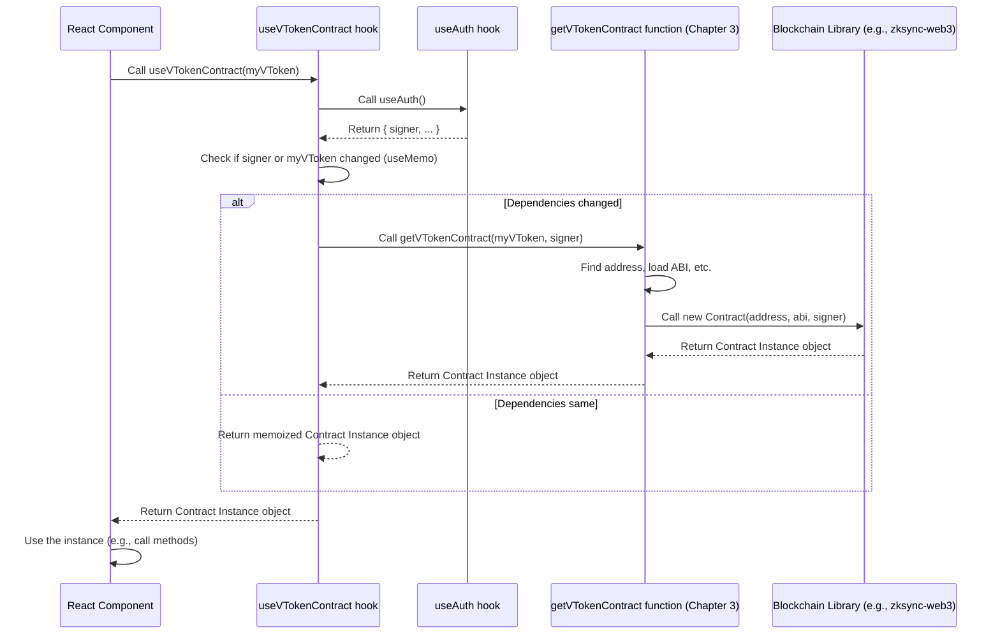

# Chapter 5: Contract React Hooks

Welcome back! We've covered a lot of ground. We know how to connect a user's wallet to get the tools needed to interact with the blockchain ([Chapter 1: Wallet & Authentication](01_wallet___authentication_.md)), how the application configures itself for the right network ([Chapter 2: Application Configuration](02_application_configuration_.md)), how to create **Smart Contract Instances** to talk to specific programs on the blockchain ([Chapter 3: Smart Contract Instances](03_smart_contract_instances_.md)), and how we structure the data we get back ([Chapter 4: Tokens and Markets Data Structures](04_tokens_and_markets_data_structures_.md)).

Now, let's bring these pieces together in a way that fits nicely within our React frontend application.

### The Problem: Repeatedly Getting Contract Instances

In [Chapter 3: Smart Contract Instances](03_smart_contract_instances_.md), we saw that to interact with a smart contract, you need to create a `Smart Contract Instance` using its address, ABI, and a `Provider` or `Signer`. If you needed to interact with the USDC token contract, you'd call a helper like `getTokenContract`, providing the USDC token's details and the current `signer` from the connected wallet.

```typescript
// Imagine this in a React component
import { useAuth } from '@/context/AuthContext'; // Get signer
import { getTokenContract } from '@/clients/contracts/getters'; // Helper function

const MyComponent = () => {
  const { signer } = useAuth(); // Get the signer from the connected wallet

  // PROBLEM: I need the USDC token details here...
  // const usdcToken = { ... USDC token info ... }; // How do I get this easily?

  // And I need to call getTokenContract here...
  // This could get repetitive if many components need the contract instance
  // const usdcContract = getTokenContract(usdcToken, signer);

  // ... then I would use usdcContract to read data or send transactions ...
};
```

If many different React components in your application need to interact with the same smart contract (like the main lending pool contract, or a specific token contract), you would have to repeat this process: import the helper, get the `signer` or `provider`, look up the contract details, and create the instance in *each* component. This leads to duplicated code and makes components harder to read and maintain.

Also, in React, you often want things to update automatically if the underlying data changes (like the connected wallet or network). Manually managing the contract instance based on `signer` changes would be tricky.

### The Solution: Contract React Hooks

This is where **Contract React Hooks** come in! They are custom React hooks designed specifically to solve this problem. They provide a clean, simple way for a React component to get a ready-to-use smart contract instance without worrying about the low-level details of fetching the `signer`, finding the address, loading the ABI, or calling the instance constructor.

Think of a Contract React Hook as a specialized "pre-dialed phone number" for a specific smart contract, ready for your component to make calls (read data) or send messages (transactions).

Instead of manually creating the instance:

```typescript
// Manual way (Chapter 3 style) - NOT ideal for React components
// const comptrollerContract = getComptrollerContract(signer);
```

You use a custom hook:

```typescript
// Using a Contract React Hook - THE preferred way in React components
import { useComptrollerContract } from '@/clients/contracts'; // Import the hook

const MyComponent = () => {
  // Simply call the hook!
  const comptrollerContract = useComptrollerContract();

  // Now 'comptrollerContract' is a ready-to-use instance for the main pool contract.
  // You can use it to call contract methods (which we'll do in the next chapter!).
};
```

This is much cleaner! The hook handles all the complexity internally.

### Core Use Case: Getting a VToken Contract Instance

Let's revisit our example from [Chapter 4: Tokens and Markets Data Structures](04_tokens_and_markets_data_structures_.md): working with VTokens (like vUSDC). Suppose a component needs to interact with the vUSDC contract to check its configuration or call one of its specific functions.

Instead of getting the USDC `Token` blueprint, finding the corresponding vUSDC `VToken` blueprint, getting the `signer`, and manually calling `getVTokenContract`, we can use the dedicated hook: `useVTokenContract`.

```typescript
import { VToken } from '@/types'; // Need the VToken type
import { useVTokenContract } from '@/clients/contracts'; // Import the hook

interface MyComponentProps {
  vToken: VToken; // This component needs to know WHICH vToken to use
}

const MyComponent: React.FC<MyComponentProps> = ({ vToken }) => {
  // ✅ Simple: Just pass the VToken object to the hook
  const vTokenContract = useVTokenContract(vToken);

  // Now 'vTokenContract' is an instance of the smart contract
  // for the specific VToken passed into the component.
  // We can now call methods like vTokenContract.supplyRatePerBlock()
  // (Data fetching with these instances is in the next chapter!)

  return (
    // ... component UI using the vToken data ...
    <div>
      Working with {vToken.underlyingToken.symbol} contract...
    </div>
  );
};
```

In this component, we simply receive the `vToken` data structure (which contains its address, ABI reference, etc.) and pass it directly to `useVTokenContract`. The hook does the rest. The component gets the `vTokenContract` instance back and can use it.

### How Contract Hooks Work (Under the Hood)

Contract React Hooks combine concepts from previous chapters:

1.  They are React Hooks, meaning they follow the rules of hooks (can only be called inside React function components or other custom hooks).
2.  They use the `useAuth` hook (from [Chapter 1: Wallet & Authentication](01_wallet___authentication_.md)) to automatically get the current `signer` (or `provider` if the wallet is connected but not specifically asking for signed transactions).
3.  They use the getter functions (like `getVTokenContract`, `getComptrollerContract`, etc., which we saw in [Chapter 3: Smart Contract Instances](03_smart_contract_instances_.md)) to actually create the smart contract instance.
4.  They often use `useMemo` to ensure the contract instance isn't recreated unnecessarily on every render, only when dependencies (like the `signer` or the specific token/address) change.

Here's a simplified flow when a component calls `useVTokenContract(myVToken)`:



The core idea is that the hook acts as a simple wrapper that handles getting the necessary context (the `signer`) and calling the lower-level function (`getVTokenContract`) to produce the instance, returning it to the component.

### Looking at the Code

The Contract React Hooks are defined in `src/clients/contracts/hooks.ts`.

Let's look at `useVTokenContract` again:

```typescript
// src/clients/contracts/hooks.ts (snippet)
import { useMemo } from 'react'; // React hook
import { VToken } from '@/types'; // VToken data structure

import { useAuth } from '@/context/AuthContext'; // Hook from Chapter 1
import { Signer } from 'zksync-web3'; // Type for the signer

import { getVTokenContract } from './getters'; // Function from Chapter 3

export const useVTokenContract = (vToken: VToken) => {
  // 1. Use the useAuth hook to get the current signer
  const { signer } = useAuth();

  // 2. Use useMemo to create the contract instance efficiently
  const vTokenContract = useMemo(
    // Create the instance using the getter function
    () => getVTokenContract(vToken, signer as Signer | undefined),
    // The instance should be recreated ONLY if signer or vToken changes
    [signer, vToken]
  );

  // 3. Return the contract instance
  return vTokenContract;
};
```

This simple hook demonstrates the pattern:
1.  It calls `useAuth()` to get the `signer`.
2.  It calls `getVTokenContract()` (from [Chapter 3: Smart Contract Instances](03_smart_contract_instances_.md)) passing the `vToken` object and the `signer`.
3.  It wraps this logic in `useMemo` with `[signer, vToken]` as dependencies. This tells React: "Run the `getVTokenContract` function only if the `signer` or the `vToken` object has changed since the last time. Otherwise, just give me the instance you created before." This is a performance optimization.
4.  It returns the resulting contract instance.

Other hooks follow a similar pattern:

```typescript
// src/clients/contracts/hooks.ts (snippet)
import { useMemo } from 'react';
import { Token } from '@/types';

import { useAuth } from '@/context/AuthContext';
import { Signer } from 'zksync-web3';

import { getTokenContract, getComptrollerContract } from './getters';

export const useTokenContract = (token: Token) => {
  const { signer } = useAuth();
  return useMemo(
    () => getTokenContract(token, signer as Signer | undefined),
    [signer, token]
  );
};

// Note: The Comptroller contract address is looked up inside getComptrollerContract
export const useComptrollerContract = (address?: string) => {
  const { signer } = useAuth();
  return useMemo(
    // getComptrollerContract might need the address passed or look it up from config
    () => getComptrollerContract(address, signer as Signer | undefined),
    [signer, address] // Dependency includes address if passed
  );
};

// ... other contract hooks like useVenusLensContract follow the same pattern
```

These hooks are the standard way components interact with smart contracts in this project. They provide a consistent, easy-to-use interface (`use...Contract`) that abstracts away the underlying complexity and fits perfectly within the React component model.

### Conclusion

In this chapter, we learned about **Contract React Hooks**. We saw that they are convenient custom hooks that simplify getting a smart contract instance within a React component. They automatically handle obtaining the user's `signer` (or `provider`) from the wallet connection ([Chapter 1: Wallet & Authentication](01_wallet___authentication_.md)) and using the appropriate getter function ([Chapter 3: Smart Contract Instances](03_smart_contract_instances_.md)) with the correct address (often derived from data structures like `Token` or `VToken` from [Chapter 4: Tokens and Markets Data Structures](04_tokens_and_markets_data_structures_.md)) and ABI. By providing a ready-to-use contract instance, these hooks make our components cleaner, more readable, and easier to maintain.

Now that our components can easily get instances of the smart contracts they need to interact with, the next logical step is to learn how to use these instances to actually fetch data from the blockchain and display it in the UI. This is where sophisticated data fetching techniques come in.

Let's move on to [Chapter 6: Data Fetching (React Query Queries)](06_data_fetching__react_query_queries__.md).

---

Generated by [AI Codebase Knowledge Builder](https://github.com/The-Pocket/Tutorial-Codebase-Knowledge)