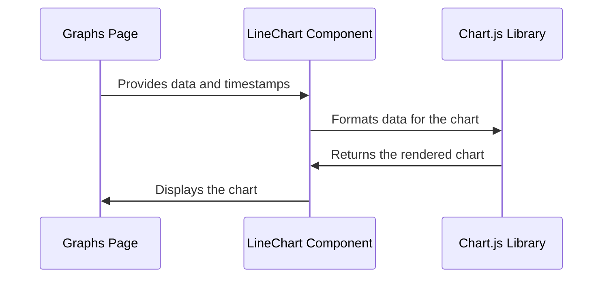

# Chapter 5: Data Visualization

Following our exploration of [Data Streaming and Processing](04_data_streaming_and_processing.md), where we learned how to prepare the data coming from our Polar sensors, this chapter focuses on how we visualize that processed data.  Think of it as turning the filtered water from our "smart pipe" into beautiful ice sculptures – making the data visually appealing and easy to understand.

Our central use case will be displaying the processed ECG data on a line graph, showing how the user's heart rate changes over time.

## Why Data Visualization?

Imagine trying to understand the quality of your filtered water by looking at a table of numbers.  It would be difficult to see trends and patterns. A graph of those numbers, however, could quickly show if the water quality is improving or worsening. Similarly, data visualization helps us see trends and patterns in our processed data, allowing us to quickly grasp the information.

## Key Concepts: Charts and Components

1. **Charts:**  These are the visual representations of our data, like our ice sculptures. We use a library called `react-chartjs-2`, which provides pre-built charts like line graphs, bar charts, and more.

2. **Components:**  These are reusable building blocks of our application. Our `LineChart` component is a wrapper around `react-chartjs-2`'s line chart, making it easy to display data in our application. It takes the processed data and formats it in a way the chart understands.


## Displaying ECG Data: Putting It All Together

Let's look at how we use our `LineChart` component in `graphs/page.js`:

```javascript
// ... other code ...
import LineChart from "./graphComponent"; // Import our LineChart component
// ... other code ...

return (
    // ... other code ...
    <LineChart
        dataValues={preparedNonACCData.slice(nonACCIndices[0], nonACCIndices[1])}
        timestamps={timestamps.slice(nonACCIndices[0], nonACCIndices[1])}
        index_offset={nonACCIndices[0]}
    />
    // ... other code ...
);
```

This code snippet shows how we use the `LineChart` component. We pass the `preparedNonACCData` (which contains our processed ECG data), `timestamps` (for the x-axis), and an `index_offset` to help account for only visualizing the last 1000 elements. The `LineChart` component takes care of displaying this data as a line graph.

## Inside the `LineChart` Component (`graphs/graphComponent.js`)

```javascript
// ... other code ...
const LineChart = ({ dataValues, timestamps, index_offset, title }) => {
  // ... sampling logic ...

  const data = {
    labels: sampledIndices, // x-axis labels (indices)
    datasets: [
      {
        label: title,        // Chart title
        data: sampledData,   // y-axis data (ECG values)
        // ... styling options ...
      },
    ],
  };

  // ... chart options ...

  return <Line data={data} options={options} />; // Render the line chart
};
```
The `LineChart` component receives the data and formats it for the `react-chartjs-2` library. It creates labels for the x-axis using the indices and sets up the data for the y-axis using the provided ECG values. It also handles styling options, like the color and width of the line. Finally, it renders the line chart using `<Line data={data} options={options} />`.


## Under the Hood: How Data Visualization Works

Let's use a sequence diagram to illustrate the process:



1. The `GraphsPage` provides the processed data and timestamps to the `LineChart` component.
2. The `LineChart` component formats the data and passes it to the `Chart.js` library.
3. The `Chart.js` library renders the chart and returns it to the `LineChart` component.
4. The `LineChart` component displays the chart on the `GraphsPage`.


## Conclusion

In this chapter, we learned how to visualize processed data using the `LineChart` component and the `react-chartjs-2` library. We saw how easy it is to display ECG data as a line graph, making it easier to understand patterns and trends in the data. We've successfully transformed our filtered water into a beautiful and informative ice sculpture!

Next, we'll delve into the `dataTrace` object, which acts as the storage for our incoming and processed data - move on to [Data Trace (dataTrace)](06_data_trace__datatrace_.md).


---

Generated by [AI Codebase Knowledge Builder](https://github.com/The-Pocket/Tutorial-Codebase-Knowledge)