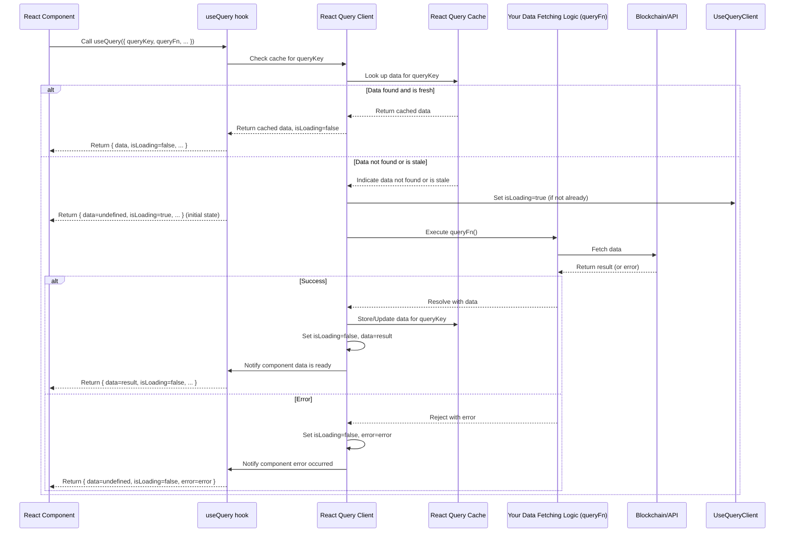

# Chapter 6: Data Fetching (React Query Queries)

Welcome back! In our journey so far, we've established a strong connection to the blockchain: we know how to link a user's wallet ([Chapter 1: Wallet & Authentication](01_wallet___authentication_.md)), configure our application for the correct network ([Chapter 2: Application Configuration](02_application_configuration_.md)), get handy Smart Contract Instances to talk to specific programs ([Chapter 3: Smart Contract Instances](03_smart_contract_instances_.md)), structure the data we expect to receive ([Chapter 4: Tokens and Markets Data Structures](04_tokens_and_markets_data_structures_.md)), and use convenient React Hooks to easily get these contract instances within our components ([Chapter 5: Contract React Hooks](05_contract_react_hooks_.md)).

Now that we have the tools to talk to smart contracts and know how we want to structure the information, the next crucial step is actually **getting the data** from the blockchain or backend APIs and displaying it in our application's user interface.

### The Problem: Managing Asynchronous Data in React

Fetching data from external sources (like a blockchain node or an API server) is an **asynchronous** operation. This means you ask for the data, and it doesn't appear immediately. You have to wait for the network request to complete.

In a React application, managing this asynchronous data can quickly become complicated. For a single piece of data, you need to handle:

1.  **Loading State:** What to show the user while waiting for the data? (e.g., a spinner)
2.  **Success State:** How to display the data once it arrives?
3.  **Error State:** What to show if something goes wrong? (e.g., a "Failed to load" message)
4.  **Refreshing Data:** How to refetch the data when something changes (like the user's address or the block number)?
5.  **Caching:** Should we remember the data we just fetched so we don't have to fetch it again immediately if the user navigates away and comes back? This makes the app feel faster.
6.  **Background Updates:** Can we automatically update the data in the background periodically or when the app regains focus, to keep the UI fresh?

Manually handling all these states and behaviors in every component that needs data leads to repetitive, complex, and error-prone code.

### The Solution: React Query (for Queries)

This is precisely the problem that **React Query** (specifically, the `@tanstack/react-query` library used in this project) solves for *reading* data.

Think of React Query as a **smart data-fetching assistant** for your React components. Instead of your components directly dealing with the waiting, error handling, and refreshing logic, they just tell the assistant: "Hey, I need *this specific piece of data*," and the assistant takes care of everything else.

React Query automatically:

*   Manages loading, error, and success states.
*   Caches the data it fetches, so if another part of your app (or the same part later) asks for the *exact same data*, it can provide it instantly from its memory, only fetching again if necessary.
*   Refetches data in the background when needed (e.g., when the component mounts, when a certain time passes, or when the user's network status changes).

This dramatically simplifies your React components. They no longer need `useState` for loading/error states or `useEffect` for fetching logic. They just use a React Query **hook** and receive the data and its status.

In React Query, the term for reading data is a **"Query"**.

### How to Use React Query for Data Fetching (Queries)

The primary way to use React Query for fetching data in a React component is using the `useQuery` hook.

The `useQuery` hook needs two main things:

1.  **`queryKey`**: A **unique identifier** for the data you want to fetch. This is super important because React Query uses this key for caching, refetching, and sharing data between different parts of your application. The key is typically an array, and it should include anything that makes the data unique. For example, fetching a user's balance for a specific token requires the user's address and the token's address. So, the `queryKey` might look something like `['balanceOf', userAddress, tokenAddress]`. If `userAddress` or `tokenAddress` changes, React Query knows it's a *different* query and will fetch new data.
2.  **`queryFn`**: An **asynchronous function** that performs the actual data fetching. This function is where you put the code that calls your API or interacts with a smart contract ([Chapter 3: Smart Contract Instances](03_smart_contract_instances_.md) / [Chapter 5: Contract React Hooks](05_contract_react_hooks_.md)). It *must* return a Promise that resolves with the data.

Let's look at a simple conceptual example: Fetching the connected user's balance of a specific token. This builds on previous chapters.

```typescript
// src/components/MyTokenBalanceDisplay.tsx (Conceptual Example)
import { useQuery } from '@tanstack/react-query'; // The React Query hook
import { useAuth } from '@/context/AuthContext'; // From Chapter 1 (for user address and provider)
import { useTokenContract } from '@/clients/contracts'; // From Chapter 5 (to get contract instance)
import { Token } from '@/types'; // From Chapter 4 (the token data structure)
import FunctionKey from '@/constants/functionKey'; // A constant for query keys

interface MyTokenBalanceDisplayProps {
  token: Token; // The token we want the balance for
}

const MyTokenBalanceDisplay: React.FC<MyTokenBalanceDisplayProps> = ({ token }) => {
  // 1. Get the connected user's address and the provider
  const { accountAddress, provider } = useAuth();

  // 2. Get the smart contract instance for the token using the hook from Chapter 5
  // This instance uses the provider from useAuth to read data
  const tokenContract = useTokenContract(token);

  // 3. Use React Query's useQuery hook to fetch the balance
  const { data: balance, isLoading, error } = useQuery({
    // a. Define the unique query key
    queryKey: [
      FunctionKey.GET_BALANCE_OF, // A constant name for this type of query
      accountAddress,             // Include user address
      token.address,              // Include token address
      // Including 'provider' is also good practice as it could theoretically change
      provider?.network.chainId,  // Include network/chainId from Chapter 2
    ],

    // b. Define the function that fetches the data
    queryFn: async () => {
      // Make sure we have a contract instance and an address before fetching
      if (!tokenContract || !accountAddress) {
        // React Query will automatically mark this query as disabled until these are available
        return undefined;
      }
      // Call the balanceOf method on the smart contract instance
      const balanceWei = await tokenContract.balanceOf(accountAddress);
      // The result (balanceWei) will be stored in the cache and returned by the hook
      return balanceWei; // This is a BigNumber, we'll format it in Chapter 7
    },

    // c. Configure the query (optional but common)
    // Only enable the query if we have an account address and a contract instance
    enabled: !!accountAddress && !!tokenContract,

    // d. Set a stale time (how long data is considered "fresh")
    // staleTime: 10000, // Example: data is fresh for 10 seconds
    // The application sets a default stale time in the QueryClient configuration
  });

  // 4. Render based on the query status
  if (isLoading) {
    return <div>Loading balance...</div>;
  }

  if (error) {
    console.error("Error fetching balance:", error);
    return <div>Error loading balance</div>;
  }

  // Assuming 'balance' is available here
  return (
    <div>
      {token.symbol} Balance: {balance ? balance.toString() : 'N/A'}
      {/* We'll format this BigNumber properly in Chapter 7 */}
    </div>
  );
};

export default MyTokenBalanceDisplay;
```

Let's break down the `useQuery` call in this example:

*   `queryKey`: `[FunctionKey.GET_BALANCE_OF, accountAddress, token.address, provider?.network.chainId]`
    *   `FunctionKey.GET_BALANCE_OF`: A constant (`'GET_BALANCE_OF'`) used as a base name for this type of query. This helps organize query keys. This comes from `src/constants/functionKey.ts`.
    *   `accountAddress`: Includes the user's address. If the user disconnects or connects a different wallet, the address changes, and React Query knows to refetch the balance for the *new* address.
    *   `token.address`: Includes the token's contract address. If the component needed to display a *different* token's balance, this part of the key would change, again triggering a new fetch.
    *   `provider?.network.chainId`: Including the chain ID (from [Chapter 2: Application Configuration](02_application_configuration_.md)) ensures that if the application switches networks, React Query fetches data for the *new* network.
    *   This array structure ensures that each unique combination of balance request (which user, which token, on which network) has its own entry in React Query's cache.
*   `queryFn`: The `async () => { ... }` function. This is where we use the `tokenContract` instance (obtained via the hook from [Chapter 5: Contract React Hooks](05_contract_react_hooks_.md)) and call its `balanceOf` method, passing the `accountAddress`. The result of this async function is what React Query caches and provides in the `data` variable.
*   `enabled`: `!!accountAddress && !!tokenContract`. This is a crucial option for blockchain apps. It tells React Query *not* to run the `queryFn` until `accountAddress` and `tokenContract` are available (i.e., until a wallet is connected and the contract instance is ready). This prevents errors trying to fetch data before the necessary dependencies are met.
*   Return Value: The hook returns an object `{ data, isLoading, error }`. We use `isLoading` to show a loading message, `error` to show an error message, and `data` (which we renamed to `balance` using object destructuring `data: balance`) to display the fetched balance once available.

This pattern (`useQuery` with a descriptive key and an async function using contract instances/APIs) is the standard way data is read throughout the application.

### Under the Hood: The React Query Flow

When you call `useQuery` in a component, here's a simplified view of what React Query does:



This diagram illustrates how React Query acts as an intermediary, managing the cache, tracking loading/error states, and executing your fetching function (`queryFn`) when needed.

### The QueryClient

All this magic is orchestrated by a central `QueryClient` instance. This instance holds the entire cache and configuration for React Query. It needs to be provided to your React application so that `useQuery` hooks everywhere can access it.

In this project, the `QueryClient` is set up once near the root of the application. You can see its configuration in files like `src/clients/queryClient.ts` and `src/app/get-query-client.ts`.

```typescript
// src/clients/queryClient.ts (simplified)
import { QueryClient } from '@tanstack/react-query';

const queryClient = new QueryClient({
  defaultOptions: {
    queries: {
      // Data is considered fresh for 10 seconds after fetching.
      // After 10 seconds, it's "stale". React Query might show stale data
      // immediately but will refetch in the background if the query is active.
      staleTime: 10000,
    },
    // ... other configurations for mutations (Chapter 8)
  },
});

export default queryClient; // Export this instance
```

This `QueryClient` is then used higher up in the component tree to provide the context for all `useQuery` calls within the application. The `staleTime` option is one example of how the `QueryClient` provides default behavior for queries.

### Custom Query Hooks

While you *can* call `useQuery` directly in your components as shown in the `MyTokenBalanceDisplay` example, it's common and recommended in larger applications to create **custom hooks** that wrap `useQuery`.

These custom hooks encapsulate the specific `queryKey` and `queryFn` logic for a particular piece of data. This makes components even cleaner, as they only need to call `useMyDataHook()` and receive the `data`, `isLoading`, and `error` directly.

For example, instead of the component calling `useQuery(...)`, we can create a `useGetBalanceOf` hook:

```typescript
// src/clients/api/queries/getBalanceOf/useGetBalanceOf.ts (Conceptual Simplified)
import { useQuery, QueryObserverOptions } from '@tanstack/react-query';
import { useAuth } from '@/context/AuthContext'; // From Chapter 1
import { useTokenContract } from '@/clients/contracts'; // From Chapter 5
import { Token } from '@/types'; // From Chapter 4
import FunctionKey from '@/constants/functionKey'; // Query key constants

// This function will be the actual queryFn
import getBalanceOf from './index'; // The file containing the raw fetching logic

// Define the input and output types (optional but good practice)
interface GetBalanceOfInput {
  provider: any; // Provider from wallet
  tokenAddress: string;
  ownerAddress: string;
}

interface GetBalanceOfOutput {
  balance: any; // Use a proper type like BigNumber here
}

// Define options type for hook users
type Options = QueryObserverOptions<
  GetBalanceOfOutput, // Data type
  Error, // Error type
  GetBalanceOfOutput, // Selector output type (often same as data)
  GetBalanceOfOutput, // Initial data type
  [FunctionKey.GET_BALANCE_OF, string, string, number | undefined] // Exact type of queryKey
>;


export const useGetBalanceOf = (token: Token, options?: Options) => {
  // Get dependencies using other hooks
  const { accountAddress, provider } = useAuth();
  const tokenContract = useTokenContract(token);

  // Define the query key based on inputs
  const queryKey = [
    FunctionKey.GET_BALANCE_OF,
    accountAddress,
    token.address,
    provider?.network.chainId,
  ] as const; // 'as const' helps TypeScript infer the exact type

  // Define the query function - it calls the core logic function
  const queryFn = () =>
    getBalanceOf({ // This function is defined elsewhere and just does the network call
      provider,
      tokenAddress: token.address,
      ownerAddress: accountAddress!, // We know accountAddress is available due to 'enabled'
    });

  // Use the standard useQuery hook internally
  return useQuery({
    queryKey,
    queryFn,
    // Only enable the query if accountAddress and tokenContract are ready
    enabled: !!accountAddress && !!tokenContract,
    // Pass through any options provided by the component using this hook
    ...(options || {}),
  });
};

// src/clients/api/queries/getBalanceOf/index.ts (Conceptual Simplified)
// This file contains the actual function that talks to the blockchain
import { Contract, Provider } from 'zksync-web3'; // Or ethers
import erc20Abi from '@/constants/contracts/abis/erc20.json'; // The ABI

interface GetBalanceOfInput {
  provider: Provider | undefined;
  tokenAddress: string;
  ownerAddress: string;
}

interface GetBalanceOfOutput {
  balance: any; // BigNumber
}

const getBalanceOf = async ({
  provider,
  tokenAddress,
  ownerAddress,
}: GetBalanceOfInput): Promise<GetBalanceOfOutput> => {
  if (!provider || !tokenAddress || !ownerAddress) {
    // This case is largely handled by the 'enabled' option in the hook,
    // but good practice to check inputs.
    throw new Error('Missing required inputs for getBalanceOf');
  }

  // Create a contract instance using the provided provider
  // Note: We could also use the getContract helper from Chapter 3 directly here
  const contract = new Contract(tokenAddress, erc20Abi, provider);

  // Call the contract method
  const balance = await contract.balanceOf(ownerAddress);

  // Return the formatted result
  return { balance };
};

export default getBalanceOf;
```

Now, the component becomes even simpler:

```typescript
// src/components/MyTokenBalanceDisplay.tsx (Using custom hook)
import { useGetBalanceOf } from '@/clients/api/queries/getBalanceOf/useGetBalanceOf'; // Import the custom hook
import { Token } from '@/types'; // From Chapter 4

interface MyTokenBalanceDisplayProps {
  token: Token;
}

const MyTokenBalanceDisplay: React.FC<MyTokenBalanceDisplayProps> = ({ token }) => {
  // ✅ Simple: Just call the custom hook, passing the necessary inputs (the token)
  const { data: balance, isLoading, error } = useGetBalanceOf(token);

  // Render based on the query status (same as before)
  if (isLoading) {
    return <div>Loading balance...</div>;
  }

  if (error) {
    console.error("Error fetching balance:", error);
    return <div>Error loading balance</div>;
  }

  return (
    <div>
      {token.symbol} Balance: {balance ? balance.toString() : 'N/A'}
    </div>
  );
};

export default MyTokenBalanceDisplay;
```

This is the standard pattern you'll see throughout the `src/clients/api/queries` directory: a directory for each query, containing the raw fetching logic (`index.ts`) and a custom hook that wraps `useQuery` and the raw logic (`useGet...Query.ts`). This keeps the fetching logic separate from the React component concerns.

You can see many examples of these custom hooks in `src/clients/api/index.ts` under the `Queries` section, like `useGetMainAssetsInAccount`, `useGetAllowance`, `useGetTokenBalances`, etc.

Even a very simple query like fetching the current blockchain block number follows this pattern (`src/clients/api/queries/getBlockNumber`). The raw function `getBlockNumber` takes a `provider` and calls `provider.getBlockNumber()`, and the `useGetBlockNumber` hook wraps this with `useQuery`, setting the `queryKey` and `queryFn`. It also configures `refetchInterval` using `BLOCK_TIME_MS` (from `src/constants/zk.ts`), which tells React Query to automatically refetch the block number every few seconds to keep it updated in the UI.

### Conclusion

In this chapter, we've learned how to efficiently fetch read-only data from the blockchain and APIs using **React Query Queries**. We saw that React Query acts as a smart assistant, handling the complexities of asynchronous data like loading states, errors, caching, and background refetching automatically. We learned how to use the core `useQuery` hook with its essential `queryKey` and `queryFn`, and how this integrates with our previous concepts of wallet connection ([Chapter 1](01_wallet___authentication_.md)), application configuration ([Chapter 2](02_application_configuration_.md)), smart contract instances ([Chapter 3](03_smart_contract_instances_.md)), and contract React hooks ([Chapter 5](05_contract_react_hooks_.md)). Finally, we saw how custom query hooks (`useGet...` hooks) provide a clean abstraction layer for specific data fetching tasks.

With our data fetched, it often arrives in large, raw formats (like `BigNumber` from the blockchain). The next step is to learn how to easily convert these raw values into human-readable amounts for display in the UI.

Let's move on to [Chapter 7: Token Amount Utilities](07_token_amount_utilities_.md).

---

Generated by [AI Codebase Knowledge Builder](https://github.com/The-Pocket/Tutorial-Codebase-Knowledge)