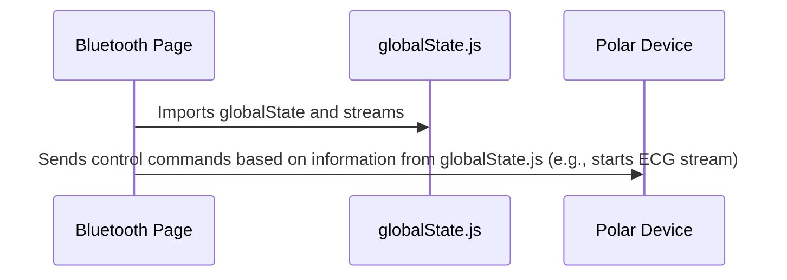

# Chapter 7: Global State (`globalState.js`)

Following our discussion on the [Data Trace (`dataTrace`)](06_data_trace__datatrace_.md), where we learned how our application stores incoming data, this chapter focuses on `globalState.js`.  Think of `globalState.js` as a central control panel in our smart house, holding the default settings and specifications for our smart appliances.  It keeps track of things like which sensor streams are available on each device and the specific commands needed to control them.

Our central use case will be understanding how the `globalState.js` file stores the information needed to connect to and control a Polar H10 heart rate sensor.

## Why `globalState.js`?

Imagine you have a manual for each of your smart appliances.  Instead of flipping through separate manuals every time you want to use a device, wouldn't it be more convenient to have a central control panel that displays all the essential information?  `globalState.js` does just that for our app. It keeps all the configuration details for our Polar sensors in one place, making them easily accessible from anywhere in the code.

## Key Concept: A JavaScript Object as the Control Panel

`globalState.js` is a JavaScript object – think of it as a container with labeled compartments.  Each compartment holds specific information about the app's configuration.

## Controlling a Polar H10: Using the Control Panel

Let's look at how `globalState.js` helps us control a Polar H10:

### 1. Accessing Device Information

```javascript
// ... other code ...
import { globalState, streams } from '../../utils/globalState';
// ... other code ...

const deviceType = name.split(" ")[1];
obj[num] = structuredClone(globalState.devices[deviceType]); //Clone relevant device settings
// ... other code ...

```

This snippet from `bluetooth/page.js` imports the `globalState` object. After a device is added, we access the relevant information from our Global State via `globalState.devices`. This line retrieves the specific settings and stream information for the connected Polar device, based on its type (H10, Sense, etc.).  These settings determine what happens when the device connects, such as turning on a specific stream, initializing a worker, or performing specific error handling. 

### 2. Accessing Stream Information

```javascript
// ... other code ...
async function connectStream(isChecked, outputSelected, deviceSelected){
    let stream = streams[outputSelected]
    // ... other code using stream information to connect ...
}
// ... other code ...
```

This snippet, also from `bluetooth/page.js`, shows how we use the `streams` object from `globalState.js` to access information about a specific data stream (like ECG or PPG).  This information is then used to correctly connect to the chosen stream on the Polar H10.  `streams` holds the control codes required to activate or deactivate each data stream.

## Under the Hood: How `globalState.js` Works

`globalState.js` is simply a JavaScript object exported for use in other components.  It's directly accessed by importing it like this:  `import { globalState } from '../../utils/globalState';`.  Let's see how this works when the app connects to a Polar H10. The relevant variables and constants are also defined within `globalState.js`, such as the list of available sensor streams.



1. The `bluetooth/page.js` component imports `globalState` and `streams`.
2. When the user connects to a Polar H10, the app uses information from `globalState.js` to determine which commands to send to the Polar H10. This information includes the device's available streams (`globalState.devices.H10.output`) and the commands needed to start or stop those streams from `streams`.

## Internal Implementation

Let's look inside `utils/globalState.js`:

```javascript
// ... other code ...
export const globalState = {
    // ... other properties ...
    devices: {
        "H10": {output: ["ECG","ACC_H10"]},
        "Sense": {output: ["ECG", "PPG", "ACC_Sense", "SDK"]},
        // ... more devices can be added here ...
    },
};

export const streams = {
    ECG: { id: 0x00, code_start: [0x01, 0x00, 0x10, 0x00, 0x01, 0x01, 0x04, 0x00, 0x3c, 0x00], code_stop: [0x00] },
    // ... other stream configurations ...
};
// ... other code ...
```

This simplified snippet shows how `globalState.js` stores the configurations.  The `devices` object defines available streams for each Polar sensor model. The `streams` object defines control codes and other relevant information for each data stream. Note that sample rates and ranges are hard coded here, but this is not a limitation of the software and may be updated in future releases. Any constants may be moved out into this file.

## Conclusion

This chapter explained how `globalState.js` acts as our central control panel, holding constant configuration settings. You learned how it helps manage different Polar device types and how it provides easy access to important control codes. This centralized approach makes our code more organized and maintainable.

Next, we will explore the [Helper Functions (`helpers.jsx`)](08_helper_functions__helpers_jsx_.md), where we will learn the functions needed to process raw data streaming from the connected Bluetooth devices.


---

Generated by [AI Codebase Knowledge Builder](https://github.com/The-Pocket/Tutorial-Codebase-Knowledge)