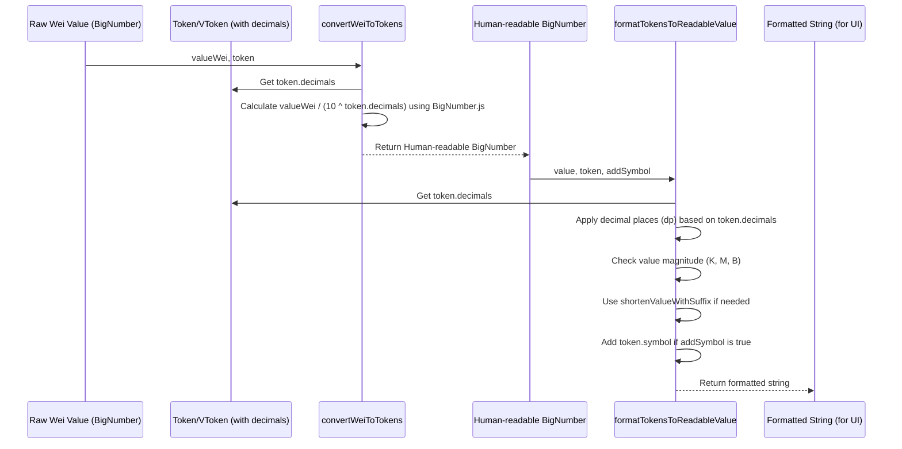

# Chapter 7: Token Amount Utilities

Welcome back! In [Chapter 6: Data Fetching (React Query Queries)](06_data_fetching__react_query_queries__.md), we learned how to use React Query to efficiently fetch data, like token balances, from the blockchain and APIs. This data arrives in our application as raw numbers. However, these blockchain numbers aren't typically in a format that's easy for humans to read directly.

This is where **Token Amount Utilities** come in.

### The Problem: Blockchain Numbers vs. Human Numbers

Imagine you fetch a user's balance for a token like USDC. The blockchain stores this balance in the smallest possible unit, often called "Wei" (a term originally from Ethereum, but the concept applies across many chains). For USDC, which has 6 decimal places, a balance of 10.5 USDC is stored as `10,500,000` in the blockchain's internal unit. For a token like ETH, with 18 decimals, a balance of 1.23 ETH is stored as `1,230,000,000,000,000,000`.

These numbers are huge and difficult for users to understand. If our UI showed "You have 10500000" instead of "You have 10.5 USDC", it would be very confusing!

Furthermore, when a user wants to *input* an amount, say they want to transfer 50 USDC, they will type "50". Our application needs to convert this human-readable input back into the blockchain's smallest unit (`50,000,000` for 50 USDC) before sending it in a transaction.

Finally, even after converting to a human-readable decimal number, we might need to format it nicely for display – maybe add a currency symbol ($ or the token symbol), round it to a specific number of decimal places, or shorten very large numbers (like displaying "1.5M" instead of "1,500,000").

The "Token Amount Utilities" abstraction solves all these problems.

### What are Token Amount Utilities?

Token amount utilities are a set of helper functions designed to:

1.  Convert amounts from the blockchain's smallest unit (like Wei) to human-readable decimal numbers, correctly accounting for the token's `decimals` property ([Chapter 4: Tokens and Markets Data Structures](04_tokens_and_markets_data_structures_.md)).
2.  Convert amounts from human-readable decimal numbers (like user input) back into the blockchain's smallest unit.
3.  Format human-readable numbers for clear display in the UI (adding symbols, handling large/small values, controlling decimal places).

These utilities are indispensable for making your dApp's numbers understandable and user-friendly.

### Handling Large Numbers Precisely: BigNumber.js

Before we look at the utilities, it's important to understand that standard JavaScript numbers can't handle the very large integers often used in blockchain amounts precisely. A balance of `1,230,000,000,000,000,000` (1.23 ETH in Wei) is larger than JavaScript's maximum safe integer. Using standard arithmetic (`/ 10**18`) would lead to rounding errors.

To solve this, blockchain applications commonly use libraries for arbitrary-precision arithmetic. This project uses `BigNumber.js`. You'll see `BigNumber` objects used throughout the code for handling token amounts, prices, and balances. These objects represent numbers precisely, no matter how large or small.

When you see `BigNumber` in the code snippets, just think of it as a "super-accurate number" that can handle blockchain values without losing precision. You perform operations on them using methods like `.dividedBy()`, `.multipliedBy()`, `.pow()`, `.dp()` (decimal places), `.toFormat()`, etc., instead of standard operators (`/`, `*`).

### Core Use Cases: Displaying and Inputting Amounts

Let's look at the two main ways you'll use these utilities:

1.  **Displaying an Amount:** You have a value fetched from the blockchain (in Wei, as a `BigNumber`) and want to show it to the user as a formatted string (e.g., "123.45 USDC").
2.  **Processing User Input:** You have a number typed by the user (as a string or standard number) and need to convert it to the smallest unit (as a `BigNumber`) to include in a transaction.

### Utility 1: Converting Wei to Human-Readable Tokens (`convertWeiToTokens`)

This is the most common utility for displaying fetched data. It takes a `BigNumber` value in the smallest unit (Wei) and the `Token` object ([Chapter 4](04_tokens_and_markets_data_structures_.md)) (because it needs the token's `decimals`) and converts it into a human-readable `BigNumber`.

You can also optionally ask it to return a *formatted string* directly.

**How to Use:**

```typescript
// Imagine you fetched a balance from a smart contract
// This balance is a BigNumber in the token's smallest unit (Wei)
const userUSDCBalanceWei = new BigNumber('10500000'); // 10.5 USDC, with 6 decimals

// And you have the Token blueprint for USDC
const usdcToken = {
  symbol: 'USDC',
  decimals: 6,
  address: '0x...',
  asset: '...',
}; // This would typically come from our constants or fetched data

// Import the utility function
import { convertWeiToTokens } from '@/utilities';

// --- Option 1: Get the value as a BigNumber ---
const userUSDCBalanceTokens = convertWeiToTokens({
  valueWei: userUSDCBalanceWei,
  token: usdcToken,
});

console.log('USDC balance (as BigNumber):', userUSDCBalanceTokens.toString());
// Output: USDC balance (as BigNumber): 10.5

// --- Option 2: Get the value directly as a formatted string ---
// Using returnInReadableFormat: true will also apply default formatting rules
// (like shortening large numbers if needed)
const userUSDCBalanceFormatted = convertWeiToTokens({
  valueWei: userUSDCBalanceWei,
  token: usdcToken,
  returnInReadableFormat: true,
});

console.log('USDC balance (formatted string):', userUSDCBalanceFormatted);
// Output will depend on the value, could be "10.50 USDC"
```

This utility is your first step when taking a raw blockchain amount (`valueWei`) and making it human-readable.

### Utility 2: Formatting Human-Readable Tokens for Display (`formatTokensToReadableValue`)

While `convertWeiToTokens` can give you a formatted string, sometimes you already have a human-readable `BigNumber` (perhaps you got it from `convertWeiToTokens` or another calculation) and just want to apply consistent formatting rules.

This is where `formatTokensToReadableValue` comes in. It takes a `BigNumber` that is *already* in the human-readable decimal format, the `Token` blueprint, and options for formatting (like whether to add the symbol), and returns a formatted string. This function also includes logic to handle very large numbers by adding suffixes (K, M, B) using an internal helper.

**How to Use:**

```typescript
// Imagine you have a balance as a human-readable BigNumber
const largeEthBalanceTokens = new BigNumber('1500000'); // 1.5 million ETH

// And you have the Token blueprint for ETH
const ethToken = {
  symbol: 'ETH',
  decimals: 18,
  address: '0x...',
  asset: '...',
};

// Import the utility function
import { formatTokensToReadableValue } from '@/utilities';

// Format the balance with symbol
const formattedEthBalance = formatTokensToReadableValue({
  value: largeEthBalanceTokens,
  token: ethToken,
  addSymbol: true,
});

console.log('Formatted ETH balance:', formattedEthBalance);
// Output might be: Formatted ETH balance: 1.50M ETH (due to shortening logic)

// Format without symbol
const formattedEthBalanceNoSymbol = formatTokensToReadableValue({
  value: largeEthBalanceTokens,
  token: ethToken,
  addSymbol: false,
});

console.log('Formatted ETH balance (no symbol):', formattedEthBalanceNoSymbol);
// Output might be: Formatted ETH balance (no symbol): 1.50M
```

This function is ideal for consistently displaying any token amount in the UI, applying the correct decimal rules (based on the token's `decimals`) and handling large values gracefully.

There's a related utility, `formatCentsToReadableValue`, used specifically for formatting *USD values* that are represented in cents (as `BigNumber`). It works similarly but is tailored for currency formatting ($ symbol, specific decimal rules).

### Utility 3: Converting Human-Readable Tokens to Wei (`convertTokensToWei`)

This utility is primarily used when preparing an amount for a transaction. You have a human-readable number (often from a user input field) and need to convert it into the token's smallest unit (Wei, as a `BigNumber`) to send to a smart contract.

**How to Use:**

```typescript
// Imagine the user typed "75.5" into an input field for USDC
const userInputAmount = '75.5';

// Convert the input string to a BigNumber first
const userInputBigNumber = new BigNumber(userInputAmount);

// And you have the Token blueprint for USDC
const usdcToken = {
  symbol: 'USDC',
  decimals: 6, // USDC has 6 decimals
  address: '0x...',
  asset: '...',
};

// Import the utility function
import { convertTokensToWei } from '@/utilities';

// Convert the human-readable BigNumber to the smallest unit (Wei)
const amountInWeiForTransaction = convertTokensToWei({
  value: userInputBigNumber,
  token: usdcToken,
});

console.log('USDC amount in Wei for transaction:', amountInWeiForTransaction.toString());
// Output: USDC amount in Wei for transaction: 75500000
```

This result (`75500000`) is the number you would pass to a smart contract function when sending a transaction involving 75.5 USDC.

### Putting It Together in a Component (Conceptual)

Here's how you might use these together in a component that fetches a balance and displays it:

```typescript
// src/components/MyTokenBalanceDisplay.tsx (Adding Formatting)
import { useQuery } from '@tanstack/react-query'; // From Chapter 6
import { useAuth } from '@/context/AuthContext'; // From Chapter 1
import { useTokenContract } from '@/clients/contracts'; // From Chapter 5
import { Token } from '@/types'; // From Chapter 4
import FunctionKey from '@/constants/functionKey'; // Query key constants
import { convertWeiToTokens, formatTokensToReadableValue } from '@/utilities'; // ✅ Import utilities!

interface MyTokenBalanceDisplayProps {
  token: Token;
}

const MyTokenBalanceDisplay: React.FC<MyTokenBalanceDisplayProps> = ({ token }) => {
  const { accountAddress, provider } = useAuth();
  const tokenContract = useTokenContract(token);

  // Fetch the balance in Wei using React Query (as seen in Chapter 6)
  const { data: balanceWei, isLoading, error } = useQuery({
    queryKey: [FunctionKey.GET_BALANCE_OF, accountAddress, token.address, provider?.network.chainId],
    queryFn: async () => {
      if (!tokenContract || !accountAddress) {
        return undefined;
      }
      const bal = await tokenContract.balanceOf(accountAddress);
      return new BigNumber(bal.toString()); // Convert ethers/zksync-web3 BigNumber to BigNumber.js
    },
    enabled: !!accountAddress && !!tokenContract,
  });

  // Convert the Wei balance to a human-readable BigNumber
  const balanceTokens = balanceWei ? convertWeiToTokens({
    valueWei: balanceWei,
    token: token,
  }) : undefined; // Use undefined if balanceWei isn't ready

  // Format the human-readable BigNumber into a display string
  const formattedBalance = balanceTokens ? formatTokensToReadableValue({
    value: balanceTokens,
    token: token,
    addSymbol: true, // Add the token symbol
  }) : 'N/A'; // Show 'N/A' if balanceTokens isn't ready


  if (isLoading) {
    return <div>Loading balance...</div>;
  }

  if (error) {
    console.error("Error fetching balance:", error);
    return <div>Error loading balance</div>;
  }

  // Display the formatted balance string
  return (
    <div>
      {token.symbol} Balance: {formattedBalance}
    </div>
  );
};

export default MyTokenBalanceDisplay;
```

This updated example shows the typical flow: fetch the raw amount (often Wei) using React Query, convert it to a human-readable `BigNumber` using `convertWeiToTokens`, and then format it into a display string using `formatTokensToReadableValue`.

### Under the Hood: How the Utilities Work

These utilities rely on the `BigNumber.js` library and the `decimals` property from the `Token` or `VToken` object.



Let's look at simplified snippets from the utility files (`src/utilities/`):

**`src/utilities/convertWeiToTokens.ts` (Simplified)**

```typescript
import BigNumber from 'bignumber.js';
import { Token, VToken } from '@/types'; // Need Token/VToken types for decimals

// (Simplified function signature and logic)
export function convertWeiToTokens({ valueWei, token }: { valueWei: BigNumber; token: Token | VToken; }): BigNumber {
  const valueTokens = valueWei
    // Divide the raw Wei value by 10 raised to the power of the token's decimals
    .dividedBy(new BigNumber(10).pow(token.decimals))
    // Ensure the result has the correct number of decimal places
    .decimalPlaces(token.decimals);

  return valueTokens; // Return the human-readable BigNumber
}

// The actual code has optional formatting logic built-in,
// but the core conversion is the division shown above.
```

This is the core logic: dividing the raw blockchain number by 10 to the power of the token's decimal places.

**`src/utilities/convertTokensToWei.ts` (Simplified)**

```typescript
import BigNumber from 'bignumber.js';
import { Token } from '@/types'; // Need Token type for decimals

export const convertTokensToWei = ({
  value, // This is a human-readable BigNumber
  token, // Need Token for decimals
}: {
  value: BigNumber;
  token: Token;
}) =>
  value
    // Multiply the human-readable value by 10 raised to the power of the token's decimals
    .multipliedBy(new BigNumber(10).pow(token.decimals))
    // Ensure the result is an integer (no fractional Wei)
    .dp(0);

// This returns the BigNumber ready for a transaction.
```

This is the inverse operation: multiplying the human-readable number by 10 to the power of the token's decimals to get the integer representation needed for the blockchain.

**`src/utilities/shortenValueWithSuffix/index.ts` (Simplified concept)**

```typescript
import BigNumber from 'bignumber.js';

// This helper function is used by formatting utilities (like formatTokensToReadableValue)
// It takes a BigNumber value and converts it to a shorter string representation
// with K (Thousands), M (Millions), or B (Billions) suffix if the value is large.
// It also handles decimal places based on the value's magnitude.

const shortenValueWithSuffix = ({ value }: { value: BigNumber }) => {
  if (value.isGreaterThanOrEqualTo(1000000000)) {
    return `${value.dividedBy(1000000000).dp(2).toFormat()}B`; // e.g., 1.5B
  }
  if (value.isGreaterThanOrEqualTo(1000000)) {
    return `${value.dividedBy(1000000).dp(2).toFormat()}M`; // e.g., 1.50M
  }
  if (value.isGreaterThanOrEqualTo(1000)) {
    return `${value.dividedBy(1000).dp(2).toFormat()}K`; // e.g., 1.50K
  }
  // Otherwise, just format with default decimal places
  return value.toFormat(2); // e.g., 10.50
};

export default shortenValueWithSuffix;

// The actual implementation is a bit more complex to handle edge cases and decimal precision.
```

This helper provides the logic for making large numbers look cleaner in the UI.

**`src/utilities/formatTokensToReadableValue/index.ts` (Simplified concept)**

```typescript
import BigNumber from 'bignumber.js';
import { Token, VToken } from '@/types';
import shortenValueWithSuffix from '../shortenValueWithSuffix'; // Uses the helper

export const formatTokensToReadableValue = ({
  value, // Human-readable BigNumber
  token, // Token for symbol and max decimals
  addSymbol = true,
}: {
  value: BigNumber;
  token: Token | VToken;
  addSymbol?: boolean;
}) => {
  // Apply shortening for large values
  const formattedReadableValue = shortenValueWithSuffix({
    value: value.absoluteValue(), // Use absolute value for shortening
    // Maybe add maxDecimalPlaces based on token.decimals here in real code
  });

  // Handle small values (e.g., < 0.000001)
  if (value.absoluteValue().isLessThan(0.000001) && !value.isEqualTo(0)) {
      return `< 0.000001${addSymbol ? ` ${token.symbol}` : ''}`;
  }

  // Add negative sign if needed
  const prefix = value.isLessThan(0) ? '-' : '';

  let result = `${prefix}${formattedReadableValue}`;

  // Add symbol if requested
  if (addSymbol) {
    result += ` ${token.symbol}`;
  }

  return result;
};
// The actual code includes checks for undefined values and placeholder keys.
```

This utility combines the `shortenValueWithSuffix` logic with handling negative numbers, very small numbers, and adding the token symbol to produce the final display string.

These utilities, along with `BigNumber.js`, are used extensively throughout the application whenever a token amount needs to be displayed to or input from the user.

### Conclusion

In this chapter, we've learned about the crucial role of **Token Amount Utilities**. We saw that blockchain amounts are stored in the smallest units (like Wei) and require conversion to be human-readable. We introduced the `BigNumber.js` library for precise arithmetic with these values. We explored the key utilities: `convertWeiToTokens` (from raw blockchain amount to human-readable `BigNumber`), `convertTokensToWei` (from human-readable `BigNumber` to raw blockchain amount), and `formatTokensToReadableValue` (for formatting human-readable `BigNumber`s into user-friendly strings, including handling large numbers). We saw how these utilities are essential for a good user experience in a dApp.

With the ability to fetch data and format it nicely, our application is getting closer to full interactivity. The next major step is handling user actions that change the blockchain state – sending transactions.

Let's move on to [Chapter 8: Transaction Handling (React Query Mutations)](08_transaction_handling__react_query_mutations__.md).

---

Generated by [AI Codebase Knowledge Builder](https://github.com/The-Pocket/Tutorial-Codebase-Knowledge)