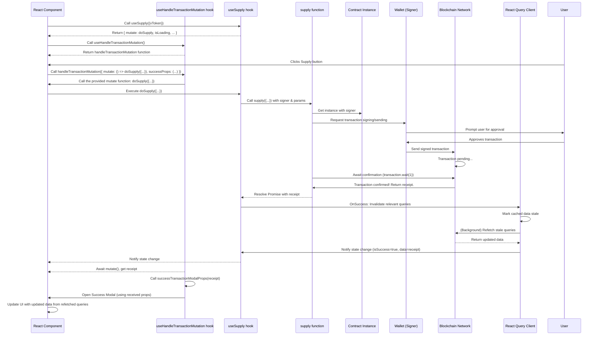

# Chapter 8: Transaction Handling (React Query Mutations)

Welcome back! So far in this tutorial, we've covered how our frontend application connects to a user's wallet ([Chapter 1: Wallet & Authentication](01_wallet___authentication_.md)), knows which network it's on ([Chapter 2: Application Configuration](02_application_configuration_.md)), can talk to smart contracts using specialized instances ([Chapter 3: Smart Contract Instances](03_smart_contract_instances_.md)) and convenient React hooks ([Chapter 5: Contract React Hooks](05_contract_react_hooks_.md)), understands how to structure blockchain data ([Chapter 4: Tokens and Markets Data Structures](04_tokens_and_markets_data_structures_.md)), efficiently fetches that data using React Query Queries ([Chapter 6: Data Fetching (React Query Queries)](06_data_fetching__react_query_queries__.md)), and makes token amounts human-readable ([Chapter 7: Token Amount Utilities](07_token_amount_utilities_.md)).

All of these concepts are about *reading* information from the blockchain or preparing data for display. But what happens when a user wants to *change* something on the blockchain? For instance, they want to:

*   Supply an asset to the lending pool.
*   Borrow assets.
*   Approve a contract to spend their tokens.
*   Enable/disable an asset as collateral.

These actions are not simple data reads; they are **transactions** that change the state of the smart contracts on the blockchain. Sending a transaction requires the user's wallet ([Chapter 1](01_wallet___authentication_.md)) to sign it (costing gas fees) and involves waiting for the transaction to be included in a block (mined) to be confirmed.

### The Problem: Managing Transaction Lifecycle in React

Just like fetching data asynchronously is tricky in React ([Chapter 6](06_data_fetching__react_query_queries__.md)), managing the lifecycle of a blockchain transaction is even more complex. When a user initiates a transaction, our application needs to:

1.  Tell the user's wallet to propose the transaction.
2.  Handle the wallet pop-up where the user approves or rejects the transaction.
3.  If approved, send the transaction to the blockchain network.
4.  Show a clear loading state to the user while the transaction is pending ("Confirming in wallet," "Transaction pending...").
5.  Wait for the transaction to be mined and confirmed on the blockchain.
6.  Show a success message or modal when the transaction is confirmed.
7.  Show an error message or toast if the transaction fails or is rejected by the user.
8.  Crucially, automatically update any data displayed in the UI (like balances, borrow limits, etc.) that might have changed as a result of the successful transaction.

Manually tracking all these states (`isConfirmingInWallet`, `isPending`, `isSuccess`, `isError`, `errorMessage`, `successData`) and coordinating data refetches in every component that initiates a transaction would be a huge burden and lead to a lot of repetitive code.

### The Solution: React Query Mutations

This is where **React Query Mutations** come to the rescue! Just as React Query Queries handle reading data, React Query **Mutations** handle sending data changes or performing side effects – which is exactly what blockchain transactions are.

Think of a React Query Mutation as a **smart transaction manager** for your React components. Instead of your components directly dealing with sending the transaction, waiting for confirmation, and handling outcomes, they just tell the mutation: "Hey, I need to perform *this specific action* with *these inputs*," and the mutation takes care of the complex lifecycle.

React Query Mutations automatically:

*   Provide a function to trigger the mutation (send the transaction).
*   Manage the state of the mutation (`idle`, `pending`, `success`, `error`).
*   Allow you to easily access the outcome (`data` for success, `error` for failure).
*   Offer powerful callbacks (`onSuccess`, `onError`, `onSettled`) to react to the mutation's outcome.
*   **Integrate tightly with Queries**: On `onSuccess`, you can automatically tell React Query to refetch related queries, ensuring your UI updates instantly with the new blockchain state.

In React Query, the term for writing data or performing side effects is a **"Mutation"**.

### Core Use Case: Supplying an Asset

Let's walk through a central transaction example: the user wants to **Supply** a specific amount of a token (like USDC) to the lending protocol.

1.  The user sees their wallet balance for USDC ([Chapter 6](06_data_fetching__react_query_queries__.md) + [Chapter 7](07_token_amount_utilities_.md)).
2.  They input an amount (e.g., "100").
3.  Our app converts "100" USDC into the smallest unit (Wei) using [Chapter 7 Token Amount Utilities](07_token_amount_utilities_.md).
4.  The user clicks a "Supply" button.
5.  Our app needs to initiate the transaction using the vUSDC contract ([Chapter 3](03_smart_contract_instances_.md), [Chapter 5](05_contract_react_hooks_.md)).
6.  The user's wallet prompts for approval.
7.  The transaction is sent and confirmed.
8.  The user's USDC wallet balance, vUSDC balance (representing their supplied amount), and overall borrow limit need to update in the UI.

This entire flow, from button click to UI update, is managed using a React Query Mutation.

### How to Use React Query for Transactions (Mutations)

The primary way to use React Query for sending transactions in a React component is using the `useMutation` hook.

The `useMutation` hook needs:

1.  **`mutationKey`**: An identifier for this specific mutation (optional but recommended for organization and features like optimistic updates). This is often a simple array, e.g., `[FunctionKey.SUPPLY]`.
2.  **`mutationFn`**: An **asynchronous function** that performs the actual transaction using the wallet's `signer`. This function takes the variables you provide when you trigger the mutation (like the amount to supply) and sends the transaction via the smart contract instance. It *must* return a Promise that resolves when the transaction is confirmed (often returning the transaction receipt).
3.  **Callbacks (`onSuccess`, `onError`, etc.)**: Functions that run when the mutation finishes. `onSuccess` is particularly important for invalidating related queries.

Let's look at the custom hook `useSupply` (`src/clients/api/mutations/supply/useSupply.ts`) which wraps a `useMutation` call for the supply transaction.

```typescript
// src/clients/api/mutations/supply/useSupply.ts (Simplified)
import { MutationObserverOptions, useMutation } from '@tanstack/react-query';
import { VToken } from '@/types'; // From Chapter 4

import supply, { SupplyInput, SupplyOutput } from '@/clients/api/mutations/supply'; // The raw transaction logic function
import FunctionKey from '@/constants/functionKey'; // Mutation key constant
import { useAuth } from '@/context/AuthContext'; // From Chapter 1 (for signer)
import { getQueryClient } from '@/app/get-query-client'; // To get the React Query client
const queryClient = getQueryClient(); // Get the client instance

// Define options type for hook users
type Options = MutationObserverOptions<
  SupplyOutput, // Expected data type on success (e.g., ContractReceipt)
  Error,        // Expected error type
  Omit<SupplyInput, 'vToken' | 'signer'> // Input variables for mutate function
>;

const useSupply = ({ vToken }: { vToken: VToken }, options?: Options) => {
  // 1. Get the signer and user address from the wallet connection
  const { signer, accountAddress } = useAuth();

  // 2. Use React Query's useMutation hook
  return useMutation({
    // a. Define the mutation key
    mutationKey: [FunctionKey.SUPPLY], // Use a constant name for this mutation type

    // b. Define the function that performs the transaction
    // This function receives variables passed to the mutate function later
    mutationFn: (params) =>
      supply({ // Call the raw transaction logic function (explained next)
        vToken,
        signer, // Pass the signer from useAuth
        ...params, // Pass other parameters (like amountWei)
      }),

    // c. Configure callbacks
    ...options, // Allow users of the hook to provide additional options/callbacks
    onSuccess: (...onSuccessParams) => {
      // This callback runs AFTER the transaction is successfully confirmed on the blockchain

      // ⚡️ Crucial Step: Invalidate relevant queries to refetch data!
      queryClient.invalidateQueries({
        queryKey: [FunctionKey.GET_V_TOKEN_BALANCES_ALL], // Refetch all vToken balances
      });
      queryClient.invalidateQueries({
        queryKey: [
          FunctionKey.GET_V_TOKEN_BALANCE, // Refetch the balance for the specific vToken
          {
            accountAddress,
            vTokenAddress: vToken.address,
          },
        ],
      });
       // Refetch market data which might include user's supplied amount / borrow limit
      queryClient.invalidateQueries({
        queryKey: [FunctionKey.GET_MAIN_MARKETS],
      });
      // Invalidate other market/pool data if applicable
      queryClient.invalidateQueries({
        queryKey: [FunctionKey.GET_ISOLATED_POOLS],
      });

      // Call any custom onSuccess logic provided by the component using this hook
      if (options?.onSuccess) {
        options.onSuccess(...onSuccessParams);
      }
    },
     // We could also add onError, onSettled callbacks here
  });
};

export default useSupply;
```

Let's break down this `useSupply` hook:

*   It uses `useAuth()` ([Chapter 1](01_wallet___authentication_.md)) to get the essential `signer` object, which is required to send transactions.
*   It uses `useMutation`.
*   `mutationKey: [FunctionKey.SUPPLY]` gives this mutation a unique identifier.
*   `mutationFn: (params) => supply({ vToken, signer, ...params })` is the heart of the mutation. It defines *what* happens when you trigger this mutation. It calls the `supply` function (which we'll look at next) and passes it the `vToken` being supplied, the `signer`, and any other `params` (like the amount) that the component provides when calling the `mutate` function.
*   `onSuccess`: This is a key feature. After the `supply` function successfully completes (meaning the transaction is mined and confirmed), this callback is executed. Inside `onSuccess`, we use `queryClient.invalidateQueries` to tell React Query that the data fetched by several queries (like `GET_V_TOKEN_BALANCES_ALL`, `GET_MAIN_MARKETS`, etc.) is now potentially outdated and needs to be refetched in the background. This is how the UI automatically updates after a transaction!
*   Return Value: The `useMutation` hook (and thus `useSupply`) returns an object like `{ mutate, isLoading, isError, isSuccess, error, data }`.
    *   `mutate`: This is the function you call in your component (e.g., in a button's `onClick`) to actually *start* the transaction. You pass the inputs needed for the transaction (like the amount) to this `mutate` function.
    *   `isLoading`: True while the transaction is pending (from proposing in wallet until confirmation).
    *   `isSuccess`: True after the transaction is successfully confirmed.
    *   `isError`: True if an error occurred.
    *   `data`: On success, this contains the result of the `mutationFn` (the transaction receipt).
    *   `error`: On error, this contains the error details.

### Under the Hood: The Raw Transaction Logic (`supply` function)

The `mutationFn` in the `useSupply` hook calls a separate function (`supply` in `src/clients/api/mutations/supply/index.ts`). This function contains the core logic for interacting with the smart contract to perform the specific transaction.

```typescript
// src/clients/api/mutations/supply/index.ts (Simplified)
import BigNumber from 'bignumber.js'; // For handling amounts
import { ContractReceipt, Signer } from 'ethers'; // Or zksync-web3 equivalents
import { VToken } from '@/types'; // From Chapter 4

import { getVTokenContract } from '@/clients/contracts'; // From Chapter 3

export interface SupplyInput {
  vToken: VToken;
  amountWei: BigNumber; // Amount in smallest units (from Chapter 7)
  signer?: Signer; // The signer from useAuth
}

export type SupplyOutput = ContractReceipt; // We expect the transaction receipt on success

const supply = async ({
  signer,
  vToken,
  amountWei,
}: SupplyInput): Promise<SupplyOutput> => {
  // 1. Make sure we have a signer and the vToken info
  if (!signer || !vToken) {
     // This case shouldn't happen if 'enabled' logic is used correctly,
     // but defensive programming is good.
     throw new Error('Missing signer or vToken info');
  }

  // 2. Get the smart contract instance using the signer (from Chapter 3/5)
  // Using the signer means subsequent calls will propose transactions
  const vTokenContract = getVTokenContract(vToken, signer as any); // Casting might be needed

  // 3. Call the specific smart contract method for "supply"
  // In this lending protocol, supplying is done by calling the 'mint' method on the VToken contract
  // Pass the amount in the correct format (often string or BigNumber from ethers/zksync-web3)
  const transaction = await vTokenContract.mint(amountWei.toFixed()); // Use toFixed() for string amount

  console.log(`Supply transaction submitted: ${transaction.hash}`);

  // 4. Wait for the transaction to be mined and confirmed (e.g., 1 block confirmation)
  // This is important! The mutation Promise resolves only AFTER confirmation.
  const contractReceipt = await transaction.wait(1); // Wait for 1 block confirmation

  console.log(`Supply transaction confirmed! Receipt:`, contractReceipt);

  // 5. Return the transaction receipt
  return contractReceipt; // This is the 'data' in the useMutation hook
};

export default supply;
```

This raw `supply` function:

*   Takes the necessary inputs (`signer`, `vToken`, `amountWei`).
*   Uses `getVTokenContract` ([Chapter 3](03_smart_contract_instances_.md)) with the `signer` to get a contract instance capable of sending transactions.
*   Calls the specific contract method (`mint` in this case) with the correct amount. `amountWei.toFixed()` is used to ensure the `BigNumber.js` amount is passed as a string, which is usually required by the underlying blockchain library methods when sending transactions.
*   Crucially, it uses `await transaction.wait(1)` to pause execution until the transaction is confirmed on the blockchain. This ensures the `onSuccess` callback in `useSupply` only runs *after* the state change is final.
*   It returns the transaction `ContractReceipt`, which contains details like the transaction hash, block number, etc. This receipt is what the `useMutation` hook provides in its `data` property on success.

Other transaction logic functions (like `borrow`, `redeem`, `approveToken`) follow a similar pattern: get the appropriate contract instance with the `signer`, call the specific contract method, and wait for the transaction confirmation.

### Standardizing UI Feedback: `useHandleTransactionMutation`

Knowing the mutation's state (`isLoading`, `isSuccess`, `isError`) allows components to show basic feedback (e.g., disable a button while loading). However, showing consistent, user-friendly feedback across the app (like a success modal or an error toast) requires more.

The project uses a helper hook, `useHandleTransactionMutation` (`src/hooks/useHandleTransactionMutation.ts`), to standardize this UI feedback layer. This hook wraps the `mutate` function returned by React Query's `useMutation` hooks.

```typescript
// src/hooks/useHandleTransactionMutation.ts (Simplified)
import { VError, formatVErrorToReadableString } from '@/errors'; // For error handling (Chapter 9)
import { ContractReceipt } from 'ethers'; // Or zksync-web3

import { toast } from '@/components/Toast'; // UI component for toasts
import useSuccessfulTransactionModal, { // Hook for success modal
  OpenSuccessfulTransactionModalInput,
} from '@/hooks/useSuccessfulTransactionModal';

// Define the expected input for the handleMutation function
export interface HandleMutationInput {
  mutate: () => Promise<ContractReceipt | void>; // The async mutate function from useMutation
  successTransactionModalProps: ( // Function to get props for the success modal
    contractReceipt: ContractReceipt
  ) => OpenSuccessfulTransactionModalInput;
}

const useHandleTransactionMutation = () => {
  // Get the function to open the success modal
  const { openSuccessfulTransactionModal } = useSuccessfulTransactionModal();

  // This is the function returned by the hook, which components will call
  const handleMutation = async ({
    mutate, // The actual mutation function from useMutation
    successTransactionModalProps, // Function to configure the success modal
  }: HandleMutationInput) => {
    try {
      // ✅ Call the actual mutation function provided by useMutation
      const contractReceipt = await mutate();

      // ✅ If successful and we got a receipt, open the success modal
      if (contractReceipt) {
        const modalProps = successTransactionModalProps(contractReceipt);
        openSuccessfulTransactionModal(modalProps);
      }
    } catch (error) {
      // ✅ If an error occurs during the mutation...
      let message = 'An unexpected error occurred.';

      // Use our custom error handling logic (covered in Chapter 9)
      if (error instanceof Error) {
         message = error.message;
      }
      if (error instanceof VError) {
        message = formatVErrorToReadableString(error);
      }
      // TODO: Handle other blockchain-specific errors more gracefully

      // ✅ Display an error toast
      toast.error({
        message,
      });

      // Re-throw the error so the component using handleMutation can still catch it if needed
      throw error;
    }
  };

  return handleMutation; // Return the helper function
};

export default useHandleTransactionMutation;
```

A component using a transaction hook (like `useSupply`) would typically use `useHandleTransactionMutation` to wrap the call to the mutation's `mutate` function:

```typescript
// Example component using useSupply and useHandleTransactionMutation (Conceptual)
import { useSupply } from '@/clients/api/mutations/supply/useSupply'; // Our supply hook
import useHandleTransactionMutation from '@/hooks/useHandleTransactionMutation'; // Helper hook
import { VToken } from '@/types';
import BigNumber from 'bignumber.js';
import { useState } from 'react';
// ... import token utilities, etc.

interface SupplyFormProps {
  vToken: VToken;
}

const SupplyForm: React.FC<SupplyFormProps> = ({ vToken }) => {
  const [amount, setAmount] = useState(''); // User input string

  // 1. Get the supply mutation hook
  const { mutate: doSupply, isLoading: isSupplyLoading } = useSupply({ vToken });

  // 2. Get the transaction handling hook
  const handleTransactionMutation = useHandleTransactionMutation();

  // Function to handle the supply button click
  const handleSupplySubmit = async () => {
    // Convert user input to amount in smallest units (using Chapter 7 utilities)
    const amountWei = new BigNumber(amount).multipliedBy(new BigNumber(10).pow(vToken.underlyingToken.decimals));

    // 3. Call the handleTransactionMutation helper, passing the actual mutation logic
    // and how to configure the success modal.
    handleTransactionMutation({
      // This is the async function handleTransactionMutation will await
      mutate: () => doSupply({ amountWei }), // Call the mutate function from useSupply

      // This function tells the helper how to structure the success modal data
      successTransactionModalProps: (receipt) => ({
        title: 'Supply Successful!',
        content: `You supplied ${amount} ${vToken.underlyingToken.symbol}`,
        transactionHash: receipt.transactionHash, // Get hash from the receipt
      }),
    });
  };

  return (
    <div>
      {/* ... Input field for amount ... */}
      <button onClick={handleSupplySubmit} disabled={isSupplyLoading}>
        {isSupplyLoading ? 'Supplying...' : 'Supply'}
      </button>
    </div>
  );
};
```

This pattern makes transaction handling very clean in components:
*   Use a custom mutation hook (`useSupply`) to get the `mutate` function and loading state.
*   Use `useHandleTransactionMutation` to get the helper function that manages UI feedback.
*   Call the helper function, passing it:
    *   An arrow function `() => doSupply({ amountWei })` which *calls* the actual `mutate` function with the required parameters. This is the core transaction logic.
    *   A function that generates the configuration for the success modal, using the `ContractReceipt` provided by the mutation.

The `handleTransactionMutation` helper then executes the provided `mutate` function, handles waiting for its result, displays a success modal on success, or catches errors and shows a toast.

### The Transaction Flow with React Query

Here's how the pieces fit together when a user triggers a transaction:



This diagram shows the flow: the component uses the helper (`useHandleTransactionMutation`) to wrap the call to the mutation's trigger function (`doSupply`). The `supply` function sends the transaction and waits. Once confirmed, React Query's `onSuccess` invalidates queries, causing the UI data to automatically update in the background. The `handleTransactionMutation` helper then continues, receives the receipt, and shows the success modal.

### Key Takeaways

*   **Mutations vs. Queries:** React Query uses `useQuery` for reading data and `useMutation` for writing data (transactions).
*   **`useMutation` Hook:** Provides a `mutate` function to trigger the transaction, and tracks its lifecycle state (`isLoading`, `isSuccess`, `isError`).
*   **`mutationFn`:** The core async function within `useMutation` that performs the actual blockchain interaction using the `signer` and waits for confirmation.
*   **`onSuccess`:** A critical callback in `useMutation` used to automatically refetch related queries using `queryClient.invalidateQueries` after a successful transaction.
*   **`useHandleTransactionMutation`:** A project-specific helper hook that wraps mutation calls to standardize UI feedback (success modals, error toasts).

By using React Query Mutations and helper hooks like `useHandleTransactionMutation`, the project centralizes and standardizes the complex process of sending blockchain transactions, tracking their progress, handling outcomes, and automatically updating the user interface. This leads to cleaner components and a more robust and predictable user experience.

Now that we understand how transactions are handled and their outcomes tracked, the next logical step is to look more closely at the errors that can occur during this process, especially blockchain-specific errors, and how the application handles them gracefully.

Let's move on to [Chapter 9: Blockchain Error Handling](09_blockchain_error_handling_.md).

---

Generated by [AI Codebase Knowledge Builder](https://github.com/The-Pocket/Tutorial-Codebase-Knowledge)