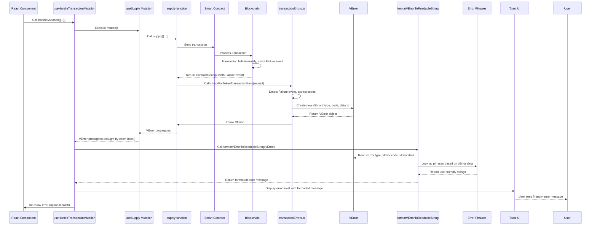

# Chapter 9: Blockchain Error Handling

Welcome back! In our exciting previous chapter, [Chapter 8: Transaction Handling (React Query Mutations)](08_transaction_handling__react_query_mutations__.md), we learned how to send transactions using React Query Mutations, manage their lifecycle, and automatically update the UI when they succeed. But what happens when a transaction *doesn't* succeed?

Blockchain transactions can fail for many reasons. Sometimes it's a simple gas error or the user rejecting the transaction in their wallet. Other times, the transaction makes it onto the blockchain, is processed by the smart contract, but the contract logic itself determines that the requested action is invalid and signals a failure *without* causing a standard low-level blockchain error.

This is where **Blockchain Error Handling** comes in.

### The Problem: Cryptic Blockchain Errors

When a smart contract operation fails due to protocol-specific rules (like trying to borrow more than your limit, or supplying an asset that isn't listed), the contract might not cause a standard "revert" error that blockchain libraries easily understand and convert into a simple error object. Instead, it might:

1.  Return a specific **error code** as the result of the function call.
2.  Emit a special **event** (often named "Failure") containing details about why it failed, like an error code and additional info code.

If our application doesn't specifically look for and understand these contract-level signals, the user might just see a very generic error message like "Transaction failed" or a cryptic technical detail from the blockchain library (e.g., "Error: 0x..." or "execution reverted"). This is not helpful for the user, who needs to know *why* their specific action (like supplying funds) didn't work.

The "Blockchain Error Handling" abstraction solves this by providing tools to:

*   Detect these specific contract-level failure signals (codes or events).
*   Translate these technical codes into understandable messages for the user.
*   Provide a consistent way to represent different types of errors (blockchain-specific, wallet-related, unexpected API issues, etc.).

The core use case is ensuring that when a user's transaction fails due to smart contract rules, they receive clear feedback like "Insufficient liquidity in the market" or "You cannot borrow that much based on your collateral."

### Key Concepts

To achieve this, the project introduces a few key pieces:

1.  **Standardized Error Codes:** The smart contracts themselves define specific numeric codes for different failure reasons. Our frontend needs to know what these codes mean.
2.  **Custom Error Type (`VError`):** A special JavaScript `Error` type used within the application to wrap different kinds of errors (especially blockchain ones) and carry structured information about them.
3.  **Transaction Receipt Parsing:** Functions that specifically look for contract-level failure signals (like the "Failure" event) within a transaction receipt after it's mined.
4.  **Error Code to Phrase Mapping:** A lookup system that maps technical error codes/infos to user-friendly, translated strings.

### Understanding Contract Error Codes

Smart contracts, especially complex ones like the lending protocol's, often use internal systems to report errors. They might define `enum`s (enumerated types) in their Solidity code for different error conditions. When a function call fails, instead of a hard revert, they might return these enum values or include them in emitted events.

Our frontend needs to have a copy of these error codes and their meanings. You can see these in `src/constants/contracts/errorReporter.ts`. This file defines `enum`s like `ComptrollerErrorReporterError`, `TokenErrorReporterError`, etc., listing the possible technical error codes reported by different smart contracts.

```typescript
// src/constants/contracts/errorReporter.ts (Simplified Snippet)
export enum ComptrollerErrorReporterError {
  NO_ERROR,
  UNAUTHORIZED,
  // ... many other error types ...
  INSUFFICIENT_LIQUIDITY, // Example: Not enough asset available to borrow
  MARKET_NOT_LISTED,      // Example: Trying to interact with an asset not in the market
  MATH_ERROR,
  // ...
}

export enum TokenErrorReporterFailureInfo {
  // ...
  BORROW_CASH_NOT_AVAILABLE, // Specific info for BORROW failure
  // ...
}
```

These enums provide the technical keys (like `ComptrollerErrorReporterError.INSUFFICIENT_LIQUIDITY`) that the smart contract might signal. Our frontend needs to know about these to interpret the raw error data from the blockchain.

### The `VError` Custom Error Type

To provide a consistent way to handle errors throughout the application, especially the structured errors from smart contracts, the project uses a custom error class called `VError`.

`VError` extends the standard JavaScript `Error` but adds properties to categorize the error (`type`) and hold specific error details (`code`, `data`).

```typescript
// src/errors/VError.ts (Simplified Snippet)
export type ErrorCodes = 'transaction' | 'unexpected' | 'interaction'; // Define types of errors

export interface VErrorParamMap {
  // Define the structure of 'data' for each error type
  transaction: {
    error: string; // Maps to one of the technical error/info phrases
    info: string;
  };
  unexpected: { message: string } | undefined; // Could hold a raw error message
  interaction: { assetName: string }; // Example: Used for interaction-related errors
}

export interface VErrorPhraseMap {
  // Maps the 'code' to the relevant list of phrases
  transaction: string; // Could be keyof typeof transactionErrorPhrases
  unexpected: string;  // Could be keyof typeof unexpectedErrorPhrases
  interaction: string; // Could be keyof typeof interactionErrorPhrases
}

export class VError<E extends ErrorCodes> extends Error {
  data: VErrorParamMap[E] | undefined; // Structured data about the error
  type: E; // The category of the error
  code: VErrorPhraseMap[E]; // A key/code identifying the specific error reason

  constructor({ type, code, data }: { type: E; code: VErrorPhraseMap[E]; data?: VErrorParamMap[E] }) {
    super(code); // Pass the code as the default message
    this.type = type;
    this.code = code;
    this.data = data;
  }
}
```

Instead of throwing a generic `Error`, functions in the application will throw a `VError` when they encounter a known, structured error condition (like a transaction failure event, or a specific interaction rule violation). This allows the error handling logic higher up to check the `type` and `code` of the `VError` and access its `data` to understand the specific issue.

For example, a function detecting a transaction failure might throw:
`throw new VError({ type: 'transaction', code: 'COMPTROLLER_REJECTION', data: { error: 'INSUFFICIENT_LIQUIDITY', info: 'BORROW_CASH_NOT_AVAILABLE' } });`

### Parsing Transaction Receipts for Errors

For smart contracts that signal failure via events (like the "Failure" event containing error and info codes), our application needs to explicitly check for these events after a transaction is mined.

The `src/errors/transactionErrors.ts` file contains helper functions to do this parsing. The core logic is in `checkForTransactionError`, which looks for a `Failure` event in the `ContractReceipt` and, if found, extracts the error and info codes and throws a `VError`.

```typescript
// src/errors/transactionErrors.ts (Simplified Snippet)
import BigNumber from 'bignumber.js';
import { ContractReceipt } from 'ethers'; // Or zksync-web3

import { VError, VErrorPhraseMap } from './VError';
import { ComptrollerErrorReporterError, ComptrollerErrorReporterFailureInfo } from '@/constants/contracts/errorReporter'; // The enums

// Helper function to check for the 'Failure' event
const checkForTransactionError = (
  receipt: ContractReceipt,
  errorEnum: any, // Simplified types here
  infoEnum: any
) => {
  const failureEvent = receipt.events?.find((event) => event.event === 'Failure');

  if (failureEvent) {
    // Extract the numeric error/info codes from the event arguments
    const errorIndex = failureEvent.args?.error ? new BigNumber(failureEvent.args.error._hex).toNumber() : 0;
    const infoIndex = failureEvent.args?.info ? new BigNumber(failureEvent.args.info._hex).toNumber() : 0; // Assuming 'info' arg

    // Look up the string names for these numeric codes using the enums
    const errorCodeName = errorEnum[errorIndex];
    const infoCodeName = infoEnum[infoIndex];

    // ⚡️ Throw a new VError with type 'transaction' and structured data
    throw new VError({
      type: 'transaction',
      code: errorCodeName as VErrorPhraseMap['transaction'], // Use the main error code as the VError code
      data: {
        error: errorCodeName as VErrorPhraseMap['transaction'], // Include both error and info in data
        info: infoCodeName as VErrorPhraseMap['transaction'],
      },
    });
  }
  return receipt; // No failure event found, transaction was successful
};

// Specific check for Comptroller contract transactions
export const checkForComptrollerTransactionError = (receipt: ContractReceipt) =>
  checkForTransactionError(
    receipt,
    ComptrollerErrorReporterError, // Pass the specific enums
    ComptrollerErrorReporterFailureInfo
  );

// Similar functions exist for Token, VaiController, etc.
```

This function is called *after* waiting for the transaction receipt within the raw mutation logic (like the `supply` function from [Chapter 8](08_transaction_handling__react_query_mutations__.md)). If a `Failure` event is detected, it throws the structured `VError`.

```typescript
// src/clients/api/mutations/supply/index.ts (Adding Error Check - Simplified)
import { ContractReceipt, Signer } from 'ethers';
// ... other imports ...
import { checkForTokenTransactionError } from '@/errors/transactionErrors'; // ⚡️ Import the error check

const supply = async ({ signer, vToken, amountWei }: SupplyInput): Promise<SupplyOutput> => {
  // ... get contract instance ...

  const transaction = await vTokenContract.mint(amountWei.toFixed());
  console.log(`Supply transaction submitted: ${transaction.hash}`);

  const contractReceipt = await transaction.wait(1);
  console.log(`Supply transaction confirmed! Receipt:`, contractReceipt);

  // ⚡️ Check the receipt for a contract-level failure event
  // This function will throw a VError if a Failure event is found
  checkForTokenTransactionError(contractReceipt); // VTokens use TokenErrorReporter

  // If no VError was thrown, the transaction was successful
  return contractReceipt;
};
```

### Mapping Errors to Readable Phrases

The technical error codes (like `INSUFFICIENT_LIQUIDITY`) aren't user-friendly. The project uses mapping files (like `src/errors/transactionErrorPhrases.ts`) to associate these codes with human-readable, translated messages.

```typescript
// src/errors/transactionErrorPhrases.ts (Simplified Snippet)
import { t } from '@/translation'; // Translation function

import {
  ComptrollerErrorReporterError,
  // ... other enums ...
} from '@/constants/contracts/errorReporter';

// This object maps the technical error code names (from enums) to user-friendly strings
export const transactionErrorPhrases: Record<
  | keyof typeof ComptrollerErrorReporterError
  | keyof typeof TokenErrorReporterError
  // ... etc.
, string> = {
  NO_ERROR: t('transactionErrors.noError'),
  UNAUTHORIZED: t('transactionErrors.unauthorized'),
  // ...
  INSUFFICIENT_LIQUIDITY: t('transactionErrors.insufficientLiquidity'), // Maps tech code to translation key
  // ...
  BORROW_CASH_NOT_AVAILABLE: t('transactionErrors.borrowCashNotAvailable'), // Maps info code
  // ... many others
};
```

This provides the lookup table for converting the technical codes stored in a `VError` into something the user can understand.

### Formatting the Readable String (`formatVErrorToReadableString`)

The final piece is taking a caught `VError` and using the phrase maps to generate the final display string. This is handled by the `formatVErrorToReadableString` function in `src/errors/formatVErrorToReadableString.ts`.

```typescript
// src/errors/formatVErrorToReadableString.ts (Simplified Snippet)
import { transactionErrorPhrases } from '@/errors/transactionErrorPhrases';
import { unexpectedErrorPhrases } from '@/errors/unexpectedErrorPhrases';
// ... other phrase maps

import { VError, VErrorParamMap, VErrorPhraseMap } from './VError'; // The VError type

export const formatVErrorToReadableString = (error: VError<ErrorCodes>) => {
  // Default message in case something goes wrong with mapping
  let phrase = unexpectedErrorPhrases.somethingWentWrong;

  // Check the type of the VError
  if (error.type === 'transaction') {
    // If it's a transaction error, use the transactionErrorPhrases map
    const message =
      transactionErrorPhrases[error.message as VErrorPhraseMap['transaction']]; // Uses the 'code' from VError constructor
    const info =
      transactionErrorPhrases[(error.data as VErrorParamMap['transaction']).info]; // Uses the 'info' from VError.data

    // Combine message and info for a more detailed error
    phrase = `${message} - ${info}`;
  } else if (error.type === 'unexpected') {
    // Handle unexpected errors
    phrase =
      unexpectedErrorPhrases[error.message as VErrorPhraseMap['unexpected']];
  }
  // ... handle other VError types

  // Return the formatted string, or a fallback if mapping failed
  return phrase || unexpectedErrorPhrases.somethingWentWrong;
};
```

This function takes the `VError` thrown by the transaction logic (or other parts of the app), uses its `type`, `code`, and `data` to find the relevant strings in the phrase maps, and constructs the final human-readable error message.

### How it Works in the UI (via `useHandleTransactionMutation`)

Now we can see how the `useHandleTransactionMutation` hook from [Chapter 8](08_transaction_handling__react_query_mutations__.md) integrates with this. When the `mutate` function called within `handleMutation` throws an error:

1.  If the raw transaction logic (`supply`) detected a `Failure` event, it throws a `VError` of type 'transaction'.
2.  The `catch` block in `useHandleTransactionMutation` catches this `VError`.
3.  It calls `formatVErrorToReadableString` with the caught `VError` to get the user-friendly string.
4.  It displays this user-friendly string in a toast message.

```typescript
// src/hooks/useHandleTransactionMutation.ts (Focus on Catch Block - Simplified)
import { VError, formatVErrorToReadableString } from '@/errors'; // ⚡️ Import VError and formatting!
import { toast } from '@/components/Toast'; // For displaying messages

// ... HandleMutationInput interface etc. ...

const useHandleTransactionMutation = () => {
  // ... get success modal opener ...

  const handleMutation = async ({ mutate, successTransactionModalProps }: HandleMutationInput) => {
    try {
      const contractReceipt = await mutate();
      // ... handle success (open modal) ...
    } catch (error) {
      // ✅ Error caught!
      let message = 'An unexpected error occurred.';

      // ⚡️ Check if it's a VError and format it
      if (error instanceof VError) {
        message = formatVErrorToReadableString(error);
      }
      // TODO: Add more checks here for other specific non-VError types if needed
      // (e.g., ethers/zksync-web3 errors like 'user rejected transaction')
      else if (error instanceof Error) {
         // Fallback for standard JavaScript Errors
         message = error.message || message;
      }


      // ✅ Display the (formatted) error message to the user
      toast.error({ message });

      // Re-throw the error for components that might need to catch it
      throw error;
    }
  };

  return handleMutation;
};
```

This is the final piece of the puzzle! The raw transaction functions detect contract errors and wrap them in `VError`, the central `useHandleTransactionMutation` catches these `VError`s (or other errors), and the `formatVErrorToReadableString` utility converts the `VError`'s structured data into a message that makes sense to the user, which is then displayed via a UI component (like a toast).

### The Error Handling Flow

Here's a sequence diagram showing the path of an error:



This flow ensures that even complex, contract-specific failures are caught, understood internally using the `VError` structure, and presented to the user with helpful information derived from the phrase maps.

### Conclusion

In this chapter, we've tackled the crucial concept of **Blockchain Error Handling**. We learned that raw blockchain errors and smart contract failure signals can be cryptic and need translation for a user-friendly experience. We explored how the project uses smart contract error codes (`ErrorReporter` enums), a custom `VError` type to structure error information, specific parsing logic to detect contract failures in transaction receipts, and phrase maps to convert technical codes into human-readable strings. Finally, we saw how the `useHandleTransactionMutation` hook ties this all together, catching errors, formatting them using `formatVErrorToReadableString`, and displaying them to the user, providing clear feedback even when transactions fail.

This robust error handling system is essential for building a dApp that users can trust and understand, even in the face of technical issues.

This concludes our deep dive into the core concepts of the `frontend` project! You now have a solid understanding of how the application connects users, configures itself, interacts with smart contracts, handles data, formats values, manages transactions, and gracefully handles errors.

---

Generated by [AI Codebase Knowledge Builder](https://github.com/The-Pocket/Tutorial-Codebase-Knowledge)