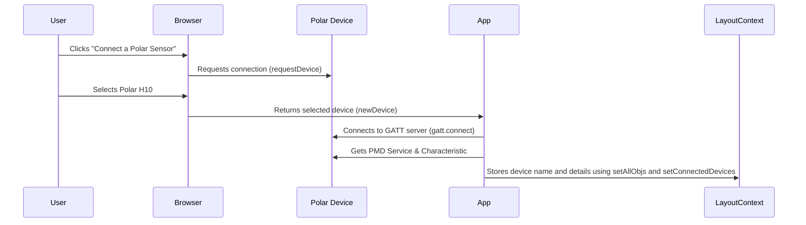

# Chapter 3: Bluetooth Device Connection

Continuing our house-building analogy from the previous chapters on [Navigation](01_navigation.md) and [LayoutContext](02_layoutcontext.md), this chapter focuses on how we connect to our "smart appliances" – our Polar Bluetooth devices. This chapter will explore how our app discovers these devices, connects to them, and prepares for data transfer.

Our central use case will be connecting to a Polar H10 heart rate sensor and preparing it for data streaming.

## Why Bluetooth Device Connection?

Imagine wanting to control your smart oven from your phone. You'd need a way for your phone and oven to communicate.  Bluetooth Device Connection is like the communication protocol that allows our app to talk to Polar devices.  It handles the process of finding nearby Polar sensors, establishing a connection, and setting up the necessary data channels.

## Key Concepts: Requesting, Connecting, and Setting Up

Connecting to a Bluetooth device involves three key steps:

1. **Requesting a Device:**  This is like asking your phone to scan for nearby Bluetooth devices.

2. **Connecting to the Device:**  This is like pairing your phone with the selected device.

3. **Setting Up Data Channels:**  This is like agreeing on which "language" your phone and device will use to communicate (e.g., which data streams to activate).

## Connecting to a Polar H10: A Step-by-Step Guide

Let's break down the code in `bluetooth/page.js` that handles connecting to a Polar H10:

### 1. Requesting a Device

```javascript
// ... other code ...
const newDevice = await navigator.bluetooth.requestDevice({
    filters: [{ namePrefix: "Polar" }], // Look for devices starting with "Polar"
    optionalServices: [PMD_SERVICE],     // Specify the service we need
});
// ... other code ...
```

This code snippet uses `navigator.bluetooth.requestDevice` to ask the user to select a Polar device.  It filters for devices with names starting with "Polar" and specifies the `PMD_SERVICE`, which is a unique identifier for Polar's data service – it's like the specific language our app needs to speak with the Polar sensor.

### 2. Connecting and Setting Up

```javascript
// ... other code ...
obj[num].server = await newDevice.gatt.connect(); // Connect to the device's GATT server
obj[num].service = await obj[num].server.getPrimaryService(PMD_SERVICE); // Get the Polar data service
obj[num].character = await obj[num].service.getCharacteristic(PMD_CONTROL); // Get the control characteristic

// ... Event listeners for data and control notifications are added here (explained later)...

setAllObjs(allObjs => ({ //Store device information in our application
    ...allObjs, 
    [name]: obj[num],  
}));
setConnectedDevices((prev) => [...prev, name]);  // Add the device name to our list of connected devices
// ... other code ...
```
This code connects to the device's GATT server (a way for Bluetooth devices to communicate), gets the Polar data service (`PMD_SERVICE`), and the control characteristic (`PMD_CONTROL`), which is used to start and stop data streams.  We then store the device's name (`name`) in our list of `connectedDevices` using the state management provided by [LayoutContext](02_layoutcontext.md). This step is crucial for managing multiple connected devices. We will cover listening to streaming data in [Data Streaming and Processing](04_data_streaming_and_processing.md).

## Under the Hood: Connecting to a Device

Let's visualize the connection process using a sequence diagram:



1.  The user clicks the "Connect a Polar Sensor" button.
2.  The browser requests a Bluetooth connection and shows available devices.
3.  The user selects the Polar H10.
4.  The browser provides the `newDevice` object to the app.
5.  The app connects to the H10's GATT server.
6.  The app gets the necessary service and characteristic for communication.
7.  The app stores the device information in the `LayoutContext`.

## Conclusion

This chapter explored how our app connects to Polar Bluetooth devices.  We saw how the code requests, connects to, and sets up the necessary data channels for a Polar H10.  This is like setting up the communication system for our smart appliances.

Next, we'll look at [Data Streaming and Processing](04_data_streaming_and_processing.md) and learn how to receive and interpret data from our connected Polar sensors.


---

Generated by [AI Codebase Knowledge Builder](https://github.com/The-Pocket/Tutorial-Codebase-Knowledge)