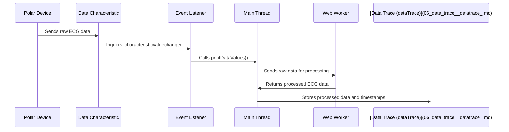

# Chapter 4: Data Streaming and Processing

Following our discussion on [Bluetooth Device Connection](03_bluetooth_device_connection.md), where we learned how to establish a connection with our Polar devices, this chapter will delve into how we continuously receive and process the data they send.  Imagine our Bluetooth connection as a water pipe.  Data flows in like water, but this "raw water" needs to be filtered and cleaned before we can use it. That's what Data Streaming and Processing does.  Our central use case will be handling incoming ECG data from a Polar H10 and preparing it for visualization.

## The Need for Streaming and Processing

Imagine you have a smart water filter that monitors the water quality as it flows. It needs to constantly analyze the incoming water and remove impurities. Similarly, our app needs to constantly listen for incoming data from the Polar device, decode it, and prepare it for display on our graphs.

## Key Concepts: Event Listening and Web Workers

1. **Event Listening:** Just like our smart filter constantly monitors the water flow, our app "listens" for incoming data using an "event listener."  It's like having a sensor in the pipe that triggers an action when water flows through it.

2. **Web Workers:** Processing raw data can be computationally intensive, like having a complex filtration system for our water.  To avoid slowing down the main "pipe" (the main thread of our application), we use Web Workers. These workers operate in the background, like having a separate team maintaining the filter, ensuring smooth and uninterrupted water flow in the main pipe.

## Handling ECG Data: A Practical Example

Let's look at how we handle incoming ECG data in `bluetooth/page.js`:

### 1. Setting up the Event Listener

```javascript
// ... other code ...
obj[num].data = await obj[num].service.getCharacteristic(PMD_DATA);
await obj[num].data.startNotifications();    
const outputfunction=await obj[num].data.addEventListener('characteristicvaluechanged', printDataValues);
// ... other code ...
```

This code snippet gets the `PMD_DATA` characteristic, which is the data channel for our Polar sensor. `startNotifications()` tells the device to start sending data.  `addEventListener` sets up our "listener" to call the `printDataValues` function whenever new data arrives – like our sensor triggering an action when water flows.

### 2. Processing the Data

```javascript
// ... other code within printDataValues function ...
if (dataType === 0) {
    // ECG Data
    const samples = new Uint8Array(data.slice(10));
    const npoints = samples.byteLength / 3;
    ECGdata = createArray(npoints);

    // ... code to convert raw bytes into ECG values ...

    console.log("ECG Data:", ECGdata); // Output: Array of processed ECG values
}
// ... other code ...
```
Inside the `printDataValues` function, we check if the incoming data is ECG data (`dataType === 0`).  Then, we extract the raw bytes and convert them into meaningful ECG values using helper functions (like filtering out impurities from our water).  Finally, using [LayoutContext](02_layoutcontext.md), we store the ECG data along with the appropriate timestamp provided by the device, ready for display on our graphs.


## Under the Hood: Data Flow with Web Workers

Let's visualize this process with a sequence diagram:



1. The Polar device sends raw ECG data through the `PMD_DATA` characteristic.
2.  This triggers the 'characteristicvaluechanged' event.
3. The event listener calls `printDataValues()` in the main thread.
4. The main thread passes the raw data to a Web Worker for processing.
5. The Web Worker processes the data (e.g., converts bytes to ECG values and filters noise - this is covered in the [Helper Functions (helpers.jsx)](08_helper_functions__helpers_jsx_.md) chapter).
6. The processed ECG data is returned to the main thread and saved using [LayoutContext](02_layoutcontext.md) and prepared to be stored using the [Data Trace (dataTrace)](06_data_trace__datatrace_.md).

## Internal Implementation Details

The `printDataValues` function in `bluetooth/page.js` acts as the entry point, receiving the raw data.  The data processing is delegated to web workers defined in `workers/workers.js`. This file is responsible for filtering noise and converting raw bytes to ECG values.  The processed data, along with timestamps, is then stored in the `dataTrace` object within [Global State (globalState.js)](07_global_state__globalstate_js_.md), making it ready for [Data Visualization](05_data_visualization.md).

## Conclusion

This chapter explained how our app receives and processes streaming data from Polar devices. We saw how event listeners act as our sensors, triggering actions when new data arrives, and how Web Workers handle data processing in the background, preventing performance bottlenecks. Now you know how our app filters and cleans the "raw water" flowing in from our Bluetooth "pipe"!

Next, we'll explore [Data Visualization](05_data_visualization.md) and see how the processed data gets transformed into informative graphs.


---

Generated by [AI Codebase Knowledge Builder](https://github.com/The-Pocket/Tutorial-Codebase-Knowledge)