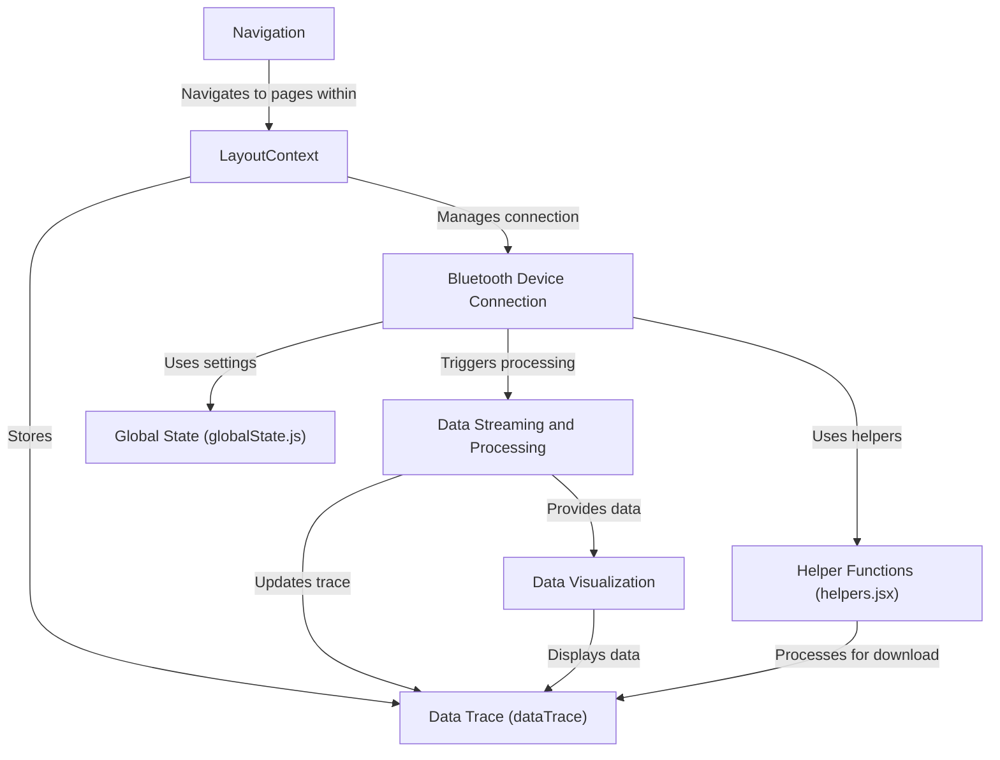

# Tutorial: app

This project visualizes data streamed from *Polar Bluetooth* heart rate sensors.  It connects to the sensors, processes the incoming data like *ECG, PPG, and ACC* in separate worker threads to keep the app responsive, and then displays the data in interactive graphs. The app also allows users to download the raw data.

**Source Repository:** [None](None)

## Chapters

1. [Navigation](01_navigation.md)
2. [LayoutContext](02_layoutcontext.md)
3. [Bluetooth Device Connection](03_bluetooth_device_connection.md)
4. [Data Streaming and Processing](04_data_streaming_and_processing.md)
5. [Data Visualization](05_data_visualization.md)
6. [Data Trace (dataTrace)](06_data_trace__datatrace_.md)
7. [Global State (globalState.js)](07_global_state__globalstate_js_.md)
8. [Helper Functions (helpers.jsx)](08_helper_functions__helpers_jsx_.md)

---

Generated by [AI Codebase Knowledge Builder](https://github.com/The-Pocket/Tutorial-Codebase-Knowledge)