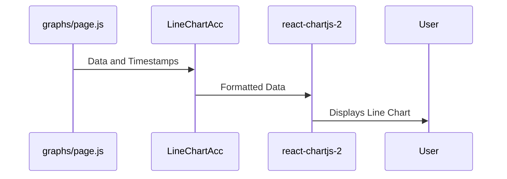

# Chapter 1: Graph Components

Imagine our `app` project is a data factory. We take raw data from sensors, process it, and then want to *see* what the data looks like.  That's where Graph Components come in. They are like the display screens in our factory, showing us the processed data visually as line charts.  We'll have different "screens" (components) for different sensor types. For instance, we have separate components for visualizing ACC (acceleration data, which has 3 axes: X, Y, and Z) and other sensor types like ECG (electrocardiogram) and PPG (photoplethysmogram).

Let's say our central use case is displaying the X, Y, and Z acceleration values from a sensor called "Sense_ACC" over time. This chapter will guide you through exactly how Graph Components do this.

## Understanding Graph Components

Think of a Graph Component as a simple machine:

1. **Input:** It takes processed sensor data (numbers) and their corresponding timestamps (when the data was recorded).
2. **Processing:**  It organizes this data in a way that a charting library (like `react-chartjs-2`, which we use here) understands.
3. **Output:** It displays a beautiful interactive line chart where you can see how the data changes over time.

We have two main types of Graph Components:

* `LineChart`:  This component is used for single-value sensor data like ECG and PPG.
* `LineChartAcc`: This specialized component is used for ACC data since it has three values (X, Y, and Z) that we want to display together.

## Displaying ACC Data (Our Use Case)

Let's walk through how `LineChartAcc` displays the "Sense_ACC" data.  Imagine our processed data looks like this (simplified):

```javascript
const processedData = {
  'Sense_ACC': {
    acc: { x: [1, 2, 3], y: [4, 5, 6], z: [7, 8, 9] },
    accTimestamp: { xTimestamp: [0.1, 0.2, 0.3], yTimestamp: [0.1, 0.2, 0.3], zTimestamp: [0.1, 0.2, 0.3] },
  },
};
```

Here, `x`, `y`, and `z` hold the acceleration values, and `xTimestamp`, `yTimestamp`, `zTimestamp` are the times those values were recorded.

Now, here's a simplified version of the `LineChartAcc` component:

```javascript
import { Line } from 'react-chartjs-2';

const LineChartAcc = ({ dataSets, timestamps }) => {
  const data = {
    labels: timestamps,
    datasets: dataSets.map((dataValues, idx) => ({
      label: `ACC ${['X', 'Y', 'Z'][idx]}`,
      data: dataValues,
    })),
  };

  return <Line data={data} />; 
};
```

In `graphs/page.js`, we use this component like so (simplified):

```javascript
<LineChartAcc 
    dataSets={[
        processedData['Sense_ACC'].acc.x,
        processedData['Sense_ACC'].acc.y,
        processedData['Sense_ACC'].acc.z,
    ]}
    timestamps={processedData['Sense_ACC'].accTimestamp.xTimestamp} 
/>
```

We provide the `x`, `y`, and `z` data as separate datasets and the timestamps to `LineChartAcc`.  `LineChartAcc` then prepares this data for `react-chartjs-2`'s `<Line>` chart, which renders the chart.

## Under the Hood

When `graphs/page.js` renders, it calls `LineChartAcc` with the processed data.  `LineChartAcc` transforms the data into a format that `react-chartjs-2` can understand.  `react-chartjs-2` then takes over and renders the chart on the screen.  



## Internal Implementation Details

The full implementation in `graphs/graphComponentTwo.js` includes more details like chart styling, axes labels, and making the chart responsive.  The core logic remains the same, though: preparing data for and rendering the line chart. Similar logic applies to `graphs/graphComponent.js` which handles the non-ACC data.

## Conclusion

Graph Components are essential for visualizing our processed sensor data. We learned about the two main types: `LineChart` and `LineChartAcc`, and how they take data and timestamps as input and render them as interactive charts.  In the next chapter, we'll explore [LayoutContext](02_layoutcontext.md), which manages the application's layout and data flow.


---

Generated by [AI Codebase Knowledge Builder](https://github.com/The-Pocket/Tutorial-Codebase-Knowledge)