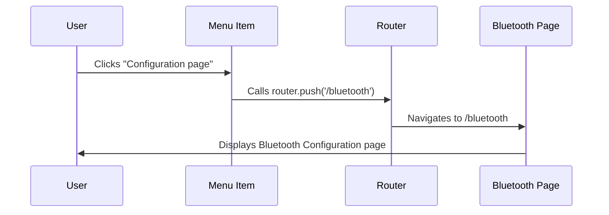

# Chapter 1: Navigation

Imagine you're building a house. You wouldn't want all the rooms crammed into one big space, would you? You'd want separate rooms for the kitchen, bedroom, living room, etc.  Similarly, in our `app` project, we use Navigation to separate different parts of our application into distinct pages: Home, Bluetooth Configuration, and Graphs.  Navigation acts like the hallways and doors of our app, allowing us to move between these different sections smoothly.

This chapter will show you how to navigate between these pages. Our central use case will be moving from the Home page to the Bluetooth Configuration page.

## How Navigation Works

Navigation in our app relies on the `next/navigation` library and specifically the `useRouter` hook.  Think of the `useRouter` hook as a helpful guide who knows all the routes within our app.  It provides us with a function called `push` which allows us to "push" a new page onto the screen, effectively changing the current view.

Let's see a code example from our `navbar/page.js` file:

```javascript
// ... other code ...
import { useRouter } from 'next/navigation';
// ... other code ...

const AppMenuBar = () => {
    const router = useRouter(); // Our helpful guide!

    const items = [
      // ... other menu items ...
      {
          label: 'Configuration page',
          icon: 'pi pi-fw pi-wifi',
          command: () => router.push('/bluetooth')  // Navigate to the Bluetooth page
      },
      // ... other menu items ...
    ];
    // ... rest of the code ...
};

export default AppMenuBar;

```

In this code snippet, `useRouter()` gives us our `router` object. When the user clicks the "Configuration page" menu item, the `command` function is executed. This function calls `router.push('/bluetooth')`. This tells the `router` to take us to the `/bluetooth` route, which displays the Bluetooth Configuration page.  It's as simple as telling our guide, "Take me to the Bluetooth page, please!"

## Under the Hood:  `router.push()`

Let's see a simplified sequence diagram of what happens when `router.push('/bluetooth')` is called:



1. The user clicks the "Configuration page" menu item.
2. This triggers the `command` function which calls `router.push('/bluetooth')`.
3. The `router`, using its knowledge of the app's routes, navigates to the `/bluetooth` route.
4.  The Bluetooth Configuration page is then displayed to the user.


## Conclusion

In this chapter, you've learned the basics of navigation within our app. You now understand how to use `useRouter` and `router.push` to move between different sections of the application. This is like learning how to use the doors in our house!

Next, we'll explore the `LayoutContext` and how it helps us manage shared layout elements across different pages. Think of this as designing the overall architecture of our house.  Let's proceed to [Chapter 2: LayoutContext](02_layoutcontext.md). 


---

Generated by [AI Codebase Knowledge Builder](https://github.com/The-Pocket/Tutorial-Codebase-Knowledge)