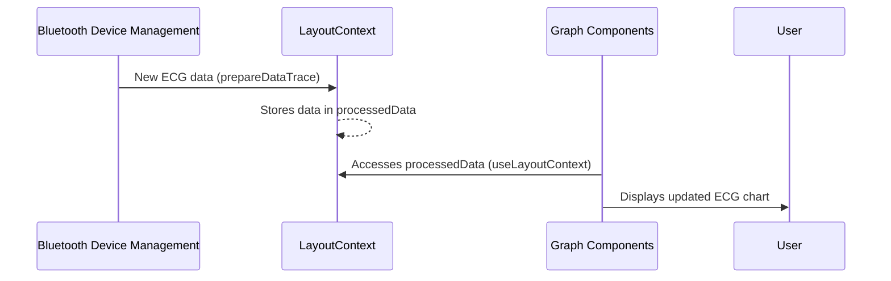

# Chapter 2: LayoutContext

In the previous chapter, [Graph Components](01_graph_components.md), we saw how our app displays sensor data as charts. But where does this data come from, and how do different parts of our app access it? This is where `LayoutContext` comes in.

Let's say our central use case is to display live ECG data from a Polar H10 sensor.  We want the [Bluetooth Device Management](03_bluetooth_device_management.md) part of our app to receive the raw ECG data and make it available to the [Graph Components](01_graph_components.md) for display. `LayoutContext` helps us achieve this.

## What is LayoutContext?

Imagine `LayoutContext` as a shared toolbox.  Anyone in our data factory (`app`) can access this toolbox. It holds tools (variables and functions) related to the layout and data handling:

* **Data:** Things like the list of connected Bluetooth devices, the raw sensor data (`dataTrace`), and the processed sensor data (`processedData`).
* **Functions:** Tools to control data streaming, connect to Bluetooth devices, and more.

By keeping these tools in a central place, we avoid having to pass them around individually between different parts of our app.

## Using LayoutContext: Displaying Live ECG Data

Here's how `LayoutContext` helps us display live ECG data:

1. **[Bluetooth Device Management](03_bluetooth_device_management.md) receives ECG data:** When the app receives new ECG readings from the Polar H10, it uses a function within `LayoutContext` (like `prepareDataTrace`) to store the raw ECG data.

2. **[Graph Components](01_graph_components.md) accesses the data:** The ECG graph component uses a hook (`useLayoutContext`) to access the processed ECG data from the `LayoutContext` toolbox.

3. **The graph updates:** With the new data, the graph component re-renders, showing the live ECG stream.

## Accessing LayoutContext: The `useLayoutContext` Hook

To access the tools within `LayoutContext`, we use a special hook called `useLayoutContext`.

```javascript
import { useLayoutContext } from '../context/LayoutContext';

const MyComponent = () => {
  const { processedData } = useLayoutContext();
  // ... use processedData to display the chart
};
```

This code snippet shows how a component can access the `processedData` from `LayoutContext`.  This allows the component to display the latest processed sensor data.

## Providing LayoutContext: The `LayoutProvider`

The `LayoutProvider` is the tool *supplier*.  It wraps our entire application and makes the `LayoutContext` available. It's like setting up the toolbox at the beginning of the workday.

```javascript
// Simplified layout.js
import { LayoutProvider } from './context/LayoutContext';

function RootLayout({ children }) {
  return (
    <LayoutProvider>
      {children} 
    </LayoutProvider>
  );
}
```

This snippet from `layout.js` shows how `LayoutProvider` wraps our app's components, making the context accessible to everything inside.

## Under the Hood: How it Works

Let's trace what happens when new data arrives:



## Internal Implementation Details

The `LayoutContext` is defined in `context/LayoutContext.js`. Here's a simplified version of where `processedData` and `prepareDataTrace` are defined:

```javascript
// Simplified context/LayoutContext.js
import { createContext, useState } from 'react';

const LayoutContext = createContext();

export function LayoutProvider({ children }) {
  const [processedData, setProcessedData] = useState({});
  // ... other tools (variables and functions)

  const prepareDataTrace = (/* ...arguments */) => {
      // Processes the data and updates processedData state with setState
  }

  const value = { processedData, setProcessedData, prepareDataTrace, /* ... other tools */ };

  return <LayoutContext.Provider value={value}>{children}</LayoutContext.Provider>;
}
```

This simplified snippet shows how the `processedData` state and the `prepareDataTrace` function are defined within the `LayoutProvider`.  This makes them available through the `LayoutContext`.

## Conclusion

`LayoutContext` acts like a central repository for our app's layout and data handling tools.  We learned how [Bluetooth Device Management](03_bluetooth_device_management.md) uses it to store data, how [Graph Components](01_graph_components.md) accesses this data using `useLayoutContext`, and how the entire system is managed by `LayoutProvider`. In the next chapter, we'll dive deeper into [Bluetooth Device Management](03_bluetooth_device_management.md) and how it interacts with `LayoutContext`.


---

Generated by [AI Codebase Knowledge Builder](https://github.com/The-Pocket/Tutorial-Codebase-Knowledge)