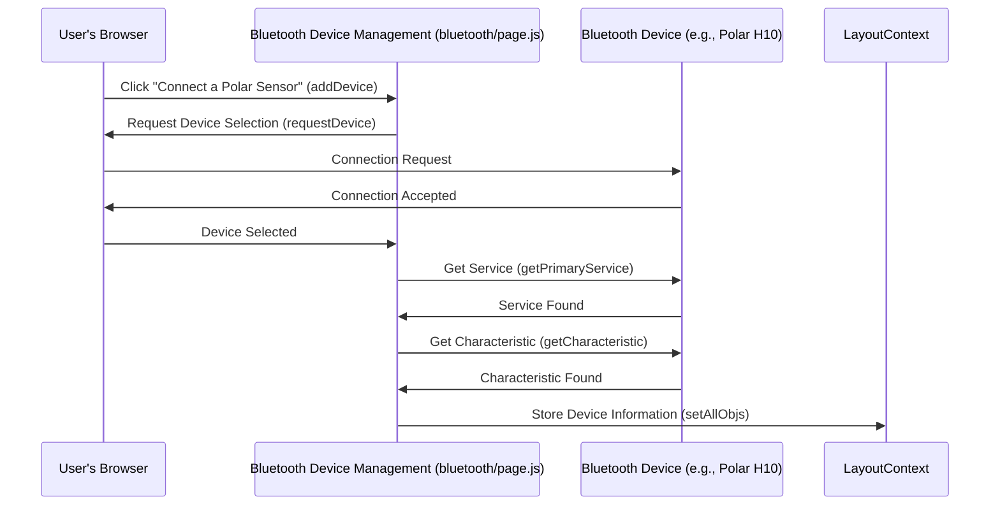

# Chapter 3: Bluetooth Device Management

In the previous chapter, [LayoutContext](02_layoutcontext.md), we learned how different parts of our app share data and functions.  Now, let's explore how we get data *into* the app in the first place. That's the job of Bluetooth Device Management.

Let's say our central use case is connecting to a Polar H10 heart rate monitor and displaying live ECG data.  Bluetooth Device Management handles the connection, disconnection, and data streaming from this device. It also keeps track of the battery level of the connected device.

## Connecting to a Device

Think of Bluetooth Device Management as the "shipping and receiving" department of our data factory. It's responsible for establishing connections with our Bluetooth sensors (like the Polar H10).  It also handles disconnections and keeps track of which devices are currently online.

Here's a simplified look at how we connect to a device:

```javascript
// File: bluetooth/page.js
async function addDevice() {
    const newDevice = await navigator.bluetooth.requestDevice({
        filters: [{ namePrefix: "Polar" }], // Look for devices starting with "Polar"
        optionalServices: [PMD_SERVICE, 'battery_service'] // Required services
    });
    // ... more code to handle the connection (explained below)
}
```

This code snippet initiates the Bluetooth connection process.  The `navigator.bluetooth.requestDevice()` function prompts the user to select a Bluetooth device.  The `filters` help narrow down the devices shown to the user.  The `optionalServices` ensures that we request access to the necessary services for reading sensor data.

After a device is selected, further steps are required to establish a full connection and start receiving data.


## Handling the Connection

Once a device is selected, we need to establish a connection to the relevant service and characteristics to receive data and control the device's measurements.  This happens inside the `addDevice` function:

```javascript
// File: bluetooth/page.js
// ... inside addDevice() function ...

obj[num].server = await obj[num].device.gatt.connect();
obj[num].service = await obj[num].server.getPrimaryService(PMD_SERVICE);
obj[num].character = await obj[num].service.getCharacteristic(PMD_CONTROL);    
// ... set up event listeners for incoming data and control messages
```

This snippet establishes a connection to the GATT server (`gatt.connect()`), retrieves the service (`getPrimaryService()`), and retrieves the relevant characteristic (`getCharacteristic()`). It sets up event listeners to process incoming data and control messages.


## Managing Disconnections

Devices can disconnect unexpectedly.  Bluetooth Device Management needs to handle this gracefully:

```javascript
// File: bluetooth/page.js
async function onDisconnected(event) {
    const device = event.target;
    console.log(`Device ${device.name} is disconnected.`);
    // ... code to remove the device from the connected list and handle cleanup
}
```

This `onDisconnected` function is called when a device disconnects.  It logs the disconnection and then performs cleanup tasks, such as removing the device from the list of connected devices.

## Monitoring Battery Level

Bluetooth Device Management also keeps an eye on the battery level of connected devices.

```javascript
// File: bluetooth/page.js (inside addDevice)
try {
    const batteryService = await device_obj.server.getPrimaryService('battery_service');
    const batteryLevelChar = await batteryService.getCharacteristic('battery_level');
    const value = await batteryLevelChar.readValue(); // Initial read
    // ... add event listener to update battery level whenever it changes
} catch (err) {
    console.warn("Battery service not available on this device:", err);
}
```
This code attempts to connect to the device's battery service. If available, it reads the initial battery level and sets up a listener for changes.  If the battery service isn't available, it logs a warning.

## Under the Hood

Here's a sequence diagram showing how the connection process works:




## Conclusion

Bluetooth Device Management handles the crucial task of connecting to and managing our Bluetooth sensors. We learned how it establishes connections, manages disconnections, monitors battery levels, and interacts with [LayoutContext](02_layoutcontext.md) to make device information available to the rest of the app.  In the next chapter, [Data Streaming and Processing](04_data_streaming_and_processing.md), we'll explore how the raw sensor data is streamed from the devices and processed into a usable format.


---

Generated by [AI Codebase Knowledge Builder](https://github.com/The-Pocket/Tutorial-Codebase-Knowledge)