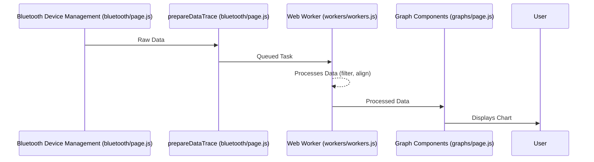

# Chapter 4: Data Streaming and Processing

In the previous chapter, [Bluetooth Device Management](03_bluetooth_device_management.md), we established a connection with our Bluetooth sensor. Now, we need to understand how the raw sensor data flows from that device into our app and how it's processed for display and saving. This is where Data Streaming and Processing comes in.

Let's say our central use case is to display live ECG data from a Polar H10. We want to receive this raw ECG data, process it, and send it to the [Graph Components](01_graph_components.md).  This chapter will walk through how that happens.

## The Data Pipeline

Imagine the data flowing like water through a series of pipes:

1. **Raw Data:** The Bluetooth device sends raw data packets.  This data is like untreated water from a source.
2. **Data Receiving:** Our app receives these raw data packets.  This is like collecting the untreated water.
3. **Data Processing:**  The raw data is then cleaned and prepared.  This is like filtering and purifying the water.  This includes:
    - **Filtering Noise:** Removing unwanted artifacts from the data.
    - **Timestamp Alignment (optional):** Ensuring that data from different devices are time-synced, if enabled.
4. **Processed Data:** The cleaned and prepared data, ready to be displayed. This is our purified water, ready to drink.
5. **Data Output:** The processed data is sent to [Graph Components](01_graph_components.md) for visualization and to [Data Saving (Local Files)](07_data_saving__local_files_.md) for storage.  This is like distributing the purified water.

## Data Receiving: `printDataValues`

The `printDataValues` function in `bluetooth/page.js` acts as the initial receiver of raw data. Think of it as the water collection point. It's called whenever new data arrives from the Bluetooth device.

```javascript
// Simplified bluetooth/page.js (printDataValues)
function printDataValues(event) {
    const dataTime = Date.now();
    const deviceName = event.currentTarget.service.device.name;
    const data = event.target.value.buffer; // Raw data packet
    const deviceTime = /* ... extract timestamp ... */;
    // ... extract data type, e.g., ECG, PPG, ACC ...
    if (/* ...data is ECG... */) {
      // ... process ECG data ...
    } else if (/* ...data is PPG... */) {
      // ... process PPG data ...
    } else if (/* ...data is ACC... */) {
        // ... process ACC data...
    }

    prepareDataTrace(deviceName, /* ... other args ... */); 
}
```

This function extracts the raw data, timestamp, and data type. It then calls `prepareDataTrace` to begin processing.

## Data Processing: `prepareDataTrace` and Web Workers

`prepareDataTrace` in `bluetooth/page.js` is responsible for queuing up tasks for processing.  It determines the type of data (ACC or non-ACC) and pushes a task to a queue (`pendingTasksRef`).

```javascript
// Simplified bluetooth/page.js (prepareDataTrace)
async function prepareDataTrace(deviceName, /* ... other args ... */) {
    // ... Determine sensor type ...
    const taskType = /* "processACC" or "processNonACC" */;

    pendingTasksRef.current.push({
        taskType,
        device: deviceName,
        // ...other data...
    });
}
```

These queued tasks are then processed by [Web Workers](08_web_workers.md) (`workers/workers.js`), which run in the background to prevent blocking the main thread.  Think of Web Workers as separate purification plants that handle data cleaning in parallel.


The Web Worker (`workers/workers.js`) receives the task and performs the data processing:


```javascript
// Simplified workers/workers.js
self.onmessage = function ({ data }) {
  const { type, payload } = data; 
  if (type === "processACC") {
    // ... filter noise, align timestamps (if enabled) ...
    postMessage({ type: "processedACC", payload: { /* ... processed data ... */ } });

  } else if (type === "processNonACC") {
    // ... filter noise, align timestamps (if enabled) ...
    postMessage({ type: "processedNonACC", payload: { /* ... processed data ... */ } });
  }
};
```

## Data Output and Display

Once the Web Worker finishes processing, it sends the cleaned data back to the main thread.  The `graphs/page.js` component receives this data and updates the [Graph Components](01_graph_components.md).



## Internal Implementation Details

`context/LayoutContext.js` holds the `processedData` object. This object is updated by `graphs/page.js` after receiving the processed data from the Web Worker.

```javascript
// Simplified context/LayoutContext.js
// ... inside LayoutProvider ...
const [processedData, setProcessedData] = useState({}); 
// ...
```

`graphs/page.js` uses the `processedData` from [LayoutContext](02_layoutcontext.md) to render the charts:

```javascript
// Simplified graphs/page.js
const { processedData } = useLayoutContext();
// ... use processedData to display charts ...
```

## Conclusion

Data Streaming and Processing is the core pipeline of our app.  We learned how raw data is received, processed in Web Workers, and then finally sent to [Graph Components](01_graph_components.md) for visualization.  In the next chapter, we'll look more closely at [Data Trace (dataTrace)](05_data_trace__datatrace_.md), a key data structure used in this pipeline.


---

Generated by [AI Codebase Knowledge Builder](https://github.com/The-Pocket/Tutorial-Codebase-Knowledge)