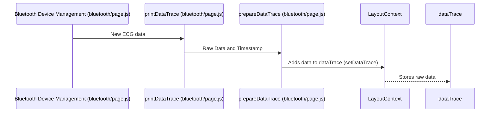

# Chapter 5: Data Trace (`dataTrace`)

In the previous chapter, [Data Streaming and Processing](04_data_streaming_and_processing.md), we saw how raw sensor data is received and processed.  But what happens to the original, raw data?  Sometimes we need to keep this raw data for later analysis.  That's where `dataTrace` comes in.

Let's say our central use case is to store the raw ECG data coming from a Polar H10 sensor. We want to keep this raw data completely separate from the processed data (which we use for graphing). This chapter will show you how `dataTrace` does this.

## What is `dataTrace`?

Imagine `dataTrace` as a separate warehouse in our data factory. While [Data Streaming and Processing](04_data_streaming_and_processing.md) sends the cleaned, processed data to the display screens ([Graph Components](01_graph_components.md)), it also sends a copy of the *raw* data to this warehouse (`dataTrace`).  This raw data is like the original, unfiltered ingredients before they are turned into a finished product.

## Using `dataTrace`: Storing Raw ECG Data

Here's how `dataTrace` stores the raw ECG data:

1. **[Data Streaming and Processing](04_data_streaming_and_processing.md) receives data:** When the app receives raw ECG readings from the Polar H10, the `printDataValues` function in `bluetooth/page.js` is called.

2. **`prepareDataTrace` is called:** `printDataValues` then calls the `prepareDataTrace` function, which is also in `bluetooth/page.js`.

3. **`prepareDataTrace` adds the raw data to `dataTrace`:** Inside `prepareDataTrace`, the raw ECG data is added to the `dataTrace` object (which is managed by [LayoutContext](02_layoutcontext.md)).

## Under the Hood: How `dataTrace` Works

Let's trace what happens when new data arrives:



## Internal Implementation Details

`dataTrace` is a state variable managed by [LayoutContext](02_layoutcontext.md). It's a JavaScript object where the keys are the device names and the values are arrays. Each array within the device's array corresponds to either the raw data values from a specific sensor from that device, or the associated timestamps for these raw sensor data values. Here's a simplified version of how it's defined in `context/LayoutContext.js`:

```javascript
// Simplified context/LayoutContext.js
// ... inside LayoutProvider ...
const [dataTrace, setDataTrace] = useState({});
// ...
```

The `prepareDataTrace` function in `bluetooth/page.js` updates the `dataTrace` state.  Here is a highly simplified example (the actual implementation handles queuing and other details):


```javascript
// Simplified bluetooth/page.js (prepareDataTrace)
// ... inside prepareDataTrace function
setDataTrace((prevDataTrace) => {
    // ... logic to add new raw data to the dataTrace array ...
});
```

This code snippet demonstrates how `prepareDataTrace` uses the `setDataTrace` function from [LayoutContext](02_layoutcontext.md) to update the `dataTrace` object with the new raw data.

## Conclusion

`dataTrace` acts as a repository for our app's raw sensor data, keeping it separate from the processed data used for visualization.  We learned how [Bluetooth Device Management](03_bluetooth_device_management.md), specifically `printDataValues` and `prepareDataTrace`, updates this structure with new raw sensor readings. In the next chapter, [Time Alignment](06_time_alignment.md), we'll explore techniques for synchronizing the timestamps of data from different devices.


---

Generated by [AI Codebase Knowledge Builder](https://github.com/The-Pocket/Tutorial-Codebase-Knowledge)