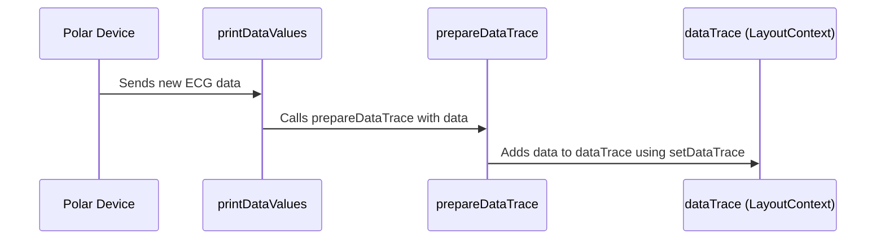

# Chapter 6: Data Trace (`dataTrace`)

Continuing from our discussion on [Data Visualization](05_data_visualization.md), where we saw how processed data is turned into graphs, this chapter focuses on the `dataTrace` object. Think of `dataTrace` as the refrigerator in our smart house, storing all the ingredients (raw sensor data) coming in from our smart appliances (Polar devices) until we're ready to use them (download the data).

Our central use case will be storing incoming ECG data from a Polar H10 in `dataTrace` so that it can later be downloaded by the user.


## Why `dataTrace`?

Imagine you're collecting ingredients for a big meal. You wouldn't want to use them immediately as they arrive. Instead, you would store them in the refrigerator until you're ready to cook.  Similarly, our app needs to store the raw sensor data as it comes in, even before it is processed and visualized.  `dataTrace` acts as this temporary storage, allowing the user to download all the collected data whenever they want.

## Key Concept:  A JavaScript Object for Storage

`dataTrace` is simply a JavaScript object used as a temporary database. It is stored using [Global State (globalState.js)](07_global_state__globalstate_js_.md). Think of it as a container with labeled compartments for each sensor and device. Each compartment holds an array of sensor readings. It gets updated by functions running within [Data Streaming and Processing](04_data_streaming_and_processing.md).

## Storing ECG Data: A Step-by-Step Example

Let's see how incoming ECG data is stored in `dataTrace` within the `bluetooth/page.js` file:

### 1. Initializing `dataTrace`

```javascript
// ... other code in bluetooth/page.js ...
async function initializeDataTraceForDevice(device_obj) {
    setDataTrace((prevDataTrace) => ({
        ...prevDataTrace,
        [device_obj.device.name]: Array(device_obj.output.length+2).fill([]), // Create an empty array for each device
    }));
}
// ... other code ...
```
This code initializes a new empty array in `dataTrace` for each stream from the Polar device. The `initializeDataTraceForDevice` function is called whenever a new Polar Device is connected to ensure that `dataTrace` is ready to store incoming data.

### 2. Adding Data to `dataTrace`

```javascript
// ... other code in bluetooth/page.js ...

function prepareDataTrace(deviceName, date, ECGdata, PPGSum, ACC, currentTimestamp) {
    setDataTrace((prevDataTrace) => {
        // ... error handling ...
        const updatedDeviceData = [...prevDataTrace[deviceName]];

        // ... updating data based on the incoming data stream type ...

        return {
            ...prevDataTrace,
            [deviceName]: updatedDeviceData, 
        };
    });
}
// ... other code ...

```
This `prepareDataTrace` function is called within [Data Streaming and Processing](04_data_streaming_and_processing.md), specifically within the `printDataValues` function. It receives the processed sensor data and adds it to the appropriate device's array within the `dataTrace` object. It also stores the relevant timestamps from the devices. Note the use of the spread operator to create new copies of the arrays to help preserve prior state.


## Under the Hood: How `dataTrace` Stores Data

Let's visualize how `dataTrace` is updated with a sequence diagram:




1. The Polar Device sends new ECG data to the app via the `characteristicvaluechanged` event.
2. This triggers the `printDataValues` function, where the data is processed and identified based on its respective `dataType`.
3. The `printDataValues` function then calls `prepareDataTrace` with the processed ECG data. 
4. `prepareDataTrace` uses the `setDataTrace` function from [LayoutContext](02_layoutcontext.md) to update the `dataTrace` object, adding the new ECG data to the correct array, under the name of the device that the data originated from.


## Internal Implementation

The `dataTrace` object is part of [Global State (globalState.js)](07_globalstate__globalstate_js_.md), using [LayoutContext](02_layoutcontext.md) for state management.  The `prepareDataTrace` function, as seen above, is responsible for updating `dataTrace`.  The `downloadValues` function, also found in `bluetooth/page.js`, retrieves the data from `dataTrace` for downloading.

## Conclusion

This chapter explored how the `dataTrace` object acts as temporary storage for incoming sensor data, much like a refrigerator in our smart home. We learned how it is initialized, how new data is added, and how it plays a vital role in storing raw sensor data for eventual download.


Next, we’ll explore how to use the [Global State (globalState.js)](07_global_state__globalstate_js_.md), to keep track of our application state, using a shared object that stores the settings from connected devices.


---

Generated by [AI Codebase Knowledge Builder](https://github.com/The-Pocket/Tutorial-Codebase-Knowledge)