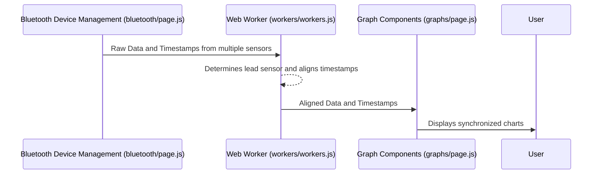

# Chapter 6: Time Alignment

In the previous chapter, [Data Trace (`dataTrace`)](05_data_trace__datatrace_.md), we learned how to store raw sensor data. Now, let's explore how to synchronize data from different sensors, which is crucial for accurate analysis. This is where Time Alignment comes in.

Let's say our central use case is to analyze ECG and ACC data collected simultaneously from two different devices. We want to ensure that the data points from both sensors align correctly in time, even if there are slight discrepancies in their individual clocks.  This chapter will show you how Time Alignment achieves this.

## What is Time Alignment?

Imagine you're conducting an orchestra.  Each musician plays their instrument, but it's your job to make sure they all play in sync. Time alignment is like being the conductor for our sensor data.  It synchronizes data streams from different sensors based on their timestamps, ensuring that we're comparing apples to apples when analyzing data collected concurrently.

## Using Time Alignment: Synchronizing ECG and ACC Data

Here's how Time Alignment works in our app:

1. **[Data Streaming and Processing](04_data_streaming_and_processing.md) receives data:**  As data streams in from the ECG and ACC sensors, their respective timestamps are also recorded.

2. **[Web Workers](08_web_workers.md) perform the alignment:**  The `workers/workers.js` file contains the logic for time alignment. It receives the raw data and timestamps.

3. **Alignment Logic:** The worker determines a "lead" sensor (the one with the earliest timestamp) and adjusts the other sensor's timestamps to match. One sensor's timestamps are matched to the lead sensor. The lead sensor is the sensor with the most current priority queue value.

4. **[Graph Components](01_graph_components.md) display aligned data:** The synchronized data is then sent to the graph components for display, ensuring that the visualizations accurately represent the timing relationships between the sensor readings.

## Under the Hood: How Time Alignment Works



## Internal Implementation Details

The core logic for Time Alignment resides within the `workers/workers.js` file.  Let's look at a simplified version:

```javascript
// Simplified workers/workers.js
self.onmessage = function ({ data }) {
  // ... other code ...
    let deviceType = device?.includes('Sense') ? 'Sense' : 'H10';
    // ...
    let concurrentStreamingDevices = new Heap((a, b) => a[0] - b[0]);
    concurrentStreamingDevices = populate_queue(concurrentStreamingDevices, streamingModeMap, deviceType, sensorType);
    timeAlignerSensor = concurrentStreamingDevices.peek()?.[1] || '';
    let timeAlignerDevice = timeAlignerSensor?.split('-')?.[0] || '';

    let alignerElementTimestamps = (timeAlignerDevice && enableAlignment) ? dataTrace[timeAlignerDevice][dataTrace[timeAlignerDevice].length - 1] : [];
    // ... rest of processing where timestamps are aligned to the aligner timestamps
    let alignedTimestampArr = matchLengthByPackage(alignerElementTimestamps, timestampArr, sensorType) 
    // ...
};

function matchLengthByPackage(alignedTimestamp, toAlignTimestamp, sensorType) {
    // ... Logic to match timestamp lengths
}

```

This code snippet shows how the worker identifies the timeAlignerDevice which is used as the lead device to which data from other devices and sensors will be aligned with. Then,  `matchLengthByPackage` is called to align the timestamps of the current sensor/device to the lead timestamp.  This function adjusts the timestamps of the sensor being aligned, effectively shifting its data in time to match the lead sensor. The actual implementation includes more details like error handling and specific alignment algorithms. The key takeaway is that this function takes the timestamps from the lead sensor and the timestamps from the sensor being aligned as input, and returns adjusted timestamps to be used for further calculations and analysis of incoming data.

The `enableAlignment` variable, managed by [Global State (globalState.js)](09_global_state__globalstate_js_.md), controls whether time alignment is active.


## Conclusion

Time Alignment is a crucial step in ensuring data consistency when working with multiple sensors. We learned how it synchronizes data streams based on their timestamps, using a lead sensor as the reference.  In the next chapter, [Data Saving (Local Files)](07_data_saving__local_files_.md), we'll discuss how to save our aligned data for later analysis.


---

Generated by [AI Codebase Knowledge Builder](https://github.com/The-Pocket/Tutorial-Codebase-Knowledge)