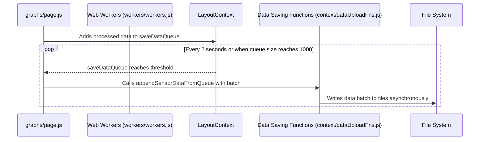

# Chapter 7: Data Saving (Local Files)

In the previous chapter, [Time Alignment](06_time_alignment.md), we learned how to synchronize data from different sensors. Now, let's explore how to save this valuable data to local files so we can access it later. This is our data factory's "warehouse."

Let's say our central use case is to save the processed and time-aligned ECG and ACC data to separate files on the user's computer. We want to do this efficiently, without slowing down the app.  This chapter will guide you through how Data Saving (Local Files) achieves this.

## Why Not Save Immediately?

Imagine if every time a single item arrived at our warehouse, we had to create a new shelf. That would be very inefficient! Similarly, writing to a file every time new sensor data arrives can be slow and resource-intensive.

Data Saving (Local Files) solves this problem by collecting data in batches. It's like grouping items together before putting them on a shelf. This reduces the number of times we have to "open the warehouse door" (access the file system), significantly improving performance.

## Asynchronous Saving: The Background Workers

Instead of saving data directly on the main thread (which would make the app feel sluggish), Data Saving uses [Web Workers](08_web_workers.md) to perform the saving in the background.  Think of these workers as dedicated warehouse staff who handle the storage process while the rest of the factory continues to operate smoothly.

## Batching and Writing

Data Saving leverages `saveDataQueue` to accumulate the data in the `graphs/page.js`. This queue is managed by [LayoutContext](02_layoutcontext.md), which is accessible to other components via the `useLayoutContext` hook. When the queue reaches a certain size (e.g., 1000 data points), a batch is processed and written to the local files.


```javascript
// Simplified graphs/page.js
  useEffect(() => {
    if (saveDataQueue.current.length >= 1000) {
      const batch = [...saveDataQueue.current];
      saveDataQueue.current = [];

      // ...process and save batch...
    }
  }, [processedData]);
```
This code snippet checks if the `saveDataQueue` has reached a size of 1000. If so, it copies the current contents of the queue into the `batch` array. The `saveDataQueue` is then cleared.


## Under the Hood

Here's a sequence diagram showing how Data Saving works:




## Internal Implementation

The `context/dataUploadFns.js` file contains the functions for saving the data:

```javascript
// Simplified context/dataUploadFns.js
// ... inside appendSensorDataFromQueue function

  // write acc data
  const accFileHandle = await directoryHandle.getFileHandle(`${deviceName}_${sessionId}_acc.csv`, { create: true });
  const accWritable = await accFileHandle.createWritable({ keepExistingData: true });
  // ... (Append data to accWritable)

  // write non-acc data
  const nonACCFileHandle = await directoryHandle.getFileHandle(`${deviceName}_${sessionId}_nonACC.csv`, { create: true });
  const nonACCWritable = await nonACCFileHandle.createWritable({ keepExistingData: true });
  // ... (Append data to nonACCWritable)

// ...
```

This simplified code demonstrates how `appendSensorDataFromQueue` writes both ACC and non-ACC data for each device to distinct files.  The actual function is slightly more complex for reasons such as preventing the writer from crashing after running for extended periods of time, but this demonstrates the core logic.

## Conclusion

Data Saving (Local Files) provides an efficient and performant way to store our valuable sensor data. We learned how it uses batching and asynchronous operations with [Web Workers](08_web_workers.md) to save data without impacting the responsiveness of our app.  In the next chapter, we'll delve into [Web Workers](08_web_workers.md) themselves and how they contribute to the overall performance of our application.


---

Generated by [AI Codebase Knowledge Builder](https://github.com/The-Pocket/Tutorial-Codebase-Knowledge)