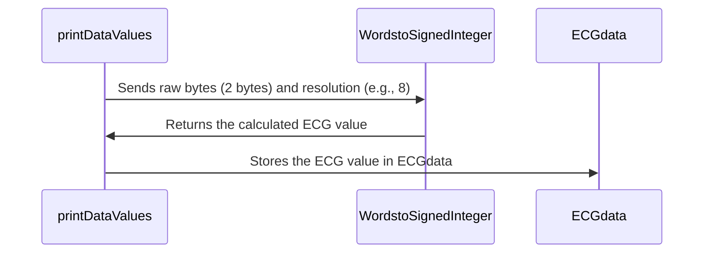

# Chapter 8: Helper Functions (`helpers.jsx`)

Following our discussion on [Global State (`globalState.js`)](07_global_state__globalstate_js_.md), which acts as our central control panel, this chapter focuses on `helpers.jsx`. Think of `helpers.jsx` as a set of specialized tools in our smart home, designed to handle specific tasks like converting units, filtering noise, and preparing data for display.  It's our toolkit for making sense of the raw data streaming in from our sensors.

Our central use case will be understanding how the `WordstoSignedInteger` function in `helpers.jsx` helps convert raw byte data from a Polar H10 into actual ECG values.

## Why `helpers.jsx`?

Imagine trying to assemble furniture with only your hands – it would be difficult!  You'd need tools like screwdrivers, hammers, and wrenches.  Similarly, working with raw sensor data requires specialized functions. `helpers.jsx` provides these functions, making it easier to process and interpret the data.

## Key Concept: A Toolkit of Functions

`helpers.jsx` is a collection of JavaScript functions, each designed for a specific data manipulation task.  It's organized like a well-stocked toolbox, making it easy to find the right tool for the job.

## Converting Raw Bytes to ECG Values: Using the Right Tool

Let's look at how `WordstoSignedInteger` helps us make sense of raw ECG data:

### 1.  The Raw Data

The Polar H10 sends ECG data as a stream of bytes.  Imagine these bytes as coded messages that need to be deciphered.

### 2. Using `WordstoSignedInteger`

```javascript
// ... other code in bluetooth/page.js ...
import { WordstoSignedInteger } from "../../utils/helpers.jsx";
// ... other code ...

// Inside the printDataValues function:
ECGdata[i] = WordstoSignedInteger(samples.slice(offset, offset + 2), 8);
// ... other code ...
```
This code snippet, from `bluetooth/page.js`, shows how we use `WordstoSignedInteger`. We pass it a slice of the raw `samples` data (2 bytes at a time) and a resolution value (8). The function then "decodes" these bytes into an actual ECG value.

## Under the Hood: How `WordstoSignedInteger` Works

Let's use a sequence diagram to illustrate:



1.  The `printDataValues` function calls `WordstoSignedInteger` with the raw bytes (2 of them) and the resolution (8).
2. `WordstoSignedInteger` performs the conversion using bitwise operations, effectively "decoding" the bytes.
3.  The resulting ECG value is returned to `printDataValues`, which then stores it in the `ECGdata` array.

## Internal Implementation

Let's look inside `utils/helpers.jsx`:

```javascript
// ... other code ...
export const WordstoSignedInteger = (bytes, resolution) => {
    let value = 0;
    for (let i = bytes.length - 1; i >= 0; i--) {
        value = (value << 8) + bytes[i];
    }
    if (value & (1 << (resolution - 1))) {
      value -= 1 << resolution;
    }
    return value;
};
// ... other code ...

```

This snippet shows a simplified version of `WordstoSignedInteger`.  It takes the `bytes` and `resolution` as input and calculates the signed integer value using bitwise operations. This function is essential for interpreting the raw data correctly.  `helpers.jsx` also contains several other helper functions like `createArray`, `fillTimeArray`, and more to complete the toolkit.


## Conclusion

This chapter explored `helpers.jsx`, our specialized toolkit for manipulating and interpreting raw sensor data.  We learned how `WordstoSignedInteger` converts raw bytes into meaningful ECG values.  Now you understand how our smart home uses its specialized tools to make sense of the incoming data!


There are no further chapters in this beginner tutorial. You've learned the core concepts of the app project. You can now revisit previous chapters or start exploring more complex functionalities of this application.


---

Generated by [AI Codebase Knowledge Builder](https://github.com/The-Pocket/Tutorial-Codebase-Knowledge)