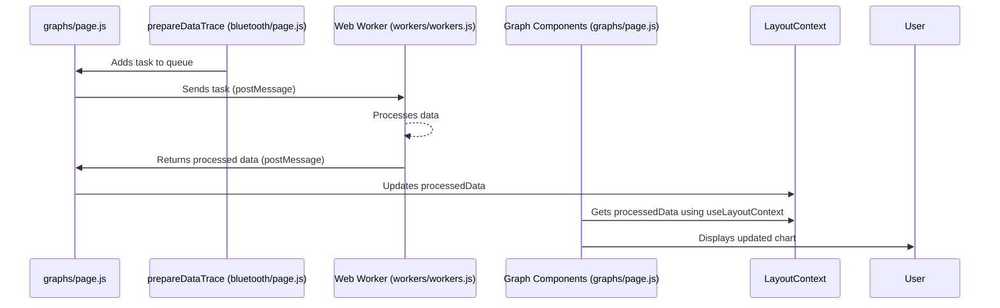

# Chapter 8: Web Workers

In the previous chapter, [Data Saving (Local Files)](07_data_saving__local_files_.md), we learned how to efficiently store our processed sensor data.  Now, let's dive into a key component that keeps our app running smoothly, even when dealing with heavy data processing: Web Workers.

Let's say our central use case is processing and displaying live ACC data from a "Sense_ACC" sensor. This data comes in quickly, and processing it (like filtering noise and [Time Alignment](06_time_alignment.md)) can be computationally intensive.  We don't want this processing to block the main thread and freeze the UI, making the app unresponsive. This is where Web Workers come in.

## What are Web Workers?

Imagine our app is a bustling data factory.  The main thread is the main assembly line, responsible for keeping everything running smoothly and displaying the final product (our charts).  Web Workers are like separate workshops within our factory.  They handle the computationally intensive tasks of data processing in the background, so that the main assembly line doesn't get blocked. This keeps the UI responsive even during heavy processing.

## Using Web Workers: Processing ACC Data

Here's how Web Workers process our ACC data:

1. **[Data Streaming and Processing](04_data_streaming_and_processing.md) queues up tasks:**  When raw ACC data arrives, the `prepareDataTrace` function in `bluetooth/page.js` adds a processing task to a queue (`pendingTasksRef`).

2. **`graphs/page.js` sends tasks to workers:**  Every 2 seconds (or sooner, if the queue reaches a certain size), `graphs/page.js` takes tasks from the queue and assigns them to available Web Workers.

3. **Web Workers process the data:** The Web Worker (defined in `workers/workers.js`) receives the raw ACC data and performs the heavy lifting: filtering noise, performing [Time Alignment](06_time_alignment.md), etc.

4. **Web Workers send back results:** Once the processing is complete, the Web Worker sends the processed data back to `graphs/page.js`.

5. **[Graph Components](01_graph_components.md) display the results:** `graphs/page.js` receives the processed data and updates the charts, giving us a smooth, real-time visualization.

## Under the Hood: How Web Workers Operate



## Internal Implementation

Web Workers are created and managed in `graphs/page.js`:

```javascript
// Simplified graphs/page.js
const workerPool = useRef({}); // Holds our workers

// ... inside useEffect ...
workerPool.current[sensorKey] = new Worker(new URL('../workers/workers.js', import.meta.url), { type: 'module' });
// ...

// ... later, to send a task:
workerPool.current[sensorKey].postMessage({ /* ... task data ... */ });
```

The worker itself (`workers/workers.js`) listens for messages and processes data:

```javascript
// Simplified workers/workers.js
self.onmessage = function({ data }) {
  const { type, payload } = data;
  if (type === 'processACC') {
    // ... process ACC data (filter, align timestamps, etc.) ...
    postMessage({ type: 'processedACC', payload: { /* ... processed data ... */ } });
  } 
};
```


## Conclusion

Web Workers are essential for keeping our app responsive during computationally intensive tasks like data processing. We learned how they work in the background, receiving tasks from the main thread, processing them, and returning the results without blocking the UI.  In the next chapter, [Global State (globalState.js)](09_global_state__globalstate_js_.md), we'll explore how global application settings are managed.


---

Generated by [AI Codebase Knowledge Builder](https://github.com/The-Pocket/Tutorial-Codebase-Knowledge)