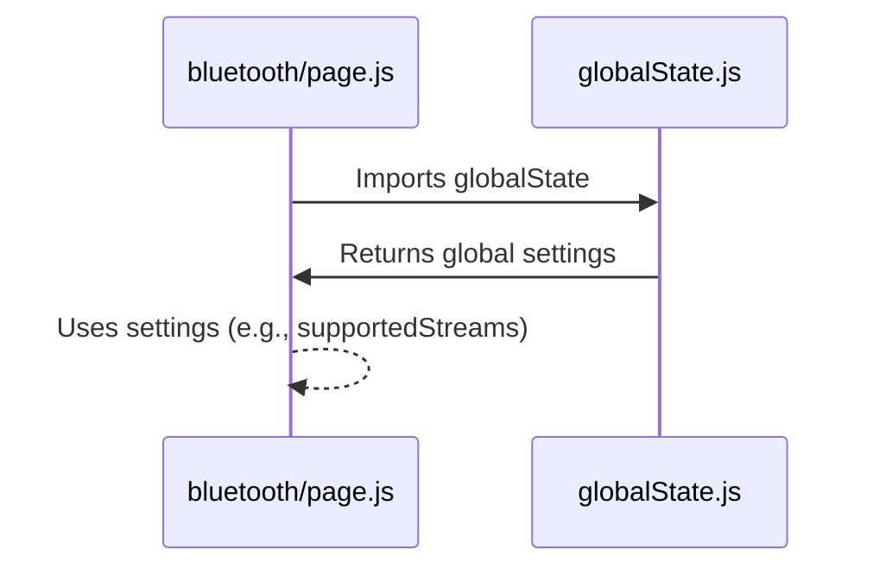

# Chapter 9: Global State (`globalState.js`)

In the previous chapter, [Web Workers](08_web_workers.md), we learned how to offload heavy processing tasks to keep our app responsive.  Now, let's explore how we manage global settings and configurations that are shared across different parts of our application.  This is where `globalState.js` comes in.

Let's say our central use case is configuring which sensor streams are available for a Polar H10 device. We want to define that this device supports ECG and ACC streams, and this information needs to be easily accessible from both [Bluetooth Device Management](03_bluetooth_device_management.md) and [Data Streaming and Processing](04_data_streaming_and_processing.md).  This chapter will show you how `globalState.js` handles this.

## What is `globalState.js`?

Think of `globalState.js` as the factory's blueprint or configuration settings.  It contains definitions of available sensor streams, default values for device settings, and other information that is shared across different parts of the application.  This avoids having to hardcode these values in multiple places.

## Using `globalState.js`: Configuring Sensor Streams

Here's how we use `globalState.js` to configure the streams for a Polar H10:

```javascript
// utils/globalState.js (simplified)
export const streams = {
    ECG: { id: 0, name: 'ECG', code_start: [1, 0, 0, 0, 130] }, // Example stream configuration
    ACC_H10: { id: 2, name: 'ACC_H10', code_start: [1, 0, 0, 0, 200] } // Another stream
};

export const globalState = {
    devices: { // Supported devices and their configurations
        H10: { output: ['ECG', 'ACC_H10'] } // H10 supports ECG and ACC
    },
    // ... other global settings
};
```

This snippet from `globalState.js` defines the `streams` object, holding the configuration for each individual stream, and the `globalState.devices` object, which specifies that the `H10` device supports the `ECG` and `ACC_H10` streams.

In our [Bluetooth Device Management](03_bluetooth_device_management.md) component (`bluetooth/page.js`), we can access this information:

```javascript
// bluetooth/page.js (simplified)
import { globalState } from '../../utils/globalState';

// ... inside the component ...
const deviceType = "H10";
const supportedStreams = globalState.devices[deviceType].output;
console.log("Supported streams:", supportedStreams); // Output: ['ECG', 'ACC_H10']
```

This code snippet shows how `bluetooth/page.js` accesses the list of supported streams for the H10 device from `globalState.devices`. Similarly, other components can access and use this shared configuration.

## Under the Hood: How `globalState.js` Works

`globalState.js` is a simple JavaScript module that exports an object containing our global settings.  When a component imports from `globalState.js`, it gets a copy of these settings.



## Internal Implementation

The `globalState.js` file is located in the `utils` directory. It defines and exports the `globalState` object, which contains all our application's global configurations. It also exports `streams`, which holds all the settings of all the sensor streams. This includes their respective ids, names, and codes required to start streaming.

```javascript
// Simplified utils/globalState.js
export const streams = { 
    // ... stream definitions ...
};

export const globalState = {
    devices: {
        // ... device configurations ...
    },
    // ... other global settings
};
```

## Conclusion

`globalState.js` provides a centralized location to manage application-wide settings and configurations, promoting code maintainability and avoiding redundancy.  We learned how it's used to define supported sensor streams and how other components can access this information. This concludes our tutorial.  We've covered all the essential concepts for understanding how this data visualization application works, from [Graph Components](01_graph_components.md) to managing [Global State (globalState.js)](09_global_state__globalstate_js_.md).


---

Generated by [AI Codebase Knowledge Builder](https://github.com/The-Pocket/Tutorial-Codebase-Knowledge)