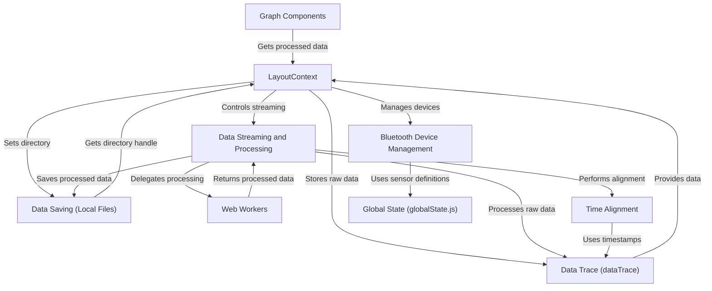

# Tutorial: app

This project visualizes data from *Polar Bluetooth sensors* like heart rate and acceleration.  It connects to the sensors, streams the raw data, processes it (like aligning timestamps and filtering noise), and then displays the data on interactive graphs. The data can also be saved to local files for later analysis.  The app uses **web workers** to handle the data processing in the background, keeping the user interface responsive.

**Source Repository:** [None](None)

## Chapters

1. [Graph Components](01_graph_components.md)
2. [LayoutContext](02_layoutcontext.md)
3. [Bluetooth Device Management](03_bluetooth_device_management.md)
4. [Data Streaming and Processing](04_data_streaming_and_processing.md)
5. [Data Trace (dataTrace)](05_data_trace__datatrace_.md)
6. [Time Alignment](06_time_alignment.md)
7. [Data Saving (Local Files)](07_data_saving__local_files_.md)
8. [Web Workers](08_web_workers.md)
9. [Global State (globalState.js)](09_global_state__globalstate_js_.md)

---

Generated by [AI Codebase Knowledge Builder](https://github.com/The-Pocket/Tutorial-Codebase-Knowledge)