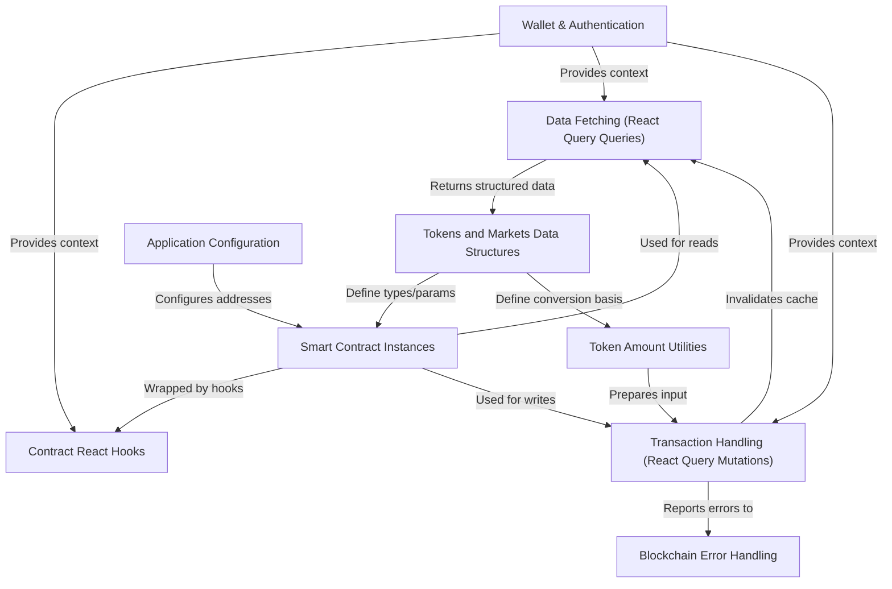

# Tutorial: frontend

This app is a frontend for a decentralized finance lending protocol on a blockchain.
It lets you **connect your cryptocurrency wallet** and interact with the protocol's
*smart contracts*. You can view market data, see your balances, and perform
actions like supplying or borrowing assets. The app handles fetching *real-time
data*, managing your transactions, and providing helpful messages if something
goes wrong on the blockchain.

**Source Repository:** [None](None)

## Chapters

1. [Wallet & Authentication
](01_wallet___authentication_.md)
2. [Application Configuration
](02_application_configuration_.md)
3. [Smart Contract Instances
](03_smart_contract_instances_.md)
4. [Tokens and Markets Data Structures
](04_tokens_and_markets_data_structures_.md)
5. [Contract React Hooks
](05_contract_react_hooks_.md)
6. [Data Fetching (React Query Queries)
](06_data_fetching__react_query_queries__.md)
7. [Token Amount Utilities
](07_token_amount_utilities_.md)
8. [Transaction Handling (React Query Mutations)
](08_transaction_handling__react_query_mutations__.md)
9. [Blockchain Error Handling
](09_blockchain_error_handling_.md)

---

Generated by [AI Codebase Knowledge Builder](https://github.com/The-Pocket/Tutorial-Codebase-Knowledge)